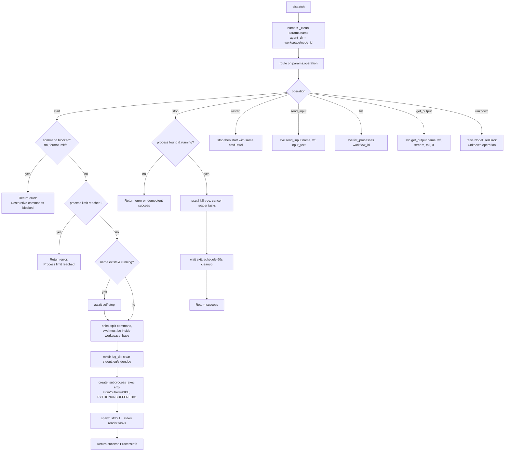

# Process Manager (`processManager`)

| Field | Value |
|------|-------|
| **Category** | code_fs_process / process (plugin lives under `server/nodes/utility/`) |
| **Backend handler** | [`server/nodes/utility/process_manager/__init__.py::ProcessManagerNode.dispatch`](../../../server/nodes/utility/process_manager/__init__.py) (dispatched via `BaseNode.execute()` + `@Operation("dispatch")`) |
| **Service** | [`server/services/process_service.py::ProcessService`](../../../server/services/process_service.py) |
| **Tests** | [`server/tests/nodes/test_code_fs_process.py`](../../../server/tests/nodes/test_code_fs_process.py) |
| **Skill (if any)** | [`server/skills/terminal/process-manager-skill/SKILL.md`](../../../server/skills/terminal/process-manager-skill/SKILL.md) |
| **Dual-purpose tool** | yes - tool name `process_manager` |

## Purpose

Manages long-running subprocesses (dev servers, watchers, build tools) for a
workflow. Unlike [`shell`](./shell.md), processes spawned here inherit the
**full** system PATH and run asynchronously - their stdout/stderr streams into
the Terminal tab via `broadcast_terminal_log()` and persists to per-process log
files at `<workspace>/<agent_node_id>/.processes/<name>/{stdout,stderr}.log`.

Six operations: `start`, `stop`, `restart`, `send_input`, `list`, `get_output`
(default `list`). The plugin's `dispatch` op is a thin wrapper over the
`ProcessService` singleton; the singleton owns a `{(workflow_id, name):
ManagedProcess}` dict, the streaming tasks, and the cleanup scheduler. The
wrapper's `_unwrap` raises `NodeUserError` on any service `{"success": False}`
envelope so the framework returns a clean failure.

## Inputs (handles)

| Handle | Connection type | Required | Purpose |
|--------|-----------------|----------|---------|
| `input-main` | main | no | Not consumed |

## Parameters

| Name | Type | Default | Required | displayOptions.show | Description |
|------|------|---------|----------|---------------------|-------------|
| `operation` | `start`/`stop`/`restart`/`list`/`send_input`/`get_output` (Literal) | `list` | no | - | Operation to run |
| `name` | string | `""` | yes (all except `list`) | - | Unique process name within the workflow (LLM `"None"` coerced to empty by `_clean`) |
| `command` | string | `""` | yes (`start` only) | `operation=start` | Command (`ProcessService` parses with `shlex.split`) |
| `cwd` | string | `""` | no | `operation=start` | Working directory; defaults to `<workspace>/<node_id>` |
| `env` | object (Dict[str,str]) | `{}` | no | `operation=start` | Declared param, but the `dispatch` op does NOT forward it to `svc.start` — currently inert |
| `input_text` | string | `""` | yes (`send_input`) | `operation=send_input` | Text to write to stdin (newline auto-appended by the service) |
| `stream` | `stdout`/`stderr` (Literal) | `stdout` | no | `operation=get_output` | Stream to read for `get_output` |
| `tail` | number | `100` (ge=1, le=10000) | no | `operation=get_output` | Tail N lines |

`ProcessManagerParams` uses `extra="ignore"`. There are NO `toolName` /
`toolDescription` / `working_directory` / `text` / `offset` params (the old
card listed pre-Wave-11 frontend fields). `get_output` is always called with
`offset=0`.

## Outputs (handles)

| Handle | Shape | Description |
|--------|-------|-------------|
| `output-main` | object | Standard envelope payload (node declares only `input-main` / `output-main`; `usable_as_tool=True` exposes the same payload as the `process_manager` tool result) |

### Output payload per operation

The shapes below are whatever `ProcessService` returns (passed through `_unwrap`).
`node_output_schemas.ProcessManagerOutput` declares `operation` / `pid` /
`status` / `output` / `processes` (extra fields allowed by `_OutputBase`).

- `start` / `stop` / `restart`: the `ProcessInfo` dict from the service
  (`{name, command, pid, status, started_at, exit_code, working_directory,
  log_dir, ...}`).
- `send_input`: the service's send-input result dict.
- `list`: `{processes: Array<ProcessInfo>}` for the current workflow.
- `get_output`: the service's `{lines, total, file, ...}` dict.

## Logic Flow

Each service call (except `list`) is wrapped in `_unwrap`, which raises
`NodeUserError` if the service returned `{"success": False}`.

## Decision Logic

- **`_clean()`**: LLMs sometimes pass the literal string `"None"` for missing
  fields; the wrapper coerces `""` and `"None"` to empty (applied to `name`,
  `command`, `cwd`, `input_text`).
- **`cwd` fallback**: if `cwd` is empty the wrapper uses `agent_dir =
  <workspace>/<node_id>` (each agent node gets its own subfolder). If the
  workspace is also empty, `ProcessService.start` falls back to
  `<workspace_base>/default` and mkdir's it.
- **Workspace guardrail**: `cwd` must resolve inside `workspace_base_resolved`
  via `Path.is_relative_to()`. Violations return an error.
- **Destructive-command block**: the service maintains a hard-coded list of
  prefixes/tokens (`rm `, `rmdir`, `del `, `rd `, `remove-item`, `format `,
  `mkfs`, `dd if=`, `shred`, `> /dev/`, `chmod 777`, `chmod -r`) and refuses
  any command that matches. Users are told to use `shell_execute` instead.
- **Process limit**: `max_processes` (default 10) caps the number of
  concurrently-running processes. Stopped/error entries do not count. When
  at the limit, a new `start` returns an error; restarting an existing entry
  is still allowed.
- **Duplicate name handling**: starting a name that already exists and is
  running triggers an implicit `stop` first; the new process inherits the
  same `log_dir` (cleared before spawn).
- **PATH inheritance**: `env = {**os.environ, "PYTHONUNBUFFERED": "1"}`.
  The full system PATH is available - this is the main distinction from the
  sandboxed shell node.
- **ANSI-stripped at capture**: `_read_stream` runs each decoded line through
  `core.ansi.strip_ansi` (a wrapper over **`click.unstyle`**) BEFORE the log-file
  write / `broadcast_terminal_log` / `line_handler`, so colour + cursor/erase
  codes from build tools (`vite`/`npm`/…) render as clean text in the Terminal
  tab, the persisted logs, and `get_output`. `click.unstyle` is byte-faithful
  apart from the stripped escapes (unlike `rich.Text.from_ansi`, which drops
  trailing newlines).
- **Exit code capture**: only the stdout reader task fulfils `exit_code` on
  EOF via `process.wait()` with a 5s timeout. Status becomes `stopped`
  (exit=0) or `error` (nonzero).
- **Auto cleanup**: 60 seconds after a process exits, `_cleanup_completed`
  removes its log directory and drops it from the tracking dict. Fast
  consumers must call `get_output` before the grace window.

## Side Effects

- **Database writes**: none.
- **Broadcasts**:
  - Every streamed stdout/stderr line fires
    `broadcast_terminal_log({timestamp, level, message, source:
    "process:<name>"})`.
- **External API calls**: none.
- **File I/O**:
  - `<workspace>/<node_id>/.processes/<name>/stdout.log`
  - `<workspace>/<node_id>/.processes/<name>/stderr.log`
  - Appended line-by-line by the reader tasks; cleared on each `start` and
    removed on `stop`/`shutdown`.
- **Subprocess**:
  - `asyncio.create_subprocess_exec(*argv, stdin/out/err=PIPE, cwd=..., env=...)`.
  - `psutil.Process(pid).children(recursive=True)` + `.kill()` for tree
    termination.

## External Dependencies

- **Python packages**: `asyncio`, `psutil`, `shlex`, `shutil`.
- **Services**: `ProcessService` singleton (global). `set_broadcaster()` must
  be called at startup for Terminal streaming to reach the frontend.
- **OS utilities**: whatever the user command references - full PATH.

## Edge cases & known limits

- **`shlex.split` is POSIX-style even on Windows**: Windows-style
  backslashes inside quotes may be mis-split. Complex PowerShell invocations
  are fragile; users are guided toward a wrapper script or to use the
  `bash`/`wsl` variants.
- **Blocked-commands list is substring-based**: `"rm "` matching checks for
  leading and mid-string occurrences, but a command like
  `python -c "os.system('rm -rf ...')"` slips through because it does not
  start with `rm ` and the word `rm ` does not appear with a leading space.
- **60-second cleanup race**: if an agent polls `get_output` at 65s it may
  hit `{lines: [], total: 0, file: ""}` with no hint that the process ever
  existed.
- **`send_input` requires trailing newline**: the handler appends `\n` only
  if `text` does not already end with one.
- **`exit_code=-1` on stop timeout**: if `process.wait()` does not return
  within 3s after the kill, `exit_code=-1` is written - ambiguous with real
  exit codes that happen to be negative (rare on POSIX, common on Windows).
- **stdout-only exit capture**: if a process writes only to stderr and
  closes stdout immediately, the stderr reader runs to completion but the
  status stays `running` until the handler is asked again. This is a known
  race in `_read_stream`.
- **No resource limits**: CPU/memory caps are NOT applied; rogue processes
  can exhaust the host.
- **Log dir name collision**: two concurrent `start` calls with the same
  `name` will serialise via the `stop` guard, but a partial cleanup from a
  previous run can leave stale files if the server was killed mid-cleanup.

## Related

- **Skills using this as a tool**: [`process-manager-skill/SKILL.md`](../../../server/skills/terminal/process-manager-skill/SKILL.md)
- **Sibling nodes**: [`shell`](./shell.md), [`fileRead`](./fileRead.md), [`fsSearch`](./fsSearch.md)
- **Architecture docs**: [DESIGN.md](../../DESIGN.md), [Status Broadcaster](../../status_broadcaster.md)
