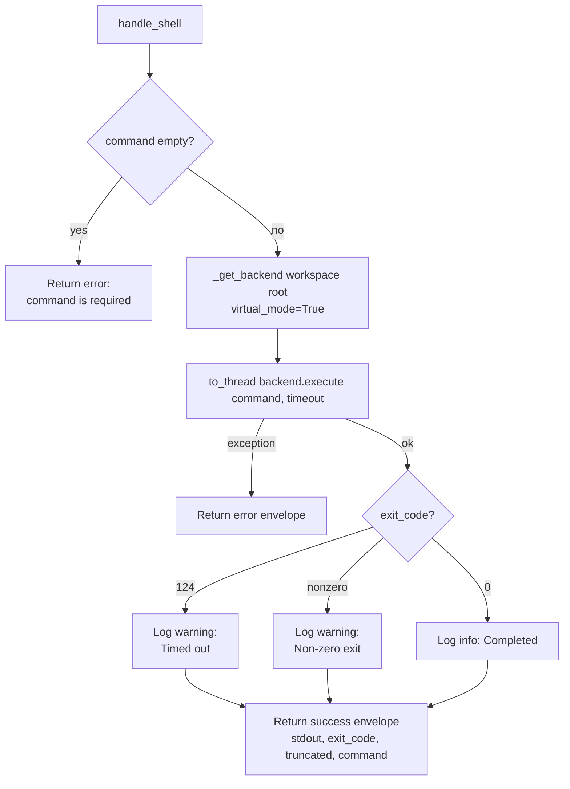

# Shell (`shell`)

| Field | Value |
|------|-------|
| **Category** | code_fs_process / filesystem |
| **Backend handler** | [`server/services/handlers/filesystem.py::handle_shell`](../../../server/services/handlers/filesystem.py) |
| **Backend** | [`deepagents.backends.LocalShellBackend.execute`](https://github.com/langchain-ai/deepagents) |
| **Tests** | [`server/tests/nodes/test_code_fs_process.py`](../../../server/tests/nodes/test_code_fs_process.py) |
| **Skill (if any)** | [`server/skills/terminal/shell-skill/SKILL.md`](../../../server/skills/terminal/shell-skill/SKILL.md) |
| **Dual-purpose tool** | yes - tool name `shell_execute` |

## Purpose

Runs a short-lived shell command inside the per-workflow workspace. Delegates
to `LocalShellBackend.execute()`, which invokes the command via `subprocess`
but intentionally **scrubs the system PATH**, so tools like `npm`, `node`,
`python`, and `git` are NOT resolvable unless supplied with an absolute path.
For long-running processes or tools that need the real PATH, users are
directed to [`processManager`](./processManager.md).

Runs synchronously under `asyncio.to_thread()` so the event loop keeps
servicing other requests while the command executes.

## Inputs (handles)

| Handle | Connection type | Required | Purpose |
|--------|-----------------|----------|---------|
| `input-main` | main | no | Not consumed by the handler |

## Parameters

| Name | Type | Default | Required | displayOptions.show | Description |
|------|------|---------|----------|---------------------|-------------|
| `command` | string | `""` | yes | - | Shell command |
| `timeout` | number | `30` | no | - | Max seconds (UI clamps 1-300) |
| `working_directory` | string | `""` | no | - | Overrides context workspace |

## Outputs (handles)

| Handle | Shape | Description |
|--------|-------|-------------|
| `output-main` | object | Standard envelope payload |
| `output-tool` | object | Same payload when wired to an AI agent |

### Output payload

```ts
{
  stdout: string;      // Combined output (backend merges stderr into stdout unless truncated); ANSI-stripped
  exit_code: number;   // 124 = timed out, else the process exit code
  truncated: boolean;  // Whether the backend truncated the output buffer
  command: string;     // Echo of the requested command
}
```

## Logic Flow



## Decision Logic

- **Validation**: empty `command` -> `"command is required"` error.
- **Sandbox PATH**: `LocalShellBackend` strips the system PATH before spawn,
  so by default only built-ins and absolute paths work. This is a deliberate
  safety choice; AI agents are steered toward `process_manager` for any
  install/build tool invocation.
- **Timeout handling**: `timeout` is forwarded to
  `backend.execute(command, timeout=timeout)`. On timeout the backend kills
  the process and sets `exit_code=124` (POSIX convention). Logged at WARNING.
- **Non-zero exit still returns `success: true`**: the envelope-level success
  reflects whether the handler itself finished, not whether the command
  succeeded. Users must inspect `exit_code` in the payload.
- **Truncation**: the backend caps output size internally; when capped
  `truncated=true` surfaces to the caller. The exact cap lives in
  `deepagents`.
- **ANSI stripping**: `result.output` is run through `core.ansi.strip_ansi`
  (a wrapper over **`click.unstyle`**) before being returned as `stdout` (and
  before the operator-log line), so colour/cursor codes from tools like
  `vite`/`npm` don't render as garbage in the Output panel. `click.unstyle` is
  byte-faithful apart from the stripped escapes.
- **Broad `except Exception`**: backend failures (missing binary,
  `virtual_mode` violations) become an error envelope.

## Side Effects

- **Database writes**: none.
- **Broadcasts**: none (but the process stdout/stderr is NOT streamed to
  Terminal - only `processManager` does that).
- **External API calls**: none.
- **File I/O**: `os.makedirs(root, exist_ok=True)` on the workspace root. The
  command itself may read/write under that root.
- **Subprocess**: one per call, via the backend's `subprocess.run`
  (synchronous, scrubbed PATH). Finished before the handler returns.

## External Dependencies

- **Python packages**: `deepagents`.
- **Environment variables**: `WORKSPACE_BASE_DIR`.
- **OS utilities**: whatever the command references - but PATH is empty, so
  absolute paths only.

## Edge cases & known limits

- **Missing binaries masquerade as command failures**: because PATH is
  scrubbed, a plain `npm test` gives "command not found" rather than a
  permissions error. Users often confuse this for a broken node.
- **Truncation corrupts JSON output**: if a command prints JSON and the
  backend truncates, the `stdout` string becomes invalid JSON with no
  trailing marker beyond `truncated=true`.
- **`exit_code=124` is exit-code polysemy**: real programs can legitimately
  exit 124; the handler does not distinguish those from a backend-side
  SIGTERM-on-timeout.
- **`timeout` is best-effort**: the backend uses `subprocess.run(..., timeout=)`.
  A child process that ignores SIGTERM may keep running until SIGKILL.
- **Stdin is empty**: the handler exposes no way to pipe data into the
  command - `input_data` from upstream nodes does not reach it.
- **No environment variable override**: users cannot inject env vars via
  parameters; the backend sets its own minimal env.
- **Windows path traversal check is string-based**: `virtual_mode=True`
  normalises paths but trust-boundary violations depend on the backend
  implementation.

## Related

- **Skills using this as a tool**: [`shell-skill/SKILL.md`](../../../server/skills/terminal/shell-skill/SKILL.md), [`bash-skill/SKILL.md`](../../../server/skills/terminal/bash-skill/SKILL.md), [`powershell-skill/SKILL.md`](../../../server/skills/terminal/powershell-skill/SKILL.md), [`wsl-skill/SKILL.md`](../../../server/skills/terminal/wsl-skill/SKILL.md)
- **Sibling nodes**: [`processManager`](./processManager.md), [`fileRead`](./fileRead.md), [`fsSearch`](./fsSearch.md)
