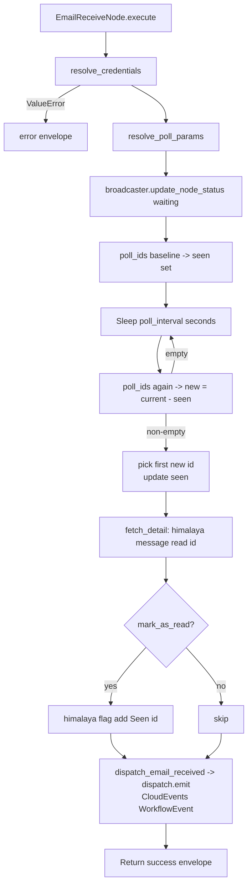

# Email Receive (`emailReceive`)

| Field | Value |
|------|-------|
| **Category** | email / trigger |
| **Backend handler** | [`server/nodes/email/email_receive/__init__.py`](../../../server/nodes/email/email_receive/__init__.py) — Run-button path is the `execute()` override; deployment-mode polling uses the `PollingTriggerNode` hooks (`setup_service` / `fetch_ids` / `fetch_detail` / `post_emit`) draining via the canary `TriggerListenerWorkflow` path |
| **Tests** | [`server/tests/nodes/test_email.py`](../../../server/tests/nodes/test_email.py) |
| **Skill (if any)** | none shipped |
| **Dual-purpose tool** | no (trigger only) |

## Purpose

Polling-based trigger that fires when a new email lands in a watched IMAP
folder. The first poll establishes a baseline (so existing mail is not
replayed), then subsequent polls diff message IDs to detect arrivals.
Mirrors the `googleGmailReceive` pattern but works against any IMAP provider via
Himalaya.

## Inputs (handles)

None. Triggers have no inputs.

## Parameters

| Name | Type | Default | Required | displayOptions.show | Description |
|------|------|---------|----------|---------------------|-------------|
| `provider` | options | `gmail` | no | - | Preset key in `email_providers.json` |
| `folder` | string | `INBOX` | no | - | IMAP folder to watch |
| `poll_interval` | number | `60` | no | - | Seconds between polls. Pydantic-validated `30-3600` (`poll_interval_clamp = (30, 3600)`) and re-clamped against config `min_interval`/`max_interval` |
| `filter_query` | string | `""` | no | - | Reserved, currently not applied during polling |
| `mark_as_read` | boolean | `false` | no | - | When true, adds the `Seen` flag to the new message after fetch |

Credential params (`email`, `password`, `imap_*`, `smtp_*`) follow the same
resolution rules as [`emailSend`](./emailSend.md#decision-logic).

## Outputs (handles)

| Handle | Shape | Description |
|--------|-------|-------------|
| `output-main` | object | Details of the first new message detected |

### Output payload

```ts
{
  message_id: string;
  folder: string;
  // plus any keys returned by `himalaya message read <id>`:
  //   from, to, subject, date, body, ...
  raw?: unknown;   // set if Himalaya output was a list/non-dict
}
```

Wrapped in the standard envelope: `{ success: true, result: <payload>, execution_time, node_id, node_type, timestamp }`.

## Logic Flow



## Decision Logic

- **Baseline-before-poll** prevents existing emails from triggering the
  workflow on first run. The baseline is an in-memory `set` of envelope IDs
  (via `EmailService.poll_ids` -> Himalaya `envelope list`, `baseline_page_size=50`).
- **Interval clamping** in `EmailService.resolve_poll_params`:
  `max(min_interval, min(max_interval, requested))`. Defaults come from
  `email_providers.json -> polling` block.
- **One event per Run-button `execute()` run**: as soon as any new IDs are seen,
  it fetches the *first* of them, dispatches a single `email_received` event via
  `dispatch_email_received`, and returns. Remaining new IDs are added to `seen`
  but not processed;
  they will be skipped on the next run because they are now considered
  baseline.
- **`filter_query` is unused in polling**: the parameter appears in the UI
  and is documented in the node description, but `poll_ids` does not pass
  it to `list_envelopes`. This is a known gap; see Edge cases.
- **`mark_as_read` flagging**: uses `defaults.flag` (`Seen`) +
  `defaults.flag_action` (`add`) - the UI exposes per-node flag/flag_action
  parameters on `emailRead`, but `emailReceive` does not.
- **Cancellation**: `asyncio.CancelledError` is caught and returned as a
  "Cancelled by user" error envelope.

## Side Effects

- **Database writes**: none directly.
- **Broadcasts**: one `update_node_status(..., "waiting", ...)` when polling
  starts, with `workflow_id` from context.
- **Event bus (canary path)**: `dispatch_email_received(email_data)` ->
  `services.events.dispatch.emit` with a CloudEvents `WorkflowEvent`
  (`type = "com.opencompany.email.message.received"`, `subject = message_id`,
  outer wire-routing key `email_received`). `emailReceive` is canary-registered
  via `register_canary_trigger_type("emailReceive", "com.opencompany.email.message.received")`
  in [`nodes/email/__init__.py`](../../../server/nodes/email/__init__.py), so the
  deployment manager skips the legacy `setup_event_trigger` and a Temporal-durable
  `TriggerListenerWorkflow` consumes the event; the same call also broadcasts the
  envelope to the FE on the `email_received` wire key. The legacy
  `event_waiter.dispatch` path has zero consumers in canary mode and is no longer
  called (`_events.py`).
- **External API calls**: none direct - IMAP traffic flows through Himalaya.
- **File I/O**: one `himalaya_*.toml` tempfile per subprocess call (baseline,
  each poll, fetch, flag). Each is deleted in `finally`.
- **Subprocess**: multiple `himalaya` invocations per run: 1 baseline + N
  poll cycles (one per `poll_interval`) + 1 message-read + optional 1 flag.

## External Dependencies

- **Binary**: `himalaya` on `PATH`.
- **Credentials**: same as [`emailSend`](./emailSend.md#external-dependencies).
- **Services**: `StatusBroadcaster` (for the waiting status),
  `services.events.dispatch` (canary CloudEvents emit via `_events.py`);
  `event_waiter.register_filter_builder` only for the `emailReceive` filter.
- **Config**: `server/config/email_providers.json -> polling`.

## Edge cases & known limits

- **`filter_query` parameter is a no-op**: it is collected but never passed
  to Himalaya during polling. Users expecting filtering at the IMAP level
  will be surprised.
- **Missed messages when > 1 arrive per poll**: only the *first* new ID is
  fetched and emitted; others are absorbed into `seen` and never processed.
  If a workflow needs to process every incoming mail it must run fast
  enough that each poll sees at most one new message, or be rebuilt to loop.
- **No persistence of `seen`**: restarting the process resets the baseline,
  so any mail that arrived while offline is treated as pre-existing.
- **IMAP UID reuse**: `poll_ids` uses `id` or `uid` from the envelope.
  Some servers recycle UIDs across folders; moving a message between
  folders can theoretically present a new ID that was `seen` elsewhere.
- **Plaintext password on disk** per subprocess call (inherited from
  `HimalayaService.execute`).
- **Poll timeout pressure**: each Himalaya call has a 60s hard timeout; a
  slow IMAP server can stall the loop. There is no per-call retry.

## Related

- **Companion nodes**: [`emailSend`](./emailSend.md), [`emailRead`](./emailRead.md)
- **Architecture docs**: [Email Service](../../email_service.md), [Event Waiter System](../../event_waiter_system.md)
