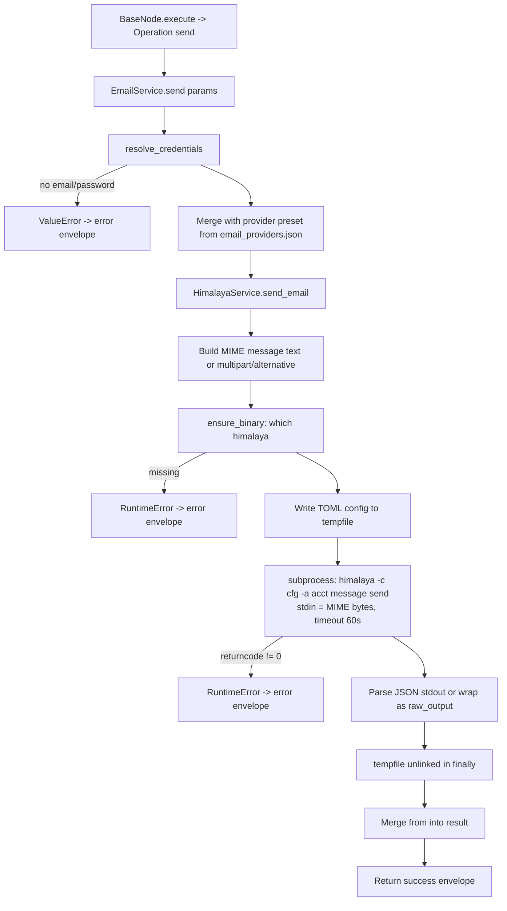

# Email Send (`emailSend`)

| Field | Value |
|------|-------|
| **Category** | email / tool (dual-purpose) |
| **Backend handler** | [`server/nodes/email/email_send/__init__.py`](../../../server/nodes/email/email_send/__init__.py) — dispatched via `BaseNode.execute()` -> `@Operation("send")` -> `EmailService.send` ([`_service.py`](../../../server/nodes/email/_service.py)) |
| **Tests** | [`server/tests/nodes/test_email.py`](../../../server/tests/nodes/test_email.py) |
| **Skill (if any)** | none shipped |
| **Dual-purpose tool** | yes - connect to `input-tools` as the node's own name |

## Purpose

Send an email over SMTP via the bundled [Himalaya](https://github.com/pimalaya/himalaya)
CLI. Works with any IMAP/SMTP provider; Gmail, Outlook/O365, Yahoo, iCloud,
ProtonMail (Bridge), Fastmail and custom/self-hosted are provided as built-in
presets (see `server/config/email_providers.json`). When wired to an AI agent's
`input-tools` handle the LLM fills the same parameter schema.

## Inputs (handles)

| Handle | Connection type | Required | Purpose |
|--------|-----------------|----------|---------|
| `input-main` | main | no | Upstream data; not consumed directly - all inputs come from `parameters` |

## Parameters

| Name | Type | Default | Required | displayOptions.show | Description |
|------|------|---------|----------|---------------------|-------------|
| `provider` | options | `gmail` | no | - | One of `gmail` / `outlook` / `yahoo` / `icloud` / `protonmail` / `fastmail` / `custom`. Picks the preset in `email_providers.json` |
| `to` | string | `""` | **yes** | - | Comma-separated recipient list |
| `subject` | string | `""` | **yes** | - | Email subject line |
| `body` | string | `""` | no | - | Email body (plain text or HTML, see `body_type`); `rows: 6` textarea hint |
| `cc` | string | `""` | no | - | CC recipients, only added if truthy |
| `bcc` | string | `""` | no | - | BCC recipients, only added if truthy |
| `body_type` | options | `text` | no | - | `text` or `html`. HTML sends a `multipart/alternative` MIME message |

Also resolved at runtime (not node-exposed):
- `email` / `password` / `display_name` - from node params OR stored `email_address` / `email_password` / `email_display_name` API keys.
- `imap_*` / `smtp_*` - from node params OR preset OR stored custom keys (see Decision Logic).

## Outputs (handles)

| Handle | Shape | Description |
|--------|-------|-------------|
| `output-main` | object | Himalaya send result merged with `from` (sender address) |

When wired to an AI agent's `input-tools` handle (`usable_as_tool = True`, tool name `email_send`), the same payload is returned to the LLM via the tool-dispatch path — there is no separate `output-tool` handle.

### Output payload

```ts
{
  from: string;           // resolved sender address from credentials
  // plus whatever keys Himalaya's `message send` command returns (often {} on success)
  raw_output?: string;    // present when Himalaya stdout is non-JSON
}
```

Wrapped in the standard envelope: `{ success: true, result: <payload>, execution_time: number, node_id, node_type, timestamp }`.

## Logic Flow



## Decision Logic

- **Credential precedence (per field)** in `EmailService.resolve_credentials`:
  1. Node parameter (e.g. `imap_host` on the node).
  2. Provider preset from `email_providers.json` (e.g. `gmail` -> `imap.gmail.com`).
  3. Stored custom API key (`email_imap_host`, `email_imap_port`, etc.). Only
     reached when the preset field is empty, which in practice means
     `provider == 'custom'`.
- **Port coercion**: stored ports are strings in the API-key store; `_coerce_port`
  casts them to `int` and silently returns `None` on invalid values.
- **Missing email/password**: `resolve_credentials` raises `ValueError`
  (`"Email address not configured"` / `"Email password not configured"`) before
  any subprocess is spawned -> `BaseNode.execute()` catches and returns
  `success=false`.
- **HTML vs plain**: `body_type == 'html'` -> `multipart/alternative` with an
  HTML part (no plain-text fallback part is attached). Anything else -> a
  single `text/plain` part.
- **CC/BCC headers**: only set when the parameter is truthy. BCC is added as a
  header (visible in the composed MIME) - Himalaya is responsible for stripping
  it before sending.
- **Account name**: derived from the email local-part via
  `HimalayaService._account_name` (`john.doe@x.com` -> `john_doe`). Dots and
  `+` are replaced with `_`.
- **Subprocess errors**: non-zero returncode raises `RuntimeError("himalaya
  error: <stderr>")`; `BaseNode.execute()`'s `except Exception` catches and
  emits the error envelope (with full traceback logging).

## Side Effects

- **Database writes**: none (no API usage tracking for email).
- **Broadcasts**: none.
- **External API calls**: none direct - SMTP traffic is handled entirely by
  the `himalaya` binary.
- **File I/O**:
  - Writes a Himalaya TOML config (containing the plaintext password) to a
    `NamedTemporaryFile` prefixed `himalaya_` in the OS temp dir.
  - Unlinks the tempfile in the `finally` block of `HimalayaService.execute`.
- **Subprocess**: spawns `himalaya -c <tmpfile> -a <account> --output json message send`
  with the composed MIME message on stdin; timeout 60s.

## External Dependencies

- **Binary**: `himalaya` must be on `PATH`. Detected via `shutil.which` and
  cached on `HimalayaService._binary_path`.
- **Credentials**: `auth_service.get_api_key('email_address')`,
  `get_api_key('email_password')`, and (for `provider='custom'`) the six
  custom host/port/encryption keys. All optional if their values are passed
  directly as node parameters.
- **Config**: `server/config/email_providers.json` for presets and defaults.
- **Python packages**: stdlib only (`asyncio`, `email.mime.*`, `tempfile`, `shutil`).

## Edge cases & known limits

- **Credentials hit the filesystem**: the generated TOML contains the raw
  password in plaintext on disk for the duration of the subprocess call. Best-
  effort cleanup happens in `finally`, but a crash between `tmp.flush()` and
  `unlink` can leave it behind.
- **No retry / idempotency**: a transient SMTP failure returns `success=false`
  and the caller must re-run the node; there is no queue.
- **Body escaping**: values are not escaped when formatted into the TOML
  config. A password or host containing `"` would produce invalid TOML and a
  confusing `himalaya error` string.
- **60s hard timeout**: SMTP sends that exceed 60 seconds raise
  `asyncio.TimeoutError` from `HimalayaService.execute` (not caught as a
  special case) and surface as a generic error envelope.
- **No attachments**: the current handler only composes a single text or HTML
  part; attachments are not supported.

## Related

- **Companion nodes**: [`emailRead`](./emailRead.md), [`emailReceive`](./emailReceive.md)
- **Architecture docs**: [Email Service](../../email_service.md), [Credentials Encryption](../../credentials_encryption.md)
