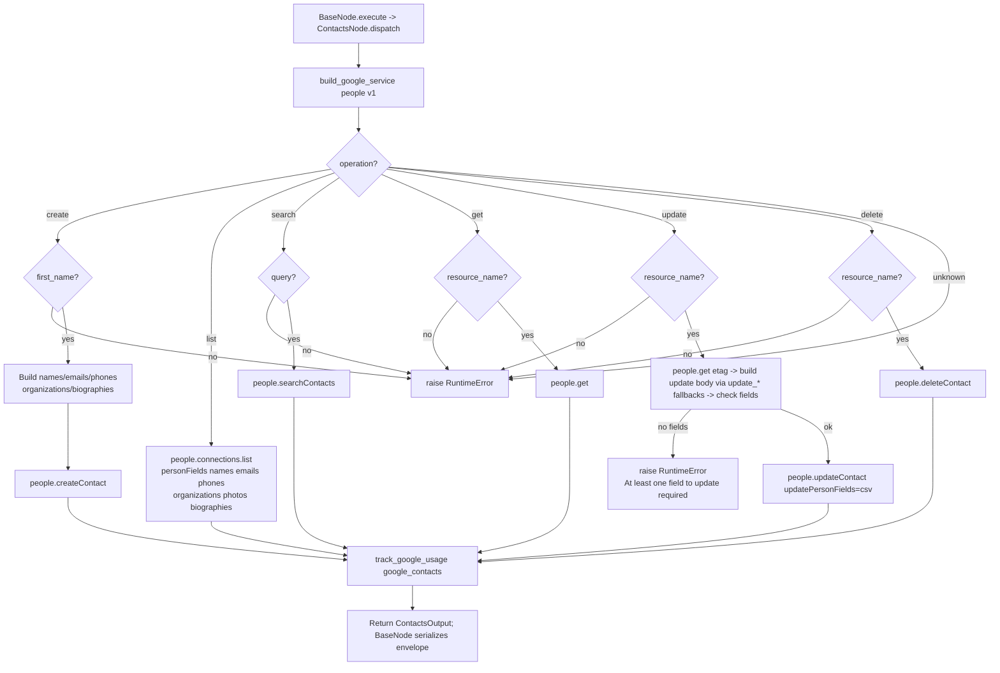

# Contacts (`googleContacts`)

| Field | Value |
|------|-------|
| **Category** | google_workspace / tool (dual-purpose) |
| **Backend handler** | [`server/nodes/google/contacts/__init__.py`](../../../server/nodes/google/contacts/__init__.py) (`ContactsNode`; dispatched via `BaseNode.execute()` -> single `@Operation("dispatch")` method that branches on `params.operation`) |
| **Tests** | [`server/tests/nodes/test_google_workspace.py`](../../../server/tests/nodes/test_google_workspace.py) |
| **Skill (if any)** | [`server/skills/productivity_agent/google-contacts-skill/SKILL.md`](../../../server/skills/productivity_agent/google-contacts-skill/SKILL.md) |
| **Dual-purpose tool** | yes - tool name `google_contacts` |

## Purpose

Consolidated Google Contacts node backed by the People API v1. One node, six
operations switched via the `operation` parameter. All payloads are flattened
through `_format_contact()` into a consistent simplified shape.

## Inputs (handles)

| Handle | Connection type | Required | Purpose |
|--------|-----------------|----------|---------|
| `input-main` | main | no | Template source for operation parameters |

## Parameters

Top-level dispatcher: `operation` (one of `create`, `list`, `search`, `get`, `update`, `delete`).

### `operation = create`

| Name | Type | Default | Required | Description |
|------|------|---------|----------|-------------|
| `first_name` | string | `""` | **yes** | Given name |
| `last_name` | string | `""` | no | Family name |
| `email` | string | `""` | no | - |
| `phone` | string | `""` | no | - |
| `company` | string | `""` | no | Organization name |
| `job_title` | string | `""` | no | - |
| `notes` | string | `""` | no | Stored as `biographies` with `contentType: TEXT_PLAIN` |

### `operation = list`

| Name | Type | Default | Description |
|------|------|---------|-------------|
| `page_size` | number | `100` | - |
| `page_token` | string | `""` | Pagination cursor |
| `sort_order` | options | `LAST_MODIFIED_DESCENDING` | also `LAST_MODIFIED_ASCENDING`, `FIRST_NAME_ASCENDING`, `LAST_NAME_ASCENDING` |

### `operation = search`

| Name | Type | Default | Required | Description |
|------|------|---------|----------|-------------|
| `query` | string | `""` | **yes** | Name/email/phone fragment |
| `page_size` | number | `30` | no | - |

### `operation = get`

| Name | Type | Default | Required | Description |
|------|------|---------|----------|-------------|
| `resource_name` | string | `""` | **yes** | e.g. `people/c12345678` |

### `operation = update`

| Name | Type | Default | Required | Description |
|------|------|---------|----------|-------------|
| `resource_name` | string | `""` | **yes** | - |
| `first_name` / `last_name` / `email` / `phone` / `company` / `job_title` | string | `""` | no | Any provided field triggers its person field group to be replaced. **At least one patch field required.** |

Also accepts the optional `update_first_name`, `update_last_name`,
`update_email`, `update_phone`, `update_company`, `update_job_title` fields. The
dispatch method reads `params.update_first_name or params.first_name` (etc.) as
fallback chains — it does NOT mutate the params dict.

### `operation = delete`

| Name | Type | Default | Required | Description |
|------|------|---------|----------|-------------|
| `resource_name` | string | `""` | **yes** | - |

## Outputs (handles)

The node declares only `input-main` and `output-main`. Tool mode
(`usable_as_tool = True`, tool name `google_contacts`) returns the same
`output-main` payload — there is no separate `output-tool` handle.

| Handle | Shape | Description |
|--------|-------|-------------|
| `output-main` | object | Formatted contact(s) `ContactsOutput` payload |

### Formatted contact shape (`_format_contact`)

```ts
{
  resource_name: string;
  display_name: string;
  given_name: string;
  family_name: string;
  email: string;       // primary
  phone: string;       // primary
  company: string;
  job_title: string;
  photo_url: string;
  emails: string[];
  phones: string[];
}
```

- `list`: `{contacts: [...], count, total_people, next_page_token}`
- `search`: `{contacts: [...], count}`
- `delete`: `{deleted: true, resource_name}`

## Logic Flow



## Decision Logic

- **Update fallback chains**: `params.update_first_name or params.first_name` (etc.) — no mutation of the params dict.
- **Update requires etag**: `update` does a `people.get` first to fetch the current etag, then submits `updateContact` with `updatePersonFields` set to the comma-joined list of person field groups touched. If no field group was modified, raises `RuntimeError("At least one field to update is required")`.
- **Search requires query**: empty query -> `RuntimeError` surfaced by `BaseNode.execute`.
- **Notes field on create**: non-empty `notes` writes a `biographies[0]` entry; empty notes skip the field. Cannot be cleared via update (not wired).
- **Format fallbacks**: `_format_contact` returns `""` for missing headers rather than `None`, so callers should not distinguish absence from empty.
- **`list` resource_name** is hard-coded to `people/me` - this node cannot list another user's contacts.

## Side Effects

- **Database writes**: `api_usage_metrics` row per call via `track_google_usage` -> `save_api_usage_metric` with `service='google_contacts'`. `list` DOES call `track_google_usage`.
- **Broadcasts**: none from the operation; executor emits standard `node_status`.
- **External API calls**: People API v1 - `people().createContact/get/updateContact/deleteContact/searchContacts`, `people().connections().list`.
- **File I/O**: none.
- **Subprocess**: none.

## External Dependencies

- **Credentials**: `GoogleCredential` -> OAuth tokens for provider `google`.
- **Services**: Google People API, `PricingService`, `Database`.
- **Python packages**: `google-api-python-client`.
- **Environment variables**: none.

## Edge cases & known limits

- Primary email/phone detection uses `metadata.primary` - contacts with no explicit primary fall back to the first entry in the list, which may not match Google UI's primary.
- Update replaces entire field groups: passing `email` wipes any additional emails on the contact. The handler does not merge.
- `search` returns at most `page_size` results; there is no pagination wrapper.
- `delete` does not prompt or verify - the deletion is immediate and final on Google's side.
- `update` requires at least one patch field; however the handler only treats first_name/last_name/email/phone/company/job_title. Notes and other fields cannot be updated here.

## Related

- **Skills using this as a tool**: [`contacts-skill/SKILL.md`](../../../server/skills/productivity_agent/google-contacts-skill/SKILL.md)
- **Companion nodes**: [`googleGmail`](./googleGmail.md), [`googleCalendar`](./googleCalendar.md), [`googleDrive`](./googleDrive.md), [`googleSheets`](./googleSheets.md), [`googleTasks`](./googleTasks.md)
- **Architecture docs**: `CLAUDE.md` -> "Google Workspace Nodes".
