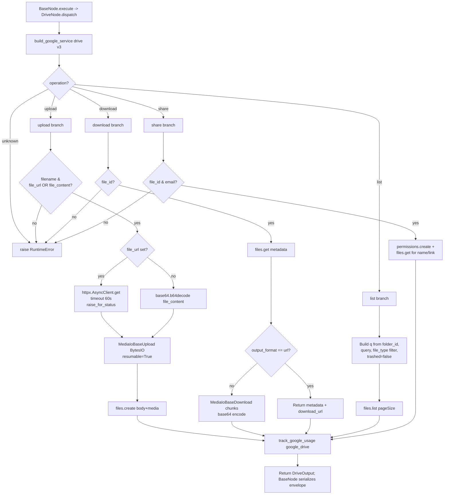

# Drive (`googleDrive`)

| Field | Value |
|------|-------|
| **Category** | google_workspace / tool (dual-purpose) |
| **Backend handler** | [`server/nodes/google/drive/__init__.py`](../../../server/nodes/google/drive/__init__.py) (`DriveNode`; dispatched via `BaseNode.execute()` -> single `@Operation("dispatch")` method that branches on `params.operation`) |
| **Tests** | [`server/tests/nodes/test_google_workspace.py`](../../../server/tests/nodes/test_google_workspace.py) |
| **Skill (if any)** | [`server/skills/productivity_agent/google-drive-skill/SKILL.md`](../../../server/skills/productivity_agent/google-drive-skill/SKILL.md) |
| **Dual-purpose tool** | yes - tool name `google_drive` |

## Purpose

Consolidated Google Drive node for file upload, download, listing, and
sharing. Uses Drive API v3. One node, four operations switched via the
`operation` parameter. Handles both remote URL sources (HTTP download then
re-upload) and base64-inlined content.

## Inputs (handles)

| Handle | Connection type | Required | Purpose |
|--------|-----------------|----------|---------|
| `input-main` | main | no | Template source for operation parameters |

## Parameters

Top-level dispatcher: `operation` (one of `upload`, `download`, `list`, `share`).

### `operation = upload`

| Name | Type | Default | Required | Description |
|------|------|---------|----------|-------------|
| `filename` | string | `""` | **yes** | Target filename in Drive |
| `file_url` | string | `""` | cond. | Source URL (either this or `file_content` required) |
| `file_content` | string | `""` | cond. | Base64-encoded file bytes |
| `folder_id` | string | `""` | no | Parent folder; empty = root |
| `mime_type` | string | `application/octet-stream` | no | MIME type |
| `description` | string | `""` | no | File description |

### `operation = download`

| Name | Type | Default | Required | Description |
|------|------|---------|----------|-------------|
| `file_id` | string | `""` | **yes** | Drive file ID |
| `output_format` | options | `base64` | no | `base64` returns bytes inline; `url` returns only metadata + download link |

### `operation = list`

| Name | Type | Default | Description |
|------|------|---------|-------------|
| `folder_id` | string | `""` | Parent folder filter |
| `query` | string | `""` | Drive query DSL |
| `max_results` | number | `20` | Clamped to `min(value, 1000)` |
| `file_types` | options | `all` | `all` / `folder` / `document` / `spreadsheet` / `image` |
| `order_by` | string | `modifiedTime desc` | - |

### `operation = share`

| Name | Type | Default | Required | Description |
|------|------|---------|----------|-------------|
| `file_id` | string | `""` | **yes** | File to share |
| `email` | string | `""` | **yes** | Grantee email |
| `role` | options | `reader` | no | `reader` / `writer` / `commenter` |
| `send_notification` | boolean | `true` | no | Send email notification |
| `message` | string | `""` | no | Custom notification message |

## Outputs (handles)

The node declares only `input-main` and `output-main`. Tool mode
(`usable_as_tool = True`, tool name `google_drive`) returns the same
`output-main` payload — there is no separate `output-tool` handle.

| Handle | Shape | Description |
|--------|-------|-------------|
| `output-main` | object | Operation-specific `DriveOutput` payload |

- `upload`: `{file_id, name, mime_type, size, web_link, download_link, created_time}`
- `download` (base64): `{file_id, name, mime_type, size, content_base64}`
- `download` (url): `{file_id, name, mime_type, size, download_url, web_link}`
- `list`: `{files: [...], count, next_page_token}`
- `share`: `{permission_id, file_id, file_name, shared_with, role, web_link}`

## Logic Flow

## Decision Logic

- **Source dispatch on upload**: `file_url` wins over `file_content`. When using `file_url` and `mime_type` is still the default, the HTTP `Content-Type` header (first token before `;`) is adopted.
- **Query composition on list**: `q` parts are joined with ` and `; always includes `trashed = false`. File type filters are hard-coded MIME mappings (Docs, Sheets, folders, `image/` prefix).
- **Download format**: `output_format=='url'` returns metadata only (`webContentLink`) and skips the `MediaIoBaseDownload` chunk loop.
- **Share**: permission created AND a second `files.get` is issued to fetch the human-readable name + link for the response. Two API calls per share.
- **HTTP fetch errors**: `httpx.get(...).raise_for_status()` is called - any HTTP error on the source URL propagates into the generic `except Exception` and becomes `error: <str>` in the envelope.

## Side Effects

- **Database writes**: `api_usage_metrics` row per call via `track_google_usage` -> `save_api_usage_metric` with `service='google_drive'`.
- **Broadcasts**: none from the operation; executor emits standard `node_status`.
- **External API calls**: Drive API v3 - `files().create/get/list`, `permissions().create`, `files().get_media`. Plus `httpx.AsyncClient.get(file_url)` on upload-from-URL.
- **File I/O**: in-memory `io.BytesIO` buffers only; no disk writes.
- **Subprocess**: none.

## External Dependencies

- **Credentials**: `GoogleCredential` -> OAuth tokens for provider `google`.
- **Services**: Google Drive API, `PricingService`, `Database`.
- **Python packages**: `google-api-python-client`, `httpx`.
- **Environment variables**: none.

## Edge cases & known limits

- `max_results` clamped to 1000 silently.
- Upload downloads `file_url` fully into memory before uploading - not streamed. Large files will OOM the worker.
- Download with `output_format=url` returns `webContentLink` which requires the caller to authenticate independently; it is NOT a public link.
- File type filter is a closed list - `file_types='video'` for example is silently ignored (falls through).
- `share` permission role `owner` is not accepted (People API requires ownership transfer semantics).
- No ETag or If-Match header on any write - concurrent edits are last-write-wins.

## Related

- **Skills using this as a tool**: [`drive-skill/SKILL.md`](../../../server/skills/productivity_agent/google-drive-skill/SKILL.md)
- **Companion nodes**: [`googleGmail`](./googleGmail.md), [`googleCalendar`](./googleCalendar.md), [`googleSheets`](./googleSheets.md), [`googleTasks`](./googleTasks.md), [`googleContacts`](./googleContacts.md)
- **Architecture docs**: `CLAUDE.md` -> "Google Workspace Nodes".
