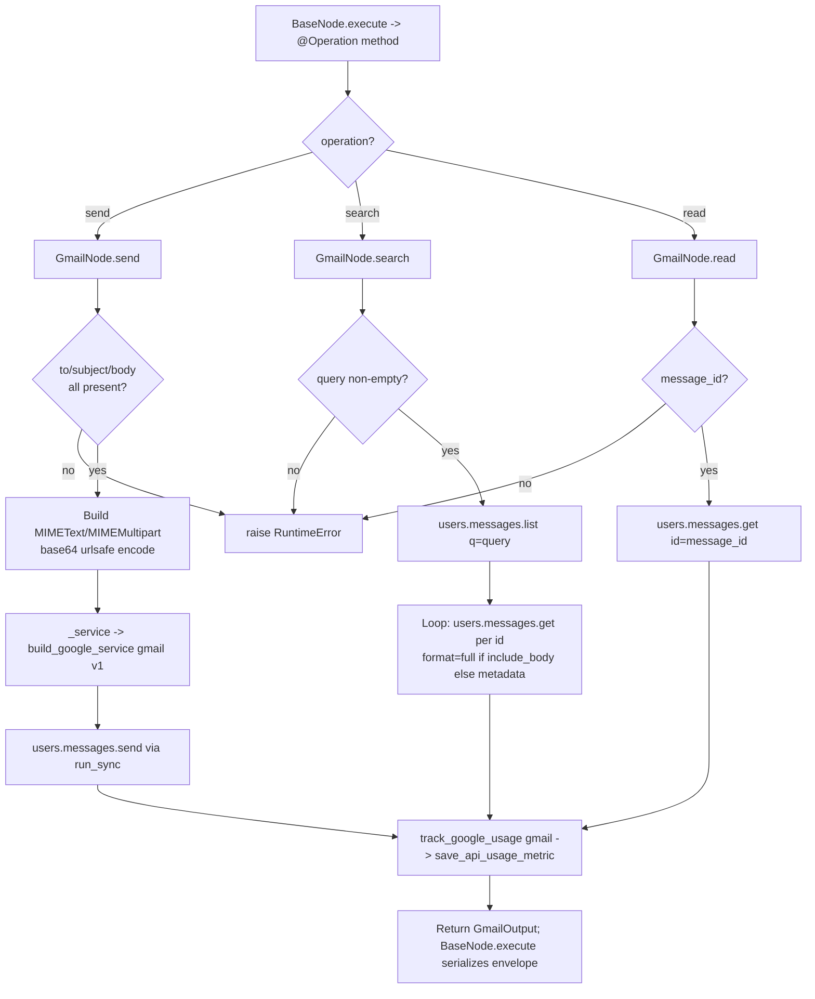

# Gmail (`googleGmail`)

| Field | Value |
|------|-------|
| **Category** | google_workspace / tool (dual-purpose) |
| **Backend handler** | [`server/nodes/google/gmail/__init__.py`](../../../server/nodes/google/gmail/__init__.py) (`GmailNode`; dispatched via `BaseNode.execute()` -> per-operation `@Operation` methods `send` / `search` / `read`) |
| **Tests** | [`server/tests/nodes/test_google_workspace.py`](../../../server/tests/nodes/test_google_workspace.py) |
| **Skill (if any)** | [`server/skills/productivity_agent/google-gmail-skill/SKILL.md`](../../../server/skills/productivity_agent/google-gmail-skill/SKILL.md) |
| **Dual-purpose tool** | yes - tool name `google_gmail` |

## Purpose

Consolidated Gmail node covering send, search, and read operations. Uses the
Google Gmail API v1 via the official `google-api-python-client`. One node, three
operations, each its own `@Operation` method selected by the `operation` Param.
Authenticates through `GoogleCredential.build_credentials()` (via
`build_google_service`) which reads OAuth tokens stored under provider `google`.

## Inputs (handles)

| Handle | Connection type | Required | Purpose |
|--------|-----------------|----------|---------|
| `input-main` | main | no | Template source for operation parameters |

## Parameters

Top-level dispatcher: `operation` (one of `send`, `search`, `read`).

### `operation = send`

| Name | Type | Default | Required | Description |
|------|------|---------|----------|-------------|
| `to` | string | `""` | **yes** | Recipient email(s), comma-separated |
| `cc` | string | `""` | no | CC recipients |
| `bcc` | string | `""` | no | BCC recipients |
| `subject` | string | `""` | **yes** | Email subject |
| `body` | string | `""` | **yes** | Email body content |
| `body_type` | options | `text` | no | `text` or `html` |

### `operation = search`

| Name | Type | Default | Required | Description |
|------|------|---------|----------|-------------|
| `query` | string | `""` | **yes** | Gmail search query (same syntax as Gmail web) |
| `max_results` | number | `10` | no | Clamped to `min(value, 100)` |
| `include_body` | boolean | `false` | no | If true, fetches `format=full` per message |

### `operation = read`

| Name | Type | Default | Required | Description |
|------|------|---------|----------|-------------|
| `message_id` | string | `""` | **yes** | Gmail message ID |
| `format` | options | `full` | no | `full` / `minimal` / `raw` / `metadata` |

Params model: `GmailParams` (`model_config extra="ignore"`). All non-`operation`
fields carry `displayOptions.show` keyed on the active operation. There is no
`account_mode` / `customer_id` field — credential scoping is resolved inside
`GoogleCredential.build_credentials`.

## Outputs (handles)

The node declares only `input-main` and `output-main`. When wired to an AI
agent's `input-tools` handle (`usable_as_tool = True`, tool name `google_gmail`)
the same `output-main` payload is returned to the LLM — there is no separate
`output-tool` handle.

| Handle | Shape | Description |
|--------|-------|-------------|
| `output-main` | object | Operation-specific `GmailOutput` payload (see below) |

### Output payloads (`GmailOutput`, `model_config extra="allow"`)

- `send`: `{operation: "send", message_id, thread_id, label_ids, to, subject}`
- `search`: `{operation: "search", messages: [...], count, query, result_size_estimate}`
  where each message comes from `format_message`
- `read`: `{operation: "read", ...format_message(result)}` (the `size_estimate`
  key is stripped out)

## Logic Flow

## Decision Logic

- **Operation dispatch**: the `@Operation`-decorated method (`send` / `search` / `read`) is selected by the framework from `params.operation`. Missing-field validation in each method raises `RuntimeError` (surfaced by `BaseNode.execute` as an error envelope).
- **Credential resolution**: `build_google_service` -> `GoogleCredential.build_credentials(params, ctx.raw)` reads stored OAuth tokens for provider `google` (owner / customer scoping handled inside the credential class). The blocking `build(...)` runs in an executor.
- **Search body fetching**: `include_body=False` uses `format=metadata` with a fixed header list (`From`, `To`, `Subject`, `Date`); `True` uses `format=full`. `format_message` (in `_gmail.py`) extracts the body.
- **Send body type**: `body_type=='html'` -> `MIMEMultipart('alternative')` with an HTML part; otherwise `MIMEText(body, 'plain')`. Message is `urlsafe_b64encode`d to base64.
- **Error paths**: each method raises `RuntimeError` for missing required fields; `BaseNode.execute()` wraps the body in `log_context` + a span and converts exceptions into the standard error envelope.

## Side Effects

- **Database writes**: one row per API call in `api_usage_metrics` via `track_google_usage` (`_base.py`) -> `database.save_api_usage_metric` with `service='gmail'`, `endpoint=<action>`, `resource_count`, `cost` (always 0 for Google APIs).
- **Broadcasts**: none from the operation itself; `BaseNode.execute()` / the executor emit standard `node_status`.
- **External API calls**: Gmail API v1 via `googleapiclient.discovery.build("gmail", "v1", creds)` - `users().messages().send/list/get`. Token refresh hits `https://oauth2.googleapis.com/token`.
- **File I/O**: none.
- **Subprocess**: none.

## External Dependencies

- **Credentials**: `GoogleCredential` -> OAuth tokens for provider `google` (`access_token` / `refresh_token`); `google_client_id` / `google_client_secret` via the API-key store.
- **Services**: Google Gmail API, `PricingService`, `Database`.
- **Python packages**: `google-auth`, `google-auth-oauthlib`, `google-api-python-client`.
- **Environment variables**: none (OAuth redirect URI derived from request at auth time).

## Edge cases & known limits

- `max_results` is silently clamped to 100 (hard ceiling).
- Search fetches every matching message individually in sequence - with `max_results=100` this is 100 round trips. No batching.
- `format_message` (in `_gmail.py`) returns empty strings for missing headers rather than omitting them; callers should not treat `""` as "header was present and empty".
- `body` is returned as a UTF-8 decoded string with `errors='ignore'` - binary parts may produce partial output without raising.

## Related

- **Skills using this as a tool**: [`gmail-skill/SKILL.md`](../../../server/skills/productivity_agent/google-gmail-skill/SKILL.md)
- **Companion nodes**: [`googleGmailReceive`](./googleGmailReceive.md), [`googleCalendar`](./googleCalendar.md), [`googleDrive`](./googleDrive.md), [`googleSheets`](./googleSheets.md), [`googleTasks`](./googleTasks.md), [`googleContacts`](./googleContacts.md)
- **Architecture docs**: `CLAUDE.md` -> "Google Workspace Nodes" and "Encrypted Credentials System".
