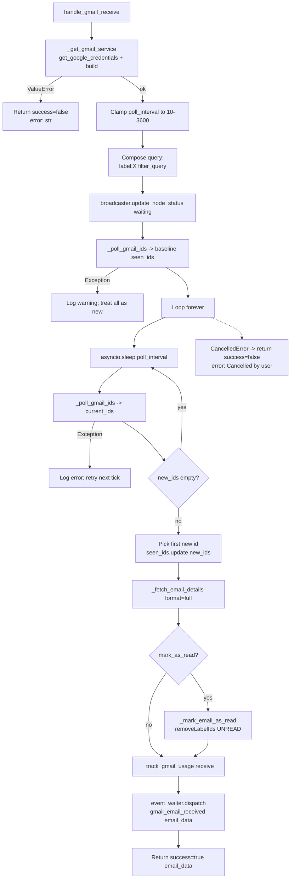

# Gmail Receive (`googleGmailReceive`)

| Field | Value |
|------|-------|
| **Category** | google_workspace / trigger (polling) |
| **Backend handler** | [`server/nodes/google/gmail_receive/__init__.py`](../../../server/nodes/google/gmail_receive/__init__.py) (`GmailReceiveNode`, a `PollingTriggerNode`; inline-Run path uses the `execute()` override, deployment path uses the `setup_service` / `fetch_ids` / `fetch_detail` / `post_emit` hooks driven by `PollingTriggerWorkflow`) |
| **Tests** | [`server/tests/nodes/test_google_workspace.py`](../../../server/tests/nodes/test_google_workspace.py) |
| **Skill (if any)** | none |
| **Dual-purpose tool** | no |

## Purpose

Polling-based trigger that fires when a new Gmail message matching a filter
query arrives. Unlike push-based triggers (webhook, WhatsApp, Telegram) Gmail
has no official push without extra Pub/Sub setup, so this node polls
`users.messages.list` at a configurable interval, diffs IDs against a
baseline, fetches full details for new messages, and optionally marks them
as read.

`event_type = "gmail_email_received"`. In deployment (canary) mode the
`PollingTriggerWorkflow` owns event fan-out directly: it calls the per-cycle
activity built from `PollingTriggerNode.as_poll_activity()` and spawns the
child `MachinaWorkflow` per new email — there is no `event_waiter.dispatch`
step. The `_events.py` `gmail_message_received` CloudEvents factory is kept for
parity / future ad-hoc emits; the legacy `dispatch_gmail_received` shim was
removed in Wave 13.

## Inputs (handles)

| Handle | Connection type | Required | Purpose |
|--------|-----------------|----------|---------|
| `input-main` | main | no | Not read - this is a trigger |

## Parameters

| Name | Type | Default | Required | Description |
|------|------|---------|----------|-------------|
| `filter_query` | string | `is:unread` | no | Gmail search query (same syntax as Gmail web) |
| `label_filter` | string | `INBOX` | no | Label name or `all`. When set and not `all`, prepended to query as `label:<name>` |
| `mark_as_read` | boolean | `false` | no | If true, remove `UNREAD` label from matched message after fetching |
| `poll_interval` | number | `60` | no | Seconds between polls; clamped to `[10, 3600]` |
| `account_mode` | options | `owner` | no | Owner or customer OAuth store |
| `customer_id` | string | `""` | cond. | Required when `account_mode == 'customer'` |

## Outputs (handles)

| Handle | Shape | Description |
|--------|-------|-------------|
| `output-main` | object | Formatted message envelope (the new email) |

### Output payload

```ts
{
  message_id: string;
  thread_id: string;
  from: string;
  to: string;
  cc: string;
  subject: string;
  date: string;
  snippet: string;
  body: string;        // included because format='full'
  labels: string[];
  size_estimate: number;
  attachments?: Array<{ filename, mime_type, size, attachment_id }>;
}
```

## Logic Flow



## Decision Logic

- **Query composition**: `label_filter` is only prepended when set AND not equal to the literal `all`. There is no validation that the label exists.
- **Baseline on startup**: the first `_poll_gmail_ids` call seeds `seen_ids`. If it raises, the set stays empty and the very next poll will treat the entire history as new - the handler logs this as a warning but does not short-circuit.
- **Per-tick error recovery**: the inner `except Exception` around `_poll_gmail_ids` just logs; the loop keeps running. The outer `except Exception` catches anything leaking out of `_get_gmail_service` / the `while True` and returns an error envelope.
- **Cancellation**: `asyncio.CancelledError` is caught at both levels. The inner handler re-raises; the outer returns `{success: false, error: "Cancelled by user"}`.
- **Single-email-per-trigger**: only the first element of `new_ids` (arbitrary `set` iteration order) is processed per invocation - the remaining new IDs are marked seen but not returned. In deployment mode, subsequent events arriving on the same cycle are lost until the next poll.

## Side Effects

- **Database writes**: one `api_usage_metrics` row via `save_api_usage_metric` per email processed (operation `receive`).
- **Broadcasts**: initial `update_node_status(node_id, "waiting", {...}, workflow_id=...)` via `get_status_broadcaster()`. Event dispatch via `event_waiter.dispatch('gmail_email_received', email_data)`.
- **External API calls**: repeated `users().messages().list(q=query, maxResults=20)`, one `users().messages().get(format=full)` per new email, optional `users().messages().modify(removeLabelIds=['UNREAD'])`. Token refresh path as per shared helper.
- **File I/O**: none.
- **Subprocess**: none.

## External Dependencies

- **Credentials**: OAuth via `auth_service.get_oauth_tokens("google")`.
- **Services**: Gmail API v1, `StatusBroadcaster`, `event_waiter`, `PricingService`, `Database`.
- **Python packages**: `google-auth`, `google-api-python-client`, `asyncio`.
- **Environment variables**: none.

## Edge cases & known limits

- `set(new_ids)` iteration order is non-deterministic - if two emails arrive in the same tick, the handler picks one arbitrarily. The others are marked seen and never surfaced by this trigger node (deployment listeners may still see the dispatched event, but only one dispatch is emitted).
- Baseline is in-memory only - restarting the handler re-walks the latest 20 unread messages as the baseline, so messages that arrived during downtime will not fire this trigger.
- `mark_as_read` failures are logged and swallowed.
- `poll_interval` is clamped to `[10, 3600]` - values outside this range are silently coerced.
- The `maxResults=20` in `_poll_gmail_ids` is hard-coded. Very busy inboxes may see the baseline constantly rolling forward without triggering if more than 20 unread emails arrive between polls (an email that falls off the first page is never seen).
- Deployment-mode polling (via `POLLING_TRIGGER_TYPES` in `constants.py`) uses a separate coroutine; this handler is the single-run path.

## Related

- **Companion nodes**: [`googleGmail`](./googleGmail.md) (send/search/read operations)
- **Architecture docs**: `CLAUDE.md` -> "Polling Triggers (Gmail, Twitter)" and "Event-Driven Trigger Node System".
