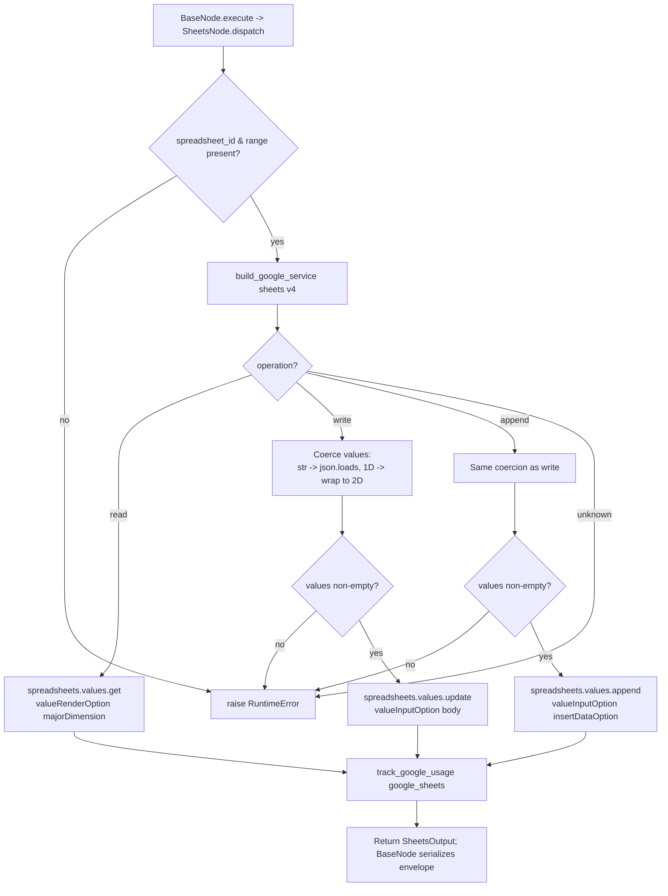

# Sheets (`googleSheets`)

| Field | Value |
|------|-------|
| **Category** | google_workspace / tool (dual-purpose) |
| **Backend handler** | [`server/nodes/google/sheets/__init__.py`](../../../server/nodes/google/sheets/__init__.py) (`SheetsNode`; dispatched via `BaseNode.execute()` -> single `@Operation("dispatch")` method that branches on `params.operation`) |
| **Tests** | [`server/tests/nodes/test_google_workspace.py`](../../../server/tests/nodes/test_google_workspace.py) |
| **Skill (if any)** | [`server/skills/productivity_agent/google-sheets-skill/SKILL.md`](../../../server/skills/productivity_agent/google-sheets-skill/SKILL.md) |
| **Dual-purpose tool** | yes - tool name `google_sheets` |

## Purpose

Consolidated Google Sheets node for reading, writing, and appending cell
values. Uses Sheets API v4 (`spreadsheets.values` collection). One node,
three operations switched via the `operation` parameter.

## Inputs (handles)

| Handle | Connection type | Required | Purpose |
|--------|-----------------|----------|---------|
| `input-main` | main | no | Template source for operation parameters |

## Parameters

Top-level dispatcher: `operation` (one of `read`, `write`, `append`).

### `operation = read`

| Name | Type | Default | Required | Description |
|------|------|---------|----------|-------------|
| `spreadsheet_id` | string | `""` | **yes** | Sheet ID (from URL) |
| `range` | string | `A1:Z1000` | **yes** | A1 notation, e.g. `Sheet1!A1:D10` |
| `value_render_option` | options | `FORMATTED_VALUE` | no | `FORMATTED_VALUE` / `UNFORMATTED_VALUE` / `FORMULA` |
| `major_dimension` | options | `ROWS` | no | `ROWS` / `COLUMNS` |

### `operation = write`

| Name | Type | Default | Required | Description |
|------|------|---------|----------|-------------|
| `spreadsheet_id` | string | `""` | **yes** | - |
| `range` | string | `A1:Z1000` | **yes** | e.g. `Sheet1!A1` |
| `values` | array/string | `[]` | **yes** | 2D array, or JSON string that parses to 2D array, or 1D auto-wrapped to 2D |
| `value_input_option` | options | `USER_ENTERED` | no | `RAW` or `USER_ENTERED` |

### `operation = append`

| Name | Type | Default | Required | Description |
|------|------|---------|----------|-------------|
| `spreadsheet_id` | string | `""` | **yes** | - |
| `range` | string | `A1:Z1000` | **yes** | e.g. `Sheet1!A:D` |
| `values` | array/string | `[]` | **yes** | Same coercion as write |
| `value_input_option` | options | `USER_ENTERED` | no | - |
| `insert_data_option` | options | `INSERT_ROWS` | no | `INSERT_ROWS` / `OVERWRITE` |

## Outputs (handles)

The node declares only `input-main` and `output-main`. Tool mode
(`usable_as_tool = True`, tool name `google_sheets`) returns the same
`output-main` payload — there is no separate `output-tool` handle.

| Handle | Shape | Description |
|--------|-------|-------------|
| `output-main` | object | Operation-specific `SheetsOutput` payload |

- `read`: `{values: [[...],...], range, rows, columns, major_dimension}`
- `write` / `append`: `{updated_range, updated_rows, updated_columns, updated_cells, table_range?}`

## Logic Flow

## Decision Logic

- **Values coercion**: if `values` is a `str`, parsed via `json.loads`. If the (possibly parsed) sequence's first element is not a list, the whole thing is wrapped into `[values]` to guarantee 2D.
- **Required fields**: `spreadsheet_id` and `range` are validated once at the top of `dispatch` (before the operation branch); write/append additionally require a non-empty `values`.
- **Usage tracking count**: read reports `len(values)` rows; write reports `updatedCells`; append reports `updates.updatedCells`. If any field is missing in the response, usage count is 0 (no exception).
- **JSON parse errors** on `values` propagate into the outer `except Exception` and become `error: "<ValueError str>"`.

## Side Effects

- **Database writes**: `api_usage_metrics` row per call via `track_google_usage` -> `save_api_usage_metric` with `service='google_sheets'`.
- **Broadcasts**: none from the operation; executor emits standard `node_status`.
- **External API calls**: Sheets API v4 - `spreadsheets().values().get/update/append`.
- **File I/O**: none.
- **Subprocess**: none.

## External Dependencies

- **Credentials**: `GoogleCredential` -> OAuth tokens for provider `google`.
- **Services**: Google Sheets API, `PricingService`, `Database`.
- **Python packages**: `google-api-python-client`.
- **Environment variables**: none.

## Edge cases & known limits

- `value_input_option='USER_ENTERED'` means strings like `=SUM(A1:A5)` are evaluated as formulas. Use `RAW` to write literal text that may otherwise be coerced.
- No row-count validation - writing a 10,000-row block will attempt it in a single call; Sheets API rejects bodies over the limit with a 413 surfaced as `HttpError`.
- `append` with `insert_data_option='OVERWRITE'` can clobber existing rows below the header; callers commonly want `INSERT_ROWS`.
- `range` for write is a start cell (e.g. `Sheet1!A1`); the API automatically expands to fit `values`. A too-small range is silently widened.
- `FORMULA` rendering returns formulas as-is for read; `UNFORMATTED_VALUE` returns native types (int/float/bool), `FORMATTED_VALUE` returns the user-visible string.

## Related

- **Skills using this as a tool**: [`sheets-skill/SKILL.md`](../../../server/skills/productivity_agent/google-sheets-skill/SKILL.md)
- **Companion nodes**: [`googleGmail`](./googleGmail.md), [`googleCalendar`](./googleCalendar.md), [`googleDrive`](./googleDrive.md), [`googleTasks`](./googleTasks.md), [`googleContacts`](./googleContacts.md)
- **Architecture docs**: `CLAUDE.md` -> "Google Workspace Nodes".
