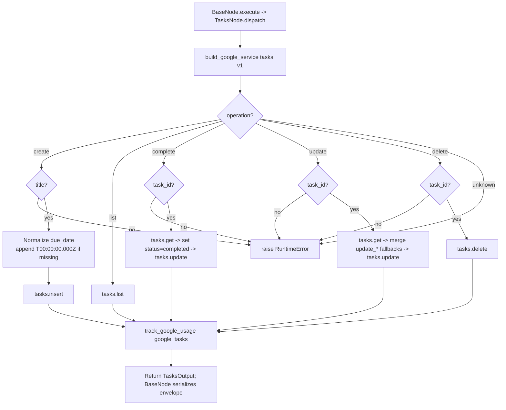

# Tasks (`googleTasks`)

| Field | Value |
|------|-------|
| **Category** | google_workspace / tool (dual-purpose) |
| **Backend handler** | [`server/nodes/google/tasks/__init__.py`](../../../server/nodes/google/tasks/__init__.py) (`TasksNode`; dispatched via `BaseNode.execute()` -> single `@Operation("dispatch")` method that branches on `params.operation`) |
| **Tests** | [`server/tests/nodes/test_google_workspace.py`](../../../server/tests/nodes/test_google_workspace.py) |
| **Skill (if any)** | [`server/skills/productivity_agent/google-tasks-skill/SKILL.md`](../../../server/skills/productivity_agent/google-tasks-skill/SKILL.md) |
| **Dual-purpose tool** | yes - tool name `google_tasks` |

## Purpose

Consolidated Google Tasks node for managing personal to-do items. Uses Google
Tasks API v1 (`tasklists` + `tasks` collections). One node, five operations
switched via the `operation` parameter.

## Inputs (handles)

| Handle | Connection type | Required | Purpose |
|--------|-----------------|----------|---------|
| `input-main` | main | no | Template source for operation parameters |

## Parameters

Top-level dispatcher: `operation` (one of `create`, `list`, `complete`, `update`, `delete`).

### `operation = create`

| Name | Type | Default | Required | Description |
|------|------|---------|----------|-------------|
| `title` | string | `null` | **yes** | Task title |
| `notes` | string | `null` | no | Task description |
| `due_date` | string | `null` | no | RFC 3339; date-only is upgraded to `T00:00:00.000Z` |
| `status` | string | `null` | no | Task status (Param exists; not written by the `create` branch) |
| `tasklist_id` | string | `@default` | no | Which tasklist (`loadOptionsMethod: googleTasklists`) |

### `operation = list`

| Name | Type | Default | Description |
|------|------|---------|-------------|
| `tasklist_id` | string | `@default` | - |
| `show_completed` | boolean | `false` | - |
| `show_hidden` | boolean | `false` | - |
| `max_results` | number | `100` | No clamp |

### `operation = complete`

| Name | Type | Default | Required | Description |
|------|------|---------|----------|-------------|
| `task_id` | string | `""` | **yes** | - |
| `tasklist_id` | string | `@default` | no | - |

### `operation = update`

| Name | Type | Default | Required | Description |
|------|------|---------|----------|-------------|
| `task_id` | string | `""` | **yes** | - |
| `tasklist_id` | string | `@default` | no | - |
| `title` / `notes` / `due_date` / `status` | string | `""` | no | Patch fields |

Also accepts the optional `update_title`, `update_notes`, `update_due_date`,
`update_status` fields. The dispatch method reads `params.update_title or
params.title` (etc.) as fallback chains — it does NOT mutate the params dict.

### `operation = delete`

| Name | Type | Default | Required | Description |
|------|------|---------|----------|-------------|
| `task_id` | string | `""` | **yes** | - |
| `tasklist_id` | string | `@default` | no | - |

## Outputs (handles)

The node declares only `input-main` and `output-main`. Tool mode
(`usable_as_tool = True`, tool name `google_tasks`) returns the same
`output-main` payload — there is no separate `output-tool` handle.

| Handle | Shape | Description |
|--------|-------|-------------|
| `output-main` | object | Operation-specific `TasksOutput` payload |

- `create` / `complete` / `update`: `{task_id, title, notes?, due, status, completed?, self_link?}`
- `list`: `{tasks: [{task_id, title, notes, due, status, completed, position}], count}`
- `delete`: `{deleted: true, task_id}`

## Logic Flow

## Decision Logic

- **Operation branch**: one `@Operation("dispatch")` method branches on `params.operation`; `complete`/`update`/`delete` share a `task_id`-required block.
- **Update fallback chains**: `params.update_title or params.title` (etc.) — no mutation of the params dict; either field works.
- **Due-date upgrade**: any `due_date` that lacks a `T` gets `T00:00:00.000Z` appended. There is no strict ISO validation otherwise.
- **Complete** is a convenience op - it does a read-modify-write (`tasks.get` then `tasks.update`) with `status='completed'`. Two API calls per completion.
- **Update** merges only truthy fields (skips empty strings). Callers cannot clear `notes` via the update path.
- **`tasks.list`** does NOT reject `max_results > 100` - the API itself caps silently.

## Side Effects

- **Database writes**: `api_usage_metrics` row per API call via `track_google_usage` -> `save_api_usage_metric` with `service='google_tasks'`. The `list` branch DOES call `track_google_usage` (`resource_count = len(tasks)`).
- **Broadcasts**: none from the operation; executor emits standard `node_status`.
- **External API calls**: Tasks API v1 - `tasks().insert/list/get/update/delete`.
- **File I/O**: none.
- **Subprocess**: none.

## External Dependencies

- **Credentials**: `GoogleCredential` -> OAuth tokens for provider `google`.
- **Services**: Google Tasks API, `PricingService`, `Database`.
- **Python packages**: `google-api-python-client`.
- **Environment variables**: none.

## Edge cases & known limits

- Update cannot clear a field - empty strings are filtered out by truthiness. To clear notes or title you must bypass this node.
- Complete is non-idempotent on the server side: re-completing a completed task overwrites the `completed` timestamp.
- `tasklist_id='@default'` only resolves for authenticated users who have created at least one list; freshly authenticated users may get a 404 until Google Tasks provisions their default list.

## Related

- **Skills using this as a tool**: [`tasks-skill/SKILL.md`](../../../server/skills/productivity_agent/google-tasks-skill/SKILL.md)
- **Companion nodes**: [`googleGmail`](./googleGmail.md), [`googleCalendar`](./googleCalendar.md), [`googleDrive`](./googleDrive.md), [`googleSheets`](./googleSheets.md), [`googleContacts`](./googleContacts.md)
- **Architecture docs**: `CLAUDE.md` -> "Google Workspace Nodes".
