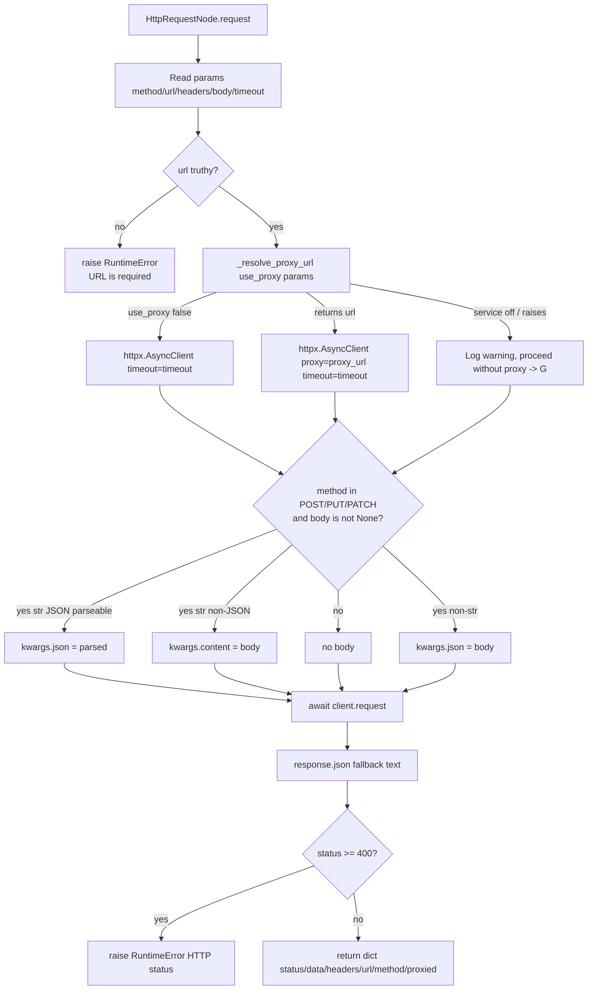

# HTTP Request (`httpRequest`)

| Field | Value |
|------|-------|
| **Category** | utility / tool (dual-purpose) |
| **Backend handler** | [`server/nodes/utility/http_request/__init__.py`](../../../server/nodes/utility/http_request/__init__.py) — `HttpRequestNode.request` (dispatched via `BaseNode.execute()` + `@Operation("request")`; the legacy `handlers/http.py` was deleted in Wave 11.D.3) |
| **Tests** | [`server/tests/nodes/test_http_proxy.py`](../../../server/tests/nodes/test_http_proxy.py) |
| **Skill (if any)** | [`server/skills/web_agent/http-request-skill/SKILL.md`](../../../server/skills/web_agent/http-request-skill/SKILL.md) |
| **Dual-purpose tool** | yes - tool name `http_request` (`usable_as_tool = True`) |

## Purpose

General-purpose outbound HTTP client used in workflows to call third-party
REST APIs. Supports all common methods, custom headers, JSON/text bodies,
and a transparent `useProxy` flag that routes the request through the
configured residential proxy provider via `ProxyService`.

## Inputs (handles)

| Handle | Connection type | Required | Purpose |
|--------|-----------------|----------|---------|
| `input-main` | main | no | Upstream trigger; parameters template-resolved before the handler runs |

## Parameters

| Name | Type | Default | Required | displayOptions.show | Description |
|------|------|---------|----------|---------------------|-------------|
| `method` | options | `GET` | no | - | One of `GET` / `POST` / `PUT` / `DELETE` / `PATCH` |
| `url` | string | `""` | **yes** | - | Target URL; empty value raises `RuntimeError('URL is required')` |
| `headers` | object (`Dict[str,str]`) | `{}` | no | - | Request headers passed straight to httpx |
| `body` | `Optional[Any]` | `null` | no | `method in [POST, PUT, PATCH]` | JSON object or raw string; ignored for GET/DELETE. String parsed as JSON when possible, else sent as raw content |
| `timeout` | number | `30` | no | - | Seconds (1-600); coerced via `float(...)` |
| `use_proxy` | boolean | `false` | no | - | Route through `ProxyService.get_proxy_url` |
| `proxy_provider` | string | `auto` | no | `use_proxy=true` | Specific provider name (`auto` selects by health score) |
| `proxy_country` | string | `""` | no | `use_proxy=true` | ISO country code for geo-targeting |
| `session_type` | options | `rotating` | no | `use_proxy=true` | `rotating` or `sticky` |
| `sticky_duration` | number | `600` | no | `use_proxy=true` and `session_type=sticky` | Sticky session duration in seconds |

## Outputs (handles)

| Handle | Shape | Description |
|--------|-------|-------------|
| `output-main` | object | Response envelope (see below) |

### Output payload

```ts
{
  status: number;              // HTTP status code
  data: any;                   // Parsed JSON body if possible, else text string
  headers: Record<string, string>;
  url: string;                 // Final URL after redirects (httpx default follows them)
  method: string;              // Echo of request method
  proxied: boolean;            // true iff a proxy URL was applied
}
```

The `request` op returns this dict directly; `BaseNode.execute()` wraps it in the standard success envelope. A status `>= 400` raises `RuntimeError(f"HTTP {status}: ...")` instead of returning, so it lands in the error envelope. The declared `HttpRequestOutput` model only pins `status` / `headers` / `body` (`extra="allow"`), so the extra `data` / `url` / `method` / `proxied` keys pass through unvalidated.

## Logic Flow



## Decision Logic

- **Validation**: `url` empty -> raises `RuntimeError('URL is required')` (surfaced via the error envelope by `BaseNode.execute()`).
- **Branches**:
  - `use_proxy=true` -> `_resolve_proxy_url` attempts a lookup; proxy errors are swallowed and the request falls back to a direct call.
  - Body handling depends on `method` and the type / JSON-parseability of `body` (str-JSON -> `json`, str-non-JSON -> `content`, non-str -> `json`).
- **Fallbacks**:
  - Proxy service disabled / not enabled / `get_proxy_url` raises -> proceed without proxy (returns `None`).
  - Non-JSON response body -> plain `text` string in `data`.
- **Error paths**:
  - Status `>= 400` -> `raise RuntimeError(f"HTTP {status}: {body!r}")`.
  - Any httpx exception (timeout, connection error, etc.) propagates uncaught; `BaseNode.execute()` produces the error envelope with the traceback. There is no timeout special-casing.

## Side Effects

- **Database writes**: none.
- **Broadcasts**: none (only `logger.info` / `logger.error`).
- **External API calls**: `client.request(method, url, ...)` to whatever URL the user supplied; optionally routed through a proxy URL provided by `ProxyService`.
- **File I/O**: none.
- **Subprocess**: none.

## External Dependencies

- **Credentials**: none directly; `ProxyService` may load proxy credentials via the auth service when `useProxy=true`.
- **Services**: `ProxyService` (optional, only when `useProxy=true`).
- **Python packages**: `httpx`.
- **Environment variables**: none (timeout comes from node params).

## Edge cases & known limits

- Proxy lookup errors are **swallowed** (`_resolve_proxy_url` logs a warning and returns `None`); the request then proceeds directly, silently losing the proxy. Downstream nodes can detect this by checking `result.proxied`.
- A `4xx`/`5xx` response raises `RuntimeError` rather than returning the body, so the error envelope carries the status; `3xx` are followed by httpx default and only surface if final status is `>= 400`.
- No caching, no retry (retry / failover is only implemented in `proxyRequest`).
- `response.url` (final URL) is stringified; for non-proxied requests with redirects disabled this equals the request URL.

## Related

- **Skills using this as a tool**: [`http-request-skill/SKILL.md`](../../../server/skills/web_agent/http-request-skill/SKILL.md)
- **Companion nodes**: [`proxyRequest`](./proxyRequest.md), [`proxyConfig`](./proxyConfig.md), [`proxyStatus`](./proxyStatus.md)
- **Architecture docs**: [Proxy Service](../../proxy_service.md)
