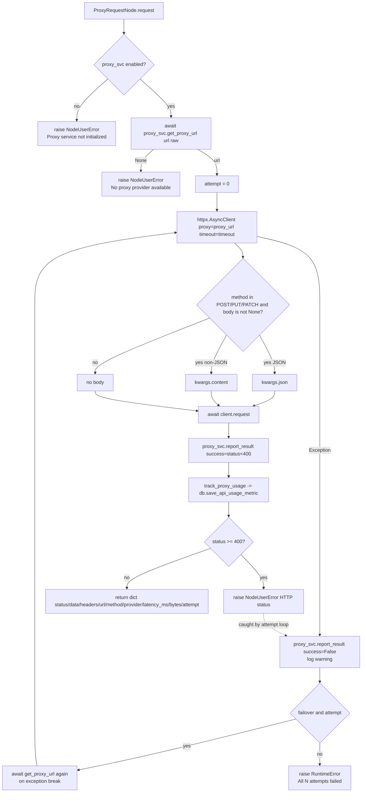

# Proxy Request (`proxyRequest`)

| Field | Value |
|------|-------|
| **Category** | proxy / tool (dual-purpose) |
| **Backend handler** | [`server/nodes/proxy/proxy_request/__init__.py`](../../../server/nodes/proxy/proxy_request/__init__.py) — `ProxyRequestNode.request` (dispatched via `BaseNode.execute()` + `@Operation("request")`; the legacy `handlers/proxy.py` was deleted in Wave 11.D.3) |
| **Tests** | [`server/tests/nodes/test_http_proxy.py`](../../../server/tests/nodes/test_http_proxy.py) |
| **Skill (if any)** | [`server/skills/web_agent/http-request-skill/SKILL.md`](../../../server/skills/web_agent/http-request-skill/SKILL.md) (covers use_proxy + proxyRequest) |
| **Dual-purpose tool** | yes - tool name `proxy_request` (`usable_as_tool = True`) |

## Purpose

Proxy-aware HTTP client with explicit retry / failover and per-attempt health
reporting. Unlike `httpRequest` (where `useProxy` is an optional flag),
`proxyRequest` is unconditional: it requires `ProxyService` to be enabled and
short-circuits if no provider is available. It additionally tracks cost and
latency per attempt and feeds them back into the provider's health score.

## Inputs (handles)

| Handle | Connection type | Required | Purpose |
|--------|-----------------|----------|---------|
| `input-main` | main | no | Upstream trigger |

## Parameters

| Name | Type | Default | Required | displayOptions.show | Description |
|------|------|---------|----------|---------------------|-------------|
| `method` | options | `GET` | no | - | `GET` / `POST` / `PUT` / `DELETE` / `PATCH` |
| `url` | string | `""` | **yes** | - | Target URL |
| `headers` | object (`Dict[str,str]`) | `{}` | no | - | Request headers passed straight to httpx |
| `body` | `Optional[Any]` | `null` | no | `method in [POST, PUT, PATCH]` | JSON object or raw string; string parsed as JSON if possible else raw content |
| `timeout` | number | `30` | no | - | Seconds (1-600) |
| `proxy_provider` | string | `auto` | no | - | Specific provider name; `auto` for health-based auto-select |
| `proxy_country` | string | `""` | no | - | ISO country code |
| `session_type` | options | `rotating` | no | - | `rotating` or `sticky` |
| `sticky_duration` | number | `600` | no | - | Sticky session duration in seconds (`ge=1`) |
| `max_retries` | number | `3` | no | - | Retry attempts (0-10); loop runs `max_retries + 1` times |
| `follow_redirects` | boolean | `true` | no | - | Declared field; handler does not currently forward it to httpx |

Params uses `extra="allow"`, so the retry loop also reads an undeclared `proxy_failover` key from the raw params (default `true`) — when `false` it breaks after the first failure.

## Outputs (handles)

| Handle | Shape | Description |
|--------|-------|-------------|
| `output-main` | object | Proxy response envelope (see below) |

### Output payload (success)

```ts
{
  status: number;
  data: any;                   // JSON if parseable, else text
  headers: Record<string, string>;
  url: string;
  method: string;
  proxy_provider: string;      // echo of proxyProvider param (may be empty when auto-selected)
  latency_ms: number;          // round-trip time of the winning attempt
  bytes_transferred: number;   // len(response.content)
  attempt: number;             // 1-indexed attempt that succeeded
}
```

### Output payload (failure)

All retries exhausted -> `raise RuntimeError("All N attempts failed. Last error: <str>")`. Short-circuit raises are `NodeUserError` ("Proxy service not initialized..." when the service is disabled; "No proxy provider available" when `get_proxy_url` returns `None`). A status `>= 400` on an attempt raises `NodeUserError(f"HTTP {status}: ...")`. `BaseNode.execute()` maps `NodeUserError` to a single WARN line + structured envelope, and the bare `RuntimeError` to a full-traceback error envelope.

## Logic Flow



## Decision Logic

- **Validation**:
  - Service disabled / not enabled -> `raise NodeUserError("Proxy service not initialized...")`.
  - `get_proxy_url` returns `None` -> `raise NodeUserError("No proxy provider available")`.
  - (`url` is a required Pydantic field; an empty value is rejected at param validation, not in the op body.)
- **Branches**:
  - Retry loop runs up to `max_retries + 1` times; `proxy_failover=false` breaks after the first failure.
  - Body str-JSON-parseable -> `kwargs.json`, str-non-JSON -> `kwargs.content`, non-str -> `kwargs.json`.
- **Error paths**:
  - A `>= 400` status raises `NodeUserError(HTTP ...)` *inside* the try block, so it is caught by the attempt loop and triggers retry/failover.
  - Per-attempt exception logged at `warning` and reported via `ProxyResult(success=False, error=...)`.
  - After all attempts: `raise RuntimeError("All <max_retries+1> attempts failed. Last error: <last_error>")`.

## Side Effects

- **Database writes**: one row per attempt that returned a response in `api_usage_metrics` via `database.save_api_usage_metric` (called from `track_proxy_usage` in [`server/nodes/proxy/_usage.py`](../../../server/nodes/proxy/_usage.py)), with `service=proxy_<provider_name>` (or `proxy` when empty), `operation=proxy_request`, `cost` computed as `bytes / 1GB * cost_per_gb` from `config/pricing.json`.
- **In-memory writes**: `proxy_svc.report_result(...)` mutates the provider's rolling history deque (length 100), which feeds `compute_score()`. The service also increments `_daily_spend_usd`.
- **Broadcasts**: none.
- **External API calls**: the target URL, tunneled through the selected proxy URL.
- **File I/O**: none.
- **Subprocess**: none.

## External Dependencies

- **Credentials**: `auth_service` stores proxy username/password under keys `proxy_<name>_username` / `proxy_<name>_password` (read by ProxyService when loading providers).
- **Services**: `ProxyService` (must be enabled), `PricingService` (read through `track_proxy_usage` -> `pricing._config["proxy"]`), `Database`.
- **Python packages**: `httpx`.
- **Environment variables**: none directly; ProxyService reads daily budget from `Settings.proxy_budget_daily_usd`.

## Edge cases & known limits

- Failed attempts are **not** tracked in `api_usage_metrics` - only successful requests that returned a response. If every attempt raises, the DB sees nothing for that call.
- `follow_redirects` is a declared field but never forwarded to `httpx`; httpx default follows redirects.
- `provider_name` in the result echoes `params.proxy_provider or ""` verbatim; with the default `auto` it shows `"auto"` even though `ProxyService` picked a concrete provider.
- Retry loop re-requests a new proxy URL via `get_proxy_url` on each retry; if that call raises (e.g. `BudgetExceededError`), the retry loop silently `break`s and the envelope reports the previous network error rather than the budget exception.
- Cost tracking reads `pricing._config["proxy"]` directly - touching a private attribute. If the pricing config is missing a `proxy` section, `cost_per_gb` falls back to `0.0` and cost rows are still written with `cost=0`.

## Related

- **Skills using this as a tool**: [`http-request-skill/SKILL.md`](../../../server/skills/web_agent/http-request-skill/SKILL.md), [`proxy-config-skill/SKILL.md`](../../../server/skills/web_agent/proxy-config-skill/SKILL.md)
- **Companion nodes**: [`httpRequest`](./httpRequest.md), [`proxyConfig`](./proxyConfig.md), [`proxyStatus`](./proxyStatus.md)
- **Architecture docs**: [Proxy Service](../../proxy_service.md), [Pricing Service](../../pricing_service.md)
