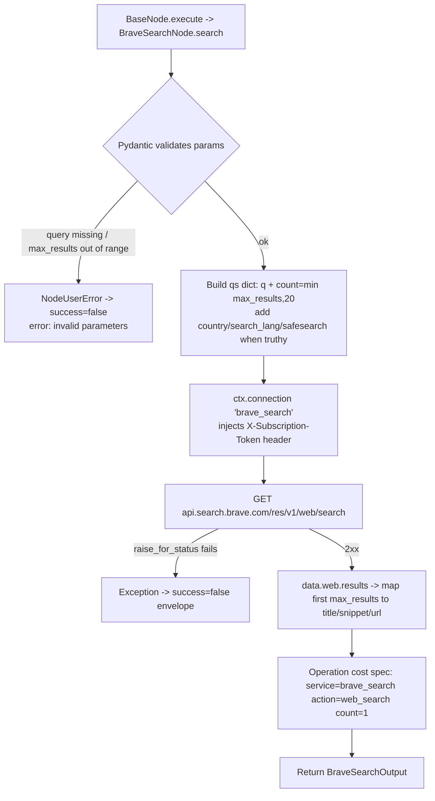

# Brave Search (`braveSearch`)

| Field | Value |
|------|-------|
| **Category** | search / tool (dual-purpose) |
| **Backend handler** | [`server/nodes/search/brave_search/__init__.py`](../../../server/nodes/search/brave_search/__init__.py) - `BraveSearchNode`; dispatched via `BaseNode.execute()` + the `@Operation("search")` method (Wave 11; the old `server/services/handlers/search.py::handle_brave_search` is deleted) |
| **Tests** | [`server/tests/nodes/test_search.py`](../../../server/tests/nodes/test_search.py) |
| **Skill (if any)** | [`server/skills/web_agent/brave-search-skill/SKILL.md`](../../../server/skills/web_agent/brave-search-skill/SKILL.md) |
| **Dual-purpose tool** | yes - tool name `brave_search` (`usable_as_tool = True`) |

## Purpose

Free-text web search via the Brave Search REST API. Returns ranked web results
with title, snippet, and URL. Used both as a workflow node (drag onto canvas)
and as an AI agent tool (connect to `input-tools`); when invoked as a tool
the LLM fills the same parameter schema documented below.

## Inputs (handles)

| Handle | Connection type | Required | Purpose |
|--------|-----------------|----------|---------|
| `input-main` | main | no | Upstream data; not consumed directly - all inputs come from `parameters` |

## Parameters

(Pydantic `BraveSearchParams`, `model_config = {"extra": "ignore"}`.)

| Name | Type | Default | Required | displayOptions.show | Description |
|------|------|---------|----------|---------------------|-------------|
| `tool_name` | string | `brave_search` | no | - | Name of this node when exposed as an AI tool |
| `tool_description` | string | (see Params) | no | - | Description shown to LLM in tool schema |
| `query` | string | (none) | **yes** | - | Search query (`min_length=1`) |
| `max_results` | int | `10` | no | - | `ge=1, le=20`; clamped via `min(max_results, 20)` before API call |
| `country` | string | `""` | no | - | ISO country code, e.g. `US` - only sent when truthy |
| `search_lang` | string | `"en"` | no | - | ISO language code - only sent when truthy |
| `safe_search` | enum | `moderate` | no | - | One of `off` / `moderate` / `strict` |

## Outputs (handles)

| Handle | Shape | Description |
|--------|-------|-------------|
| `output-main` | object | Standard search payload (see below). When wired to an AI agent's `input-tools`, the same payload is returned to the LLM. |

### Output payload

`BraveSearchOutput`:

```ts
{
  query: string;
  results: Array<{ title: string; snippet: string; url: string }>;
  result_count: number;
  provider: 'brave_search';
}
```

Wrapped by `BaseNode._serialize_result` in the standard envelope: `{ success: true, result: <payload>, ... }`. Shared runtime schema: `SearchOutput` in [`server/services/node_output_schemas.py`](../../../server/services/node_output_schemas.py).

## Logic Flow



## Decision Logic

- **Validation**: handled by Pydantic on `BraveSearchParams`. Empty / missing `query` (`min_length=1`) and out-of-range `max_results` (`le=20`) are rejected before the operation body runs; `BaseNode.execute` surfaces an `invalid parameters` failure envelope.
- **Param trimming**: `country`, `search_lang`, `safe_search` only added to the request querystring when truthy. `search_lang` defaults to `'en'` and `safe_search` defaults to `'moderate'`, so both are effectively always sent.
- **max_results clamp**: API receives `min(max_results, 20)`; the response list is then sliced to `max_results` before mapping.
- **Result mapping**: missing fields fall back to empty string (`title`, `snippet`, `url`).

## Side Effects

- **Database writes**: one row in `api_usage_metrics` via the framework's cost-tracking on the `@Operation("search", cost={...})` spec (`service='brave_search'`, `action='web_search'`, `count=1`).
- **Broadcasts**: per-node status via `BaseNode.execute` (`update_node_status` executing/success/error); no plugin-specific broadcasts.
- **External API calls**: `GET https://api.search.brave.com/res/v1/web/search` via `ctx.connection`.
- **File I/O**: none.
- **Subprocess**: none.

## External Dependencies

- **Credentials**: `BraveSearchCredential` (`ApiKeyCredential`, id `brave_search`, header `X-Subscription-Token`) - resolved by the Connection facade at execution time; stored in `EncryptedAPIKey`.
- **Services**: `ctx.connection` (Connection facade), framework cost tracking.
- **Python packages**: `httpx` (via Connection facade).
- **Environment variables**: none.

## Edge cases & known limits

- `max_results` is hard-bounded at 20 by Pydantic (`le=20`); values above 20 fail validation rather than being silently capped (test `test_clamps_max_results_to_100` asserts `success=false`).
- `response.raise_for_status()` propagates non-2xx as an exception; `BaseNode.execute` converts it into a failure envelope, so downstream nodes always see an envelope.
- The handler does not validate `safe_search` enum at runtime beyond Pydantic - the API rejects unknown values with 4xx.

## Related

- **Skills using this as a tool**: [`brave-search-skill/SKILL.md`](../../../server/skills/web_agent/brave-search-skill/SKILL.md)
- **Companion nodes**: [`serperSearch`](./serperSearch.md), [`perplexitySearch`](./perplexitySearch.md), `duckduckgoSearch` (tool category)
- **Architecture docs**: [Plugin System](../../plugin_system.md), [Pricing Service](../../pricing_service.md), [Credentials Encryption](../../credentials_encryption.md)
