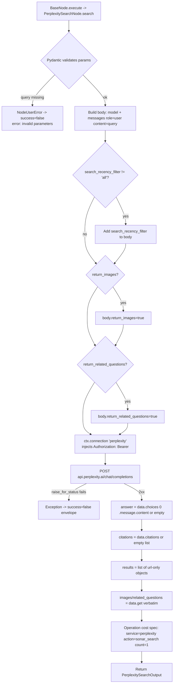

# Perplexity Search (`perplexitySearch`)

| Field | Value |
|------|-------|
| **Category** | search / tool (dual-purpose) |
| **Backend handler** | [`server/nodes/search/perplexity_search/__init__.py`](../../../server/nodes/search/perplexity_search/__init__.py) - `PerplexitySearchNode`; dispatched via `BaseNode.execute()` + the `@Operation("search")` method (Wave 11; the old `server/services/handlers/search.py::handle_perplexity_search` is deleted) |
| **Tests** | [`server/tests/nodes/test_search.py`](../../../server/tests/nodes/test_search.py) |
| **Skill (if any)** | [`server/skills/web_agent/perplexity-search-skill/SKILL.md`](../../../server/skills/web_agent/perplexity-search-skill/SKILL.md) |
| **Dual-purpose tool** | yes - tool name `perplexity_search` (`usable_as_tool = True`) |

## Purpose

AI-generated answer with inline citations from Perplexity Sonar models. The
node returns an LLM completion *plus* the citation URLs Perplexity used so
downstream nodes can render references or follow the sources.

## Inputs (handles)

| Handle | Connection type | Required | Purpose |
|--------|-----------------|----------|---------|
| `input-main` | main | no | Upstream data; not consumed directly |

## Parameters

(Pydantic `PerplexitySearchParams`, `model_config = {"extra": "ignore"}`.)

| Name | Type | Default | Required | displayOptions.show | Description |
|------|------|---------|----------|---------------------|-------------|
| `tool_name` | string | `perplexity_search` | no | - | Tool name when exposed to AI |
| `tool_description` | string | (see Params) | no | - | Tool description for AI |
| `query` | string | (none) | **yes** | - | Question for the model (`min_length=1`) |
| `model` | enum | `sonar` | no | - | One of `sonar` / `sonar-pro` / `sonar-reasoning` / `sonar-reasoning-pro` |
| `search_recency_filter` | enum | `all` | no | - | One of `all` / `month` / `week` / `day` / `hour` (`all` = off, not sent) |
| `return_images` | boolean | `false` | no | - | When true, request images from the API |
| `return_related_questions` | boolean | `false` | no | - | When true, request related questions from the API |

## Outputs (handles)

| Handle | Shape | Description |
|--------|-------|-------------|
| `output-main` | object | Answer + citations payload |

### Output payload

`PerplexitySearchOutput`:

```ts
{
  query: string;
  answer: string;                       // markdown content from choices[0].message.content
  citations: string[];                  // URLs the model cited
  results: Array<{ url: string }>;      // citations remapped as result objects
  images: dict[] | null;                // data.images verbatim (null when API omits it)
  related_questions: string[] | null;   // data.related_questions verbatim (null when API omits it)
  model: string;                        // echoes the model param
  provider: 'perplexity';
}
```

Wrapped by `BaseNode._serialize_result` in the standard envelope. Shared runtime schema: `SearchOutput` in [`server/services/node_output_schemas.py`](../../../server/services/node_output_schemas.py).

## Logic Flow



## Decision Logic

- **Validation**: Pydantic on `PerplexitySearchParams`. Empty / missing `query` (`min_length=1`) is rejected before the operation body (`invalid parameters` failure envelope).
- **Optional body fields**: `search_recency_filter` is added only when `!= 'all'`; `return_images` / `return_related_questions` are added only when truthy. `search_recency_filter='all'` is the explicit "off" value.
- **Empty `choices`**: `answer` falls back to `''` rather than raising.
- **Optional response fields**: `images` / `related_questions` are set verbatim from `data.get(...)` - they are `None` when the API omits them (no `if x:` gating; this differs from the deleted pre-Wave-11 handler which only included them when non-empty).

## Side Effects

- **Database writes**: one `api_usage_metrics` row per call via the `@Operation` cost spec (`service='perplexity'`, `action='sonar_search'`, `count=1`).
- **Broadcasts**: per-node status via `BaseNode.execute`; no plugin-specific broadcasts.
- **External API calls**: `POST https://api.perplexity.ai/chat/completions` via `ctx.connection`.
- **File I/O**: none.
- **Subprocess**: none.

## External Dependencies

- **Credentials**: `PerplexityCredential` (`ApiKeyCredential`, id `perplexity`, bearer auth). Its `_probe` short-circuits to `ProbeResult(valid=True)` - Perplexity has no cheap auth-gated validation endpoint, so a bad key only surfaces as a runtime 401.
- **Services**: `ctx.connection`, framework cost tracking.
- **Python packages**: `httpx` (via Connection facade).

## Edge cases & known limits

- Sonar Reasoning models can be slow; the Connection facade's default timeout governs (no per-call override in the plugin body, unlike the old handler's explicit 60s).
- Citations field shape can vary across Perplexity response versions (`list[str]` historically). The plugin assumes `list[str]`; a list-of-objects response passes through to the output unchanged but breaks the `results` mapping (`{'url': <obj>}`).
- The `results` list is purely a citations remap; downstream nodes expecting `title` / `snippet` will not find them - use `braveSearch` or `serperSearch` for those.

## Related

- **Skills using this as a tool**: [`perplexity-search-skill/SKILL.md`](../../../server/skills/web_agent/perplexity-search-skill/SKILL.md)
- **Companion nodes**: [`braveSearch`](./braveSearch.md), [`serperSearch`](./serperSearch.md)
- **Architecture docs**: [Plugin System](../../plugin_system.md), [Pricing Service](../../pricing_service.md)
