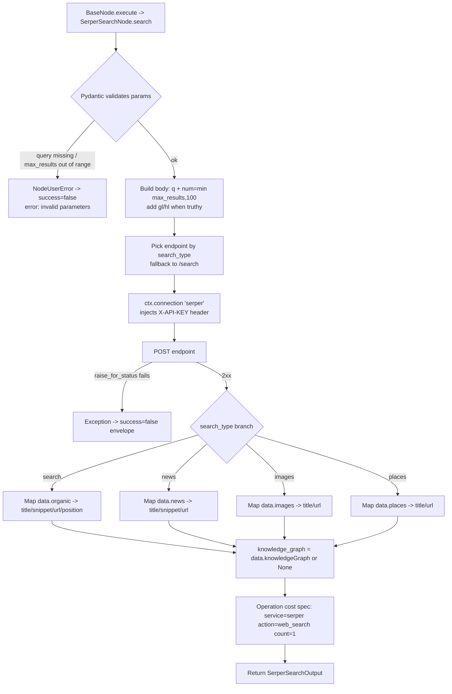

# Serper Search (`serperSearch`)

| Field | Value |
|------|-------|
| **Category** | search / tool (dual-purpose) |
| **Backend handler** | [`server/nodes/search/serper_search/__init__.py`](../../../server/nodes/search/serper_search/__init__.py) - `SerperSearchNode`; dispatched via `BaseNode.execute()` + the `@Operation("search")` method (Wave 11; the old `server/services/handlers/search.py::handle_serper_search` is deleted) |
| **Tests** | [`server/tests/nodes/test_search.py`](../../../server/tests/nodes/test_search.py) |
| **Skill (if any)** | [`server/skills/web_agent/serper-search-skill/SKILL.md`](../../../server/skills/web_agent/serper-search-skill/SKILL.md) |
| **Dual-purpose tool** | yes - tool name `serper_search` (`usable_as_tool = True`) |

## Purpose

Google SERP scraping via the Serper API. Supports four search verticals
(web, news, images, places) and optional knowledge-graph enrichment for the
default web search. Used as a workflow node and as an AI agent tool.

## Inputs (handles)

| Handle | Connection type | Required | Purpose |
|--------|-----------------|----------|---------|
| `input-main` | main | no | Upstream data; not consumed directly |

## Parameters

(Pydantic `SerperSearchParams`, `model_config = {"extra": "ignore"}`.)

| Name | Type | Default | Required | displayOptions.show | Description |
|------|------|---------|----------|---------------------|-------------|
| `tool_name` | string | `serper_search` | no | - | Tool name when exposed to AI |
| `tool_description` | string | (see Params) | no | - | Tool description for AI |
| `query` | string | (none) | **yes** | - | Search query (`min_length=1`) |
| `search_type` | enum | `search` | no | - | One of `search` / `news` / `images` / `places` |
| `max_results` | int | `10` | no | - | `ge=1, le=100`; clamped via `min(max_results, 100)` before API call |
| `country` | string | `""` | no | - | Sent as `gl` only when truthy |
| `language` | string | `"en"` | no | - | Sent as `hl` only when truthy |

## Outputs (handles)

| Handle | Shape | Description |
|--------|-------|-------------|
| `output-main` | object | Search payload (`results` field shape varies by `search_type`). |

### Output payload

`SerperSearchOutput`. Every result is the unified `SerperSearchResult` model
(`title` / `snippet` / `url` / `position?`); fields not populated for a given
vertical are left at their defaults (empty string / null).

```ts
{
  query: string;
  results: Array<{ title: string; snippet: string; url: string; position: number | null }>;
  result_count: number;
  search_type: 'search' | 'news' | 'images' | 'places';
  knowledge_graph: object | null;   // only set when API returns knowledgeGraph
  provider: 'serper';
}
```

Per vertical (mapping in the operation body):
- `search`: `title`, `snippet`, `url` (from `organic[].link`), `position`.
- `news`: `title`, `snippet`, `url` (from `news[].link`). No `position`.
- `images`: `title`, `url` (from `images[].imageUrl` or `link`). No `snippet`.
- `places`: `title`, `url` (from `places[].website`). No `snippet`.

Wrapped by `BaseNode._serialize_result` in the standard envelope. Shared runtime schema: `SearchOutput` in [`server/services/node_output_schemas.py`](../../../server/services/node_output_schemas.py).

## Logic Flow



## Decision Logic

- **Validation**: Pydantic on `SerperSearchParams`. Empty / missing `query` and out-of-range `max_results` are rejected before the operation body (`invalid parameters` failure envelope).
- **search_type dispatch**: `_ENDPOINTS` map keyed by `search_type`; unknown values fall back to `https://google.serper.dev/search` for the request BUT match no result-mapping branch, so they return `results: []` (known gotcha; locked by `test_unknown_search_type_falls_back_to_web_endpoint_but_returns_empty_results`). Note `search_type` is a `Literal`, so frontend/agent inputs are constrained; an out-of-Literal value only reaches the body via the AI-tool path if validation is bypassed.
- **knowledge_graph**: only set when the API includes a non-falsy `knowledgeGraph` field.
- **max_results clamp**: API receives `min(max_results, 100)`; each branch slices its source list to `max_results`.
- **gl/hl trimming**: `country` -> `gl`, `language` -> `hl`. Only sent when truthy (`language` defaults to `'en'`).

## Side Effects

- **Database writes**: one `api_usage_metrics` row per call via the `@Operation` cost spec (`service='serper'`, `action='web_search'`, `count=1`).
- **Broadcasts**: per-node status via `BaseNode.execute`; no plugin-specific broadcasts.
- **External API calls**: `POST` to one of `https://google.serper.dev/{search,news,images,places}` via `ctx.connection`.
- **File I/O**: none.
- **Subprocess**: none.

## External Dependencies

- **Credentials**: `SerperCredential` (`ApiKeyCredential`, id `serper`, header `X-API-KEY`) - resolved by the Connection facade.
- **Services**: `ctx.connection`, framework cost tracking.
- **Python packages**: `httpx` (via Connection facade).

## Edge cases & known limits

- An unrecognised `search_type` value returns `results: []` (no error). Refactors must preserve this or update the contract test.
- `response.raise_for_status()` propagates non-2xx as an exception; `BaseNode.execute` converts it into a failure envelope.
- The handler trusts the API to return the expected nested keys (`organic`, `news`, etc.); a malformed response yields an empty results list rather than an exception.
- Result models are unified - `news`/`images`/`places` do NOT carry `date` / `source` / `address` / `rating` fields; only `title` / `snippet` / `url` / `position` exist.

## Related

- **Skills using this as a tool**: [`serper-search-skill/SKILL.md`](../../../server/skills/web_agent/serper-search-skill/SKILL.md)
- **Companion nodes**: [`braveSearch`](./braveSearch.md), [`perplexitySearch`](./perplexitySearch.md)
- **Architecture docs**: [Plugin System](../../plugin_system.md), [Pricing Service](../../pricing_service.md)
