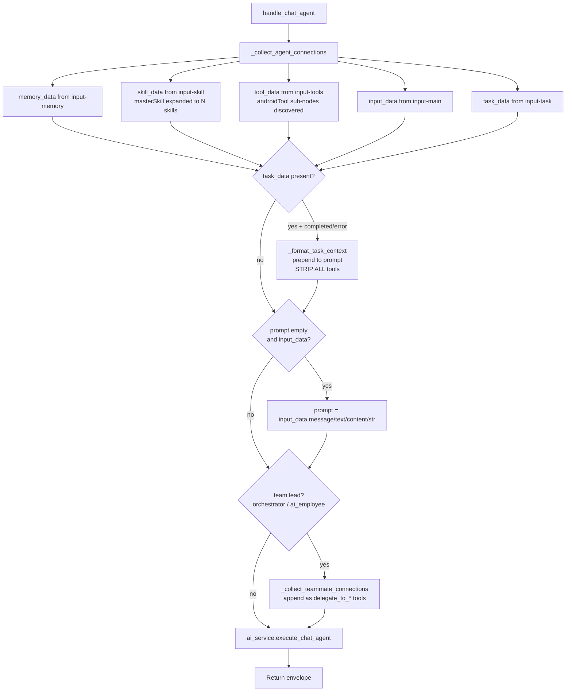

# Generic Specialized Agent Pattern (`handle_chat_agent`)

This document describes the shared behavioural contract for the 13 specialized
agent nodes that route to the same backend handler:

`android_agent`, `coding_agent`, `web_agent`, `task_agent`, `social_agent`,
`travel_agent`, `tool_agent`, `productivity_agent`, `payments_agent`,
`consumer_agent`, `autonomous_agent`, `orchestrator_agent`, `ai_employee`.

All specialized nodes use the `handle_chat_agent` handler wired in
`server/services/node_executor.py`. They differ only in frontend
presentation (icon, theme color, default skills) and intended use case.
The two agents with **dedicated** handlers (`rlm_agent`,
`claude_code_agent`) are documented separately.

| Field | Value |
|------|-------|
| **Category** | specialized_agents |
| **Backend handler** | [`server/services/handlers/ai.py::handle_chat_agent`](../../../server/services/handlers/ai.py) |
| **Registry binding** | `partial(handle_chat_agent, ai_service=..., database=...)` |
| **Tests** | [`server/tests/nodes/test_specialized_agents.py`](../../../server/tests/nodes/test_specialized_agents.py) |
| **Architecture docs** | [Agent Architecture](../../agent_architecture.md), [Agent Delegation](../../agent_delegation.md), [Agent Teams](../../agent_teams.md) |

## Purpose

A specialized agent is an `aiAgent` pre-configured for a specific domain
(Android control, coding, web automation, etc.). From the backend's
perspective it is identical to `chatAgent`: same handler, same inputs, same
output envelope, same delegation semantics. The specialization is conveyed
only through:

1. Connected skills (usually via a Master Skill node seeded with the
   domain-specific folder in `server/skills/`).
2. Connected tools (e.g. `coding_agent` typically has `pythonExecutor` wired
   to `input-tools`).
3. Frontend cosmetics (icon, theme color, AGENT_CONFIGS label).

## Inputs (handles)

All 13 agents share these input handles.

| Handle | Connection type | Required | Purpose |
|--------|-----------------|----------|---------|
| `input-main` | main | no | Upstream data; auto-prompt fallback when `prompt` param is empty |
| `input-skill` | main | no | Skill node(s) providing SKILL.md context |
| `input-memory` | main | no | `simpleMemory` node for conversation history |
| `input-tools` | main | no | Tool nodes exposed to the LLM via `chat_model.bind_tools` |
| `input-task` | main | no | `taskTrigger` events from delegated child agents |
| `input-teammates` | main | no | **Only on `orchestrator_agent` and `ai_employee`** -- connected agents become `delegate_to_*` tools |

## Parameters

All specialized agents share the `AI_AGENT_PROPERTIES` schema from
`specializedAgentNodes.ts` plus node-specific extras (e.g. orchestrator has
`teamMode`, `ai_employee` has `teamMode` + `maxConcurrent`).

| Name | Type | Default | Description |
|------|------|---------|-------------|
| `provider` | options | `openai` | AI provider (openai / anthropic / gemini / ...) |
| `model` | string | `""` | Model ID; required |
| `prompt` | string | `""` | User prompt; falls back to upstream output when empty |
| `systemMessage` | string | `""` | Additional system instructions (prepended to skill content) |
| `options.temperature` | number | `0.7` | Sampling temperature |
| `options.maxTokens` | number | `4096` | Max response tokens |
| `options.thinkingEnabled` | boolean | `false` | Extended thinking / reasoning |
| `options.thinkingBudget` | number | `2048` | Thinking budget tokens (Claude/Gemini) |
| `options.reasoningEffort` | options | `medium` | For OpenAI o-series and GPT-5 |

## Outputs (handles)

| Handle | Shape | Description |
|--------|-------|-------------|
| `output-main` / `output-top` / `output-0` | object | Standard agent envelope |

### Output payload

```ts
{
  response: string;          // Final agent message
  thinking?: string;         // Extended thinking content (when enabled)
  model: string;
  provider: string;
  finish_reason?: string;
  timestamp: string;
}
```

Wrapped in the standard envelope:
`{ success: true, result: <payload>, execution_time: number }`.

## Logic Flow



## Decision Logic

- **Task completion short-circuit**: if `task_data.status in {completed,
  error}`, the handler strips **all** tools from `tool_data`. This prevents
  Gemini from hallucinating a delegate call when the original prompt says
  "just report the result".
- **Auto-prompt fallback**: when `parameters.prompt` is empty and an
  upstream node is connected to `input-main`, the handler pulls
  `input_data.message` -> `text` -> `content` -> `str(input_data)` in that
  order.
- **Team-lead detection**: `TEAM_LEAD_TYPES = {'orchestrator_agent',
  'ai_employee'}`. Teammates are collected only for these two node types
  and appended to `tool_data` as delegation targets.
- **Master Skill expansion**: `masterSkill` source nodes are expanded in
  `_collect_agent_connections` - each enabled entry in `skillsConfig`
  becomes a separate skill entry with `node_id = f"{source_id}_{skill_key}"`.

## Side Effects

- **Database reads**: `database.get_node_parameters(source_id)` for every
  connected skill, memory, tool, and teammate node.
- **Database writes**: `TokenUsageMetric` and potentially `CompactionEvent`
  rows (via `CompactionService` invoked inside `ai_service.execute_chat_agent`).
- **Broadcasts**: `StatusBroadcaster.update_node_status` events for the
  agent's execution phase (`executing`, `executing_tool`, `success`,
  `error`), plus `executing_tool` fired on connected tool nodes when the LLM
  invokes them.
- **External API calls**: one or more calls to the configured LLM provider
  (see `services/ai.py::execute_chat_agent` -> LangChain chat model + `_run_agent_loop`).
- **Subprocess / file I/O**: none directly in the handler; tools invoked by
  the LLM may trigger those themselves.

## External Dependencies

- **Credentials**: `auth_service.get_api_key(<provider>)` for the
  configured LLM provider.
- **Services**: `AIService.execute_chat_agent`, `CompactionService`,
  `PricingService`, `StatusBroadcaster`.
- **Python packages**: `langchain-core`, plus provider SDKs.

## Edge cases & known limits

- Empty `prompt` with no `input-main` connection still calls
  `execute_chat_agent` -- the LLM may produce a generic response. There is
  no early-return error envelope for missing prompts in this handler.
- When a `masterSkill` has zero enabled skills, no skill context is
  injected and the agent runs without domain-specific instructions.
- `input-teammates` is silently ignored for all non-team-lead node types
  (the edge is collected but never expanded).
- Token tracking and compaction happen inside `execute_chat_agent`; if the
  configured provider is unknown, tracking is skipped without an error.

## Related

- **Dedicated-handler siblings**: [`deepAgent`](./deepAgent.md), [`rlmAgent`](./rlmAgent.md), [`claudeCodeAgent`](./claudeCodeAgent.md)
- **Per-node variants** (short link-style docs):
  [`androidAgent`](./androidAgent.md), [`codingAgent`](./codingAgent.md),
  [`webAgent`](./webAgent.md), [`taskAgent`](./taskAgent.md),
  [`socialAgent`](./socialAgent.md), [`travelAgent`](./travelAgent.md),
  [`toolAgent`](./toolAgent.md), [`productivityAgent`](./productivityAgent.md),
  [`paymentsAgent`](./paymentsAgent.md), [`consumerAgent`](./consumerAgent.md),
  [`autonomousAgent`](./autonomousAgent.md),
  [`orchestratorAgent`](./orchestratorAgent.md), [`aiEmployee`](./aiEmployee.md)
- **Architecture docs**: [Memory Compaction](../../memory_compaction.md),
  [Pricing Service](../../pricing_service.md)
