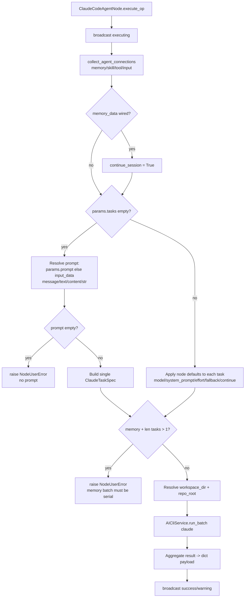

# Claude Code Agent (`claude_code_agent`)

| Field | Value |
|------|-------|
| **Category** | specialized_agents |
| **Plugin** | [`server/nodes/agent/claude_code_agent/__init__.py::ClaudeCodeAgentNode.execute_op`](../../../server/nodes/agent/claude_code_agent/__init__.py) (dispatch via `BaseNode.execute()`) |
| **Backend service** | [`server/services/cli_agent/service.py::AICliService.run_batch`](../../../server/services/cli_agent/service.py) (provider `"claude"`); pool [`_pool.py`](../../../server/nodes/agent/claude_code_agent/_pool.py), argv [`_provider.py`](../../../server/nodes/agent/claude_code_agent/_provider.py), skill materialiser [`_skills.py`](../../../server/nodes/agent/claude_code_agent/_skills.py) |
| **Connection collection** | [`server/services/plugin/edge_walker.py::collect_agent_connections`](../../../server/services/plugin/edge_walker.py) |
| **Tests** | [`server/tests/nodes/test_specialized_agents.py::TestClaudeCodeAgent`](../../../server/tests/nodes/test_specialized_agents.py) |

## Purpose

Runs N parallel Claude Code CLI sessions over a list of `ClaudeTaskSpec`
tasks via `AICliService.run_batch("claude", ...)`. The pool spawns `claude`
as a plain subprocess driven over the VSCode-extension stream-json protocol
(`--output-format stream-json --input-format stream-json --verbose --ide`) —
NOT the old headless `claude -p`. The common case is a single visible
`prompt` that synthesises a one-task batch. Memory continuity is handled by
claude's own on-disk session JSONL via `--continue` / `--resume` over a
stable `cwd`, not by re-injecting markdown. This is the only
specialized-agent node that shells out; the others stay in-process.

## Inputs (handles)

Standard `std_agent_handles()` topology (same as the generic agents).

| Handle | Purpose |
|--------|---------|
| `input-main` | Auto-prompt fallback (reads `source.message / text / content / str`) |
| `input-skill` | Connected skill names collected; SKILL.md trees materialised under `<workspace>/.claude/skills/` and exposed to the CLI (not injected into a system prompt) |
| `input-memory` | When wired, sets `continue_session=True` so claude emits `--continue` and resumes its on-disk session under the stable cwd |
| `input-tools` | Connected tool nodes exposed to the CLI as `mcp__opencompany__<type>` MCP tools |
| `input-task` | Collected by the edge-walker; `task_data` is unpacked but the 5th element is ignored (`_`) here |

## Parameters

`ClaudeCodeAgentParams` — only `prompt` is visible; every other field carries
`json_schema_extra.hidden=True` and feeds defaults into the per-task
`ClaudeTaskSpec`.

| Name | Type | Default | Required | displayOptions.show | Description |
|------|------|---------|----------|---------------------|-------------|
| `prompt` | string | `""` | no | - | The prompt sent to Claude Code (only visible field, 4 rows) |
| `tasks` | `ClaudeTaskSpec[]` | `[]` | no | hidden | Advanced multi-task batch (max 5 concurrent); `null` coerced to `[]` |
| `model` | enum (`ClaudeCodeModel`) | `claude-sonnet-4-6` | no | hidden | `--model`; aliases `sonnet`/`opus`/`haiku` or pinned IDs; unknown values coerced to default |
| `system_prompt` | string\|null | `None` | no | hidden | System prompt (3 rows) |
| `working_directory` | string\|null | `None` | no | hidden | Git repo root; defaults to workflow workspace dir |
| `max_parallel` | int | `5` | no | hidden | 1-20 concurrency cap |
| `allowed_credentials` | string[] | `[]` | no | hidden | Credential names the CLI may fetch via MCP; `null` coerced to `[]` |
| `effort` | enum\|null (`ClaudeCodeEffort`) | `None` | no | hidden | `low`/`medium`/`high`/`xhigh`/`max` via `--effort` (thinking models) |
| `fallback_model` | enum\|null | `None` | no | hidden | `--fallback-model`; unknown values coerced to `None` |

## Outputs (handles)

`Output = ClaudeCodeAgentOutput` (`extra="forbid"`) — aggregated batch shape:

| Handle | Shape | Description |
|--------|-------|-------------|
| `output-main` / `output-top` | object | Batch result (see payload below) |

### Output payload

```ts
{
  success: boolean;              // result.n_failed == 0
  n_tasks: number;
  n_succeeded: number;
  n_failed: number;
  total_cost_usd: number | null;
  wall_clock_ms: number;
  tasks: SessionResultModel[];   // per-task result models
  provider: "claude";
  timestamp: string;
  // Legacy single-task convenience (populated when len(tasks) == 1):
  response: string | null;
  session_id: string | null;
  cost_usd: number | null;
}
```

`node_output_schemas.py` registers `claude_code_agent` as `AIAgentOutput`
(`response`/`thinking`/`model`/`provider`/`finish_reason`/`timestamp`) for the
frontend Input Data panel — a separate, looser schema from the plugin's strict
`ClaudeCodeAgentOutput`.

## Logic Flow



## Decision Logic

- **Prompt resolution**: explicit `prompt` param wins; otherwise scans
  `input_data` and reads `message / text / content / str` (same chain as
  `_inline.py`). Empty -> `NodeUserError`.
- **Single-task synthesis**: when `params.tasks` is empty, one
  `ClaudeTaskSpec` is built from `prompt` + `model` + `system_prompt` +
  `effort` + `fallback_model` + `continue_session`.
- **Batch defaulting**: when `params.tasks` is non-empty, node-level
  `model`/`system_prompt`/`effort`/`fallback_model` fill any task that
  didn't override; `continue_session=True` is auto-set only when memory is
  wired AND the task didn't explicitly opt in or pick a resume UUID.
- **Memory bridge**: `continue_session = bool(memory_data)`; the argv builder
  emits `--continue` (first run is a benign no-op, later runs resume the
  on-disk JSONL). NO markdown re-injection.
- **Serial-memory guard**: memory wired AND `len(tasks) > 1` -> `NodeUserError`
  (parallel `--resume` against one JSONL would corrupt it).
- **Workspace**: `ctx.raw["workspace_dir"]` (injected by workflow.py) or
  `working_directory`; falls back to `{workspace_base_resolved}/{workflow_id|default}`.

## Side Effects

- **Subprocess spawn**: `AICliService.run_batch` -> `ClaudeSessionPool` spawns
  `claude` as a plain-pipe subprocess (no PTY) with `--output-format
  stream-json --input-format stream-json --verbose --ide
  --permission-mode dontAsk` + `--allowedTools <mcp tools + conditional Skill +
  5 infra tools>` + `--mcp-config <bearer>` + `--add-dir <workspace>`. Warm
  subprocesses are reused across turns/batches; crash recovery via
  `--resume <UUID>`.
- **Broadcasts**: `StatusBroadcaster.update_node_status` -- executing
  ("Starting Claude Code batch..."), then `success`/`warning` on completion
  (`n_succeeded`/`n_tasks`). The pool emits 4 typed CloudEvents
  (`claude.session.{spawned,cleared,terminated,usage}`); memory turns emit
  `node_parameters_updated` so the simpleMemory panel refreshes live.
- **File I/O**: materialises connected SKILL.md trees under
  `<workspace>/.claude/skills/<name>/` (diff-based on warm reuse). Claude
  keeps its own session JSONL under `<CLAUDE_CONFIG_DIR>/projects/<cwd-key>/`.
- **External API**: indirect -- the CLI calls Anthropic internally.

## External Dependencies

- **Binaries**: `@anthropic-ai/claude-code`, OpenCompany-managed — auto-installed on first use into the shared npm tree at `<DATA_DIR>/packages/` (binary at `<DATA_DIR>/packages/node_modules/.bin/claude[.cmd]`); requires `npm` on PATH.
- **Python packages**: standard library + the `services/cli_agent/` framework
  (FastMCP bridge, session pool).
- **Credentials**: Claude Code handles its own authentication via
  `CLAUDE_CONFIG_DIR=<DATA_DIR>/claude/` (= `~/.opencompany/claude/` by
  default; see [Claude OAuth](../../claude_code_agent_architecture.md));
  OpenCompany does not inject an API key.

## Edge cases & known limits

- **No prompt -> `NodeUserError`**: when `tasks` is empty AND neither
  `prompt` nor a connected `input-main` output yields text, `execute_op`
  raises `NodeUserError` (single WARN line, structured envelope).
- **Memory-bound batches must be serial**: memory wired AND `len(tasks) > 1`
  raises `NodeUserError` (parallel `--resume` would corrupt one JSONL).
- **Stale-model coercion**: legacy saved `model` / `fallback_model` strings
  (dot-spelled, date-suffixed, empty) coerce to the default / `None` via a
  `mode="before"` field validator so old workflows still load.
- **Output is strict** (`extra="forbid"`): a malformed CLI envelope raises a
  `ValidationError` at the Output boundary instead of emitting an
  unparseable shape downstream.
- **Strict tool allowlist**: `--permission-mode dontAsk` enforces
  `--allowedTools` (only wired `mcp__opencompany__*` tools, conditional `Skill`,
  5 infra tools); claude's own built-in Read/Edit/Bash/etc. do NOT fire
  unless wired.
- **Per-workflow skill isolation**: SKILL.md trees materialise under the
  workspace's `.claude/skills/`, not the repo, so workflow A's skills can't
  leak into workflow B's subprocess.

## Related

- **Dedicated-path siblings**: [`rlmAgent`](./rlmAgent.md)
- **Generic pattern**: [`_pattern.md`](./_pattern.md)
- **Architecture**: [CLI Agent Framework](../../cli_agent_framework.md),
  [Claude Code Interactive Mode](../../claude_code_interactive_mode.md),
  [Claude Code Agent](../../claude_code_agent_architecture.md)
