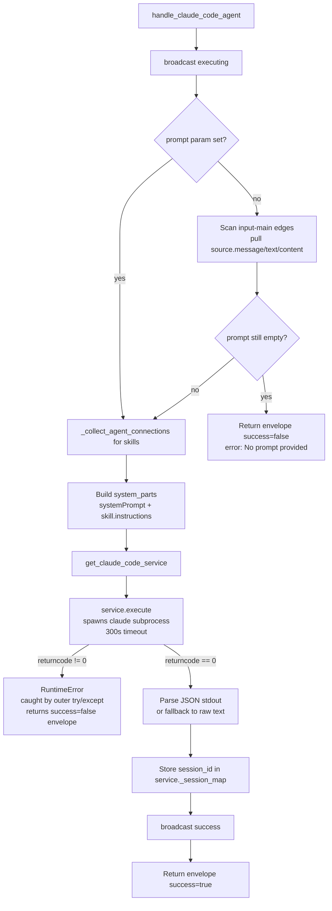

# Claude Code Agent (`claude_code_agent`)

| Field | Value |
|------|-------|
| **Category** | specialized_agents |
| **Backend handler** | [`server/services/handlers/claude_code.py::handle_claude_code_agent`](../../../server/services/handlers/claude_code.py) |
| **Backend service** | [`server/services/claude_code_service.py::ClaudeCodeService.execute`](../../../server/services/claude_code_service.py) |
| **Tests** | [`server/tests/nodes/test_specialized_agents.py::TestClaudeCodeAgent`](../../../server/tests/nodes/test_specialized_agents.py) |

## Purpose

Runs a Claude Code CLI subprocess (`claude -p <prompt> --output-format json
...`) and returns the parsed JSON. Keeps a per-`node_id` session map so
follow-up invocations resume with `--resume <session_id>`. This is the
only specialized-agent node that shells out; the others stay in-process.

## Inputs (handles)

| Handle | Purpose |
|--------|---------|
| `input-main` | Auto-prompt fallback (reads `source.message / text / content`) |
| `input-skill` | Skill instructions appended to `--append-system-prompt` |

All other handles (`input-memory`, `input-tools`, `input-task`,
`input-teammates`) are **ignored** by this handler.

## Parameters

| Name | Type | Default | Description |
|------|------|---------|-------------|
| `prompt` | string | `""` | User prompt passed via `-p` |
| `systemPrompt` | string | `""` | Prepended to any skill content for `--append-system-prompt` |
| `model` | string | `claude-sonnet-4-6` | Passed via `--model` |
| `workingDirectory` | string | (default workspace) | `cwd` for the subprocess |
| `allowedTools` | string | `Read,Edit,Bash,Glob,Grep,Write` | Passed via `--allowedTools` |
| `maxTurns` | number | `10` | `--max-turns` |
| `maxBudgetUsd` | number | `5.0` | **`--max-budget-usd`** (note: historical bug fixed to use this exact flag name) |

## Outputs (handles)

| Handle | Shape | Description |
|--------|-------|-------------|
| `output-main` | object | `{ response, model, provider: 'anthropic', session_id, usage, timestamp }` |

## Logic Flow

## Decision Logic

- **Prompt resolution**: explicit `prompt` param wins; otherwise scans
  `input-main` edges and reads `source.message / text / content / str`.
- **Skill collection**: uses `_collect_agent_connections` only to gather
  skills. Memory, tools, teammates, task triggers are all discarded.
- **System prompt assembly**: `systemPrompt` param + every enabled skill's
  `instructions`, joined by `\n\n`, passed as
  `--append-system-prompt`.
- **Session resume**: `ClaudeCodeService._session_map[node_id]` is
  consulted; when set, `--resume <session_id>` is added to argv.
- **Working directory**: if `workingDirectory` is empty, the service
  defaults to `{workspace_base_resolved}/default` and creates it if
  missing.

## Side Effects

- **Subprocess spawn**: `asyncio.create_subprocess_exec('claude', '-p',
  <prompt>, '--output-format', 'json', '--model', <model>, '--max-turns',
  N, '--allowedTools', <list>, '--max-budget-usd', <usd>, [--resume
  <session_id>,] [--append-system-prompt <system>,] ...)` with a 300s
  `asyncio.wait_for` timeout. Falls back to `npx -y @anthropic-ai/claude-code`
  when the `claude` binary is not on PATH.
- **Broadcasts**: `StatusBroadcaster.update_node_status` -- executing
  ("Starting Claude Code..." and "Running Claude Code (<model>)..."),
  then success on completion.
- **Database**: none directly; usage tracking happens only if the caller
  wires it in (handler signature accepts `database=None` and never uses
  it).
- **File I/O**: creates `{workspace_base_resolved}/default` when the
  default cwd does not exist.
- **External API**: indirect -- the CLI calls Anthropic internally.

## External Dependencies

- **Binaries**: `@anthropic-ai/claude-code`, MachinaOs-managed — auto-installed on first use into the shared npm tree at `<DATA_DIR>/packages/` (binary at `<DATA_DIR>/packages/node_modules/.bin/claude[.cmd]`); requires `npm` on PATH.
- **Python packages**: standard library only
  (`asyncio.create_subprocess_exec`).
- **Credentials**: Claude Code handles its own authentication via
  `CLAUDE_CONFIG_DIR=<DATA_DIR>/claude/` (= `~/.machina/claude/` by
  default; see [Claude OAuth](../../claude_code_agent_architecture.md));
  MachinaOs does not inject an API key.

## Edge cases & known limits

- **No prompt -> early failure**: unlike `handle_chat_agent`, this
  handler explicitly returns an error envelope when neither `prompt`
  nor a connected `input-main` output yields text.
- **`max_budget_usd <= 0`**: the `--max-budget-usd` flag is omitted
  entirely (see `claude_code_service.py:50-51`). This silently disables
  budget enforcement rather than passing `0`.
- **Non-zero exit**: `ClaudeCodeService.execute` raises `RuntimeError`,
  the handler's outer `except Exception` converts it to
  `success=false` with the error message as the envelope's `error` field.
- **300-second timeout**: `asyncio.wait_for(proc.communicate(),
  timeout=300)` is hard-coded. Long CLI runs beyond 5 minutes abort and
  surface as `TimeoutError` in the envelope.
- **Tools/memory/teammates ignored**: connecting memory, tools, or
  teammates has no effect. The CLI's own tool set is controlled by
  `allowedTools`.
- **JSON parsing fallback**: if stdout is not valid JSON, the service
  returns `{"result": <raw text>}` -- the handler still reports
  `success=true` and `response` contains the raw text.

## Related

- **Pattern siblings**: [`deepAgent`](./deepAgent.md), [`rlmAgent`](./rlmAgent.md)
- **Architecture**: [Claude Code Agent](../../claude_code_agent_architecture.md)
