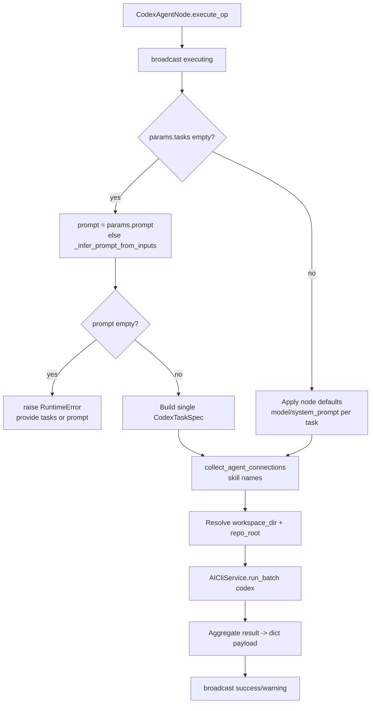

# Codex (`codex_agent`)

| Field | Value |
|------|-------|
| **Category** | specialized_agents |
| **Plugin** | [`server/nodes/agent/codex_agent/__init__.py::CodexAgentNode.execute_op`](../../../server/nodes/agent/codex_agent/__init__.py) (dispatch via `BaseNode.execute()`) |
| **Backend service** | [`server/services/cli_agent/service.py::AICliService.run_batch`](../../../server/services/cli_agent/service.py) (provider `"codex"`) |
| **Connection collection** | [`server/services/plugin/edge_walker.py::collect_agent_connections`](../../../server/services/plugin/edge_walker.py) |
| **Tests** | [`server/tests/nodes/test_specialized_agents.py`](../../../server/tests/nodes/test_specialized_agents.py) |
| **Dual-purpose tool** | no |

## Purpose

Runs N parallel OpenAI Codex CLI sessions over a list of `CodexTaskSpec`
tasks via `AICliService.run_batch("codex", ...)`. Sandbox-first companion to
`claude_code_agent`: the sandbox is enforced by Codex itself (not MachinaOs),
and each task runs in its own git worktree. Codex exposes no
session/resume/budget/turns surface — only `sandbox` + `ask_for_approval` are
task-level overrides. The common case is a single `prompt` that synthesises a
one-task batch.

## Inputs (handles)

Standard `std_agent_handles()` topology.

| Handle | Connection type | Required | Purpose |
|--------|-----------------|----------|---------|
| `input-main` | input/main | no | Prompt fallback: `_infer_prompt_from_inputs` reads `outputs[source].message/text/content/prompt/str` |
| `input-skill` | input/skill | no | Connected skill names collected and passed to `run_batch` |
| `input-memory` | input/memory | no | Collected by edge-walker but unused (Codex has no resume surface) |
| `input-tools` | input/tools | no | Collected by edge-walker (5-tuple) but discarded here |
| `input-task` | input/task | no | Collected but discarded |

## Parameters

`CodexAgentParams` (`extra="ignore"`):

| Name | Type | Default | Required | displayOptions.show | Description |
|------|------|---------|----------|---------------------|-------------|
| `tasks` | `CodexTaskSpec[]` | `[]` | no | - | List of Codex tasks (max 5 concurrent) |
| `prompt` | string | `""` | no | - | Single-prompt fallback used only when `tasks` is empty (4 rows) |
| `model` | string | `gpt-5.2-codex` | no | - | Default model for tasks that don't override |
| `sandbox` | string | `workspace-write` | no | - | `read-only` / `workspace-write` / `danger-full-access` |
| `ask_for_approval` | string | `never` | no | - | `untrusted` / `on-request` / `never` |
| `system_prompt` | string\|null | `None` | no | - | System prompt (3 rows) |
| `working_directory` | string\|null | `None` | no | - | Git repo root; defaults to workflow workspace dir |
| `max_parallel` | int | `5` | no | - | 1-20 concurrency cap |
| `allowed_credentials` | string[] | `[]` | no | - | Credential names the CLI may fetch via MCP |

## Outputs (handles)

`Output = CodexAgentOutput` (`extra="allow"`) — aggregated batch shape.

| Handle | Shape | Description |
|--------|-------|-------------|
| `output-main` / `output-top` | object | Batch result (see payload below) |

### Output payload

```ts
{
  success: boolean;            // result.n_failed == 0
  n_tasks: number;
  n_succeeded: number;
  n_failed: number;
  total_cost_usd: null;        // always None for Codex
  wall_clock_ms: number;
  tasks: SessionResultModel[];
  provider: "codex";
  timestamp: string;
  response: string | null;     // populated when len(tasks) == 1
}
```

Note: `codex_agent` is **not** registered in
`server/services/node_output_schemas.py::_AGENT_TYPES`, so the frontend Input
Data panel has no declared output schema for it (falls back to live execution
data or empty state).

## Logic Flow



## Decision Logic

- **Prompt resolution**: `params.prompt` wins; otherwise
  `_infer_prompt_from_inputs` scans `input-main` (or untagged) edges and reads
  `outputs[source].message/text/content/prompt/str`. Empty -> `RuntimeError`.
- **Single-task synthesis**: empty `tasks` builds one `CodexTaskSpec` from
  `prompt` + `model` + `sandbox` + `ask_for_approval` + `system_prompt`.
- **Batch defaulting**: non-empty `tasks` get node-level `model` /
  `system_prompt` filled where the task didn't override.
- **No memory/resume/budget/turns**: Codex has no session surface; memory /
  tools / task data are collected by the edge-walker but discarded.

## Side Effects

- **Subprocess spawn**: `AICliService.run_batch("codex", ...)` spawns the
  Codex CLI per task (per-task git worktree isolation; sandbox enforced by
  Codex).
- **Broadcasts**: `StatusBroadcaster.update_node_status` -- executing
  ("Starting Codex batch..."), then `success`/`warning` on completion.
- **File I/O**: per-task git worktrees under the workflow workspace dir.
- **External API**: indirect -- the Codex CLI calls OpenAI internally.

## External Dependencies

- **Binaries**: the OpenAI Codex CLI (provider `"codex"` in the cli_agent
  framework).
- **Python packages**: the `services/cli_agent/` framework.
- **Credentials**: Codex handles its own authentication; MachinaOs does not
  inject an API key here. `allowed_credentials` gates what the CLI may fetch
  via the MachinaOs MCP bridge.

## Edge cases & known limits

- **No prompt / tasks -> `RuntimeError`**: when `tasks` is empty AND no input
  yields a prompt, `execute_op` raises `RuntimeError` (full traceback path —
  not `NodeUserError` like `claude_code_agent`).
- **`total_cost_usd` is always `None`**: Codex does not surface per-run cost.
- **No output schema registration**: see Outputs note above.

## Related

- **Dedicated-path siblings**: [`claudeCodeAgent`](./claudeCodeAgent.md), [`rlmAgent`](./rlmAgent.md)
- **Generic pattern**: [`_pattern.md`](./_pattern.md)
- **Architecture**: [CLI Agent Framework](../../cli_agent_framework.md)
