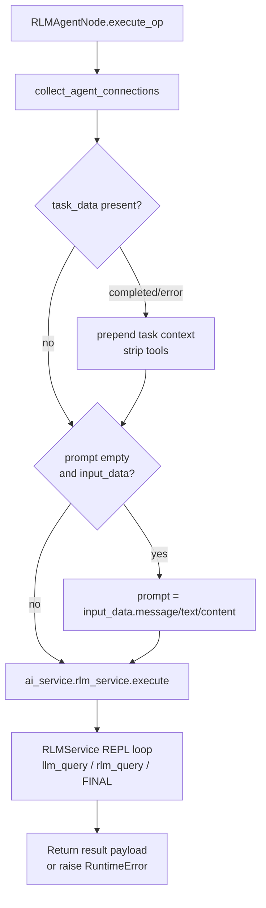

# RLM Agent (`rlm_agent`)

| Field | Value |
|------|-------|
| **Category** | specialized_agents |
| **Plugin** | [`server/nodes/agent/rlm_agent/__init__.py::RLMAgentNode.execute_op`](../../../server/nodes/agent/rlm_agent/__init__.py) (dispatch via `BaseNode.execute()`) |
| **Backend service** | `AIService.rlm_service` -> `RLMService.execute` |
| **Connection collection** | [`server/services/plugin/edge_walker.py::collect_agent_connections`](../../../server/services/plugin/edge_walker.py) |
| **Tests** | [`server/tests/nodes/test_specialized_agents.py::TestRLMAgent`](../../../server/tests/nodes/test_specialized_agents.py) |

## Purpose

Recursive Language Model agent. Instead of the standard tool-calling loop, the
LLM is prompted to emit Python code that is executed in a REPL and may
recursively call `llm_query()` or `rlm_query()` and end with `FINAL(...)`
to return a result. See [RLM Service](../../rlm_service.md).

## Inputs (handles)

Same 5 shared handles as the generic specialized agents. **No
`input-teammates` handle** -- RLM does not support team-lead expansion.

## Parameters

`RLMAgentNode.Params = SpecializedAgentParams` — the **same** model as the
generic specialized agents (`prompt`, `provider`, `model`, `system_message`,
`temperature`, `max_tokens`). There is **no** `maxIterations` field on the node
params; REPL iteration bounding lives inside `RLMService` /
`server/config/llm_defaults.json`, not on this plugin.

| Name | Type | Default | Required | displayOptions.show | Description |
|------|------|---------|----------|---------------------|-------------|
| `prompt` | string | `""` | no | - | Reasoning task; falls back to upstream input |
| `provider` | enum | `openai` | no | - | Big-LM provider |
| `model` | string | `""` | no | - | Big-LM model ID |
| `system_message` | string\|null | `"You are a helpful assistant"` | no | - | System instructions |
| `temperature` | float\|null | `None` | no | group `options` | 0.0-2.0 |
| `max_tokens` | int\|null | `None` | no | group `options` | 1-200000 |

## Outputs (handles)

| Handle | Shape | Description |
|--------|-------|-------------|
| `output-main` / `output-top` | object | `SpecializedAgentOutput` (`extra="allow"`): `{ response, thinking?, model, provider, finish_reason?, timestamp }` plus any RLM extras the service emits |

`node_output_schemas.py` registers `rlm_agent` as `AIAgentOutput` (same field
set) for the frontend Input Data panel.

## Logic Flow

## Decision Logic

- **Same preprocessing as the generic agent path**: task-completion tool
  strip (when `task_data.status in {completed, error}`), auto-prompt
  fallback. Implemented inline in `RLMAgentNode.execute_op` (NOT via
  `prepare_agent_call` — RLM has its own copy of the 3-step preamble).
- **No teammate expansion**: `collect_teammate_connections` is not called;
  `rlm_agent` is not in `TEAM_LEAD_TYPES`.
- **No workspace injection**: RLM executes code in an in-memory REPL
  (`exec()`), not on a real filesystem; the plugin does not pass
  `workspace_dir`.
- **Failure**: `execute_op` raises `RuntimeError` when the service returns
  `success=False`; `BaseNode.execute()` wraps it into the error envelope.

## Side Effects

- **Database reads**: `database.get_node_parameters` for each connected
  skill/memory/tool node.
- **Database writes**: token usage metrics via `RLMService` ->
  `AIService` helpers.
- **Broadcasts**: `StatusBroadcaster.update_node_status` (executing,
  success, error); `executing_tool` for connected tools invoked during
  REPL calls.
- **External API calls**: one call to the big LM per REPL turn, plus
  nested `llm_query()` calls to the small LM provider when configured.
- **File I/O / subprocess**: none directly; REPL `exec()` may import
  libraries and run computation in-process.

## External Dependencies

- **Credentials**: `auth_service.get_api_key(<provider>)` for big LM, and
  optionally the small-LM provider wired as a connected chat-model node.
- **Services**: `RLMService`, `StatusBroadcaster`, `PricingService`.
- **Python packages**: the `rlm` package plus the native OpenCompany LLM
  configuration and tool-bridge helpers.

## Edge cases & known limits

- **REPL exec() is in-process**: user code runs in the backend Python
  process with no sandboxing. The skill prompt is expected to constrain
  the LLM, but nothing prevents a misbehaving LLM from importing
  `subprocess` or `os` and doing I/O.
- **No per-step timeout**: the RLM iteration cap (configured in
  `RLMService` / `llm_defaults.json`, not on the node) is the only bound;
  a single REPL step can hang the operation if user code blocks.
- **No team-lead support**: `input-teammates` is not read. Connecting
  agents there has no effect.
- **LLM output parsing**: the REPL parser expects a specific fenced-code
  format. If the big LM ignores formatting instructions, the loop
  aborts early and returns whatever partial result it collected.

## Related

- **Dedicated-path siblings**: [`claudeCodeAgent`](./claudeCodeAgent.md)
- **Generic pattern**: [`_pattern.md`](./_pattern.md)
- **Architecture**: [RLM Service](../../rlm_service.md)
