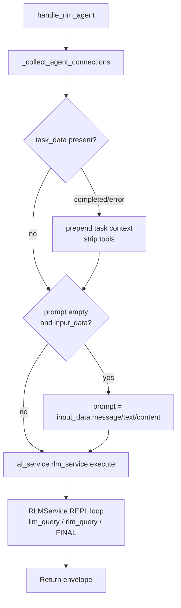

# RLM Agent (`rlm_agent`)

| Field | Value |
|------|-------|
| **Category** | specialized_agents |
| **Backend handler** | [`server/services/handlers/rlm.py::handle_rlm_agent`](../../../server/services/handlers/rlm.py) |
| **Backend service** | `AIService.rlm_service` -> `RLMService.execute` |
| **Theme color** | `dracula.orange` |
| **Icon** | brain (U+1F9E0) |
| **Tests** | [`server/tests/nodes/test_specialized_agents.py::TestRLMAgent`](../../../server/tests/nodes/test_specialized_agents.py) |

## Purpose

Recursive Language Model agent. Instead of the standard tool-calling loop, the
LLM is prompted to emit Python code that is executed in a REPL and may
recursively call `llm_query()` or `rlm_query()` and end with `FINAL(...)`
to return a result. See [RLM Service](../../rlm_service.md).

## Inputs (handles)

Same 5 shared handles as the generic specialized agents. **No
`input-teammates` handle** -- RLM does not support team-lead expansion.

## Parameters

Standard `AI_AGENT_PROPERTIES` plus RLM extras:

| Name | Type | Default | Description |
|------|------|---------|-------------|
| `maxIterations` | number | `30` | Hard cap on REPL iterations before forcing `FINAL(...)` |

## Outputs (handles)

| Handle | Shape | Description |
|--------|-------|-------------|
| `output-main` | object | `{ response, model, provider, iterations, timestamp }` |

## Logic Flow

## Decision Logic

- **Same preprocessing as `handle_chat_agent`**: task-completion tool
  strip, auto-prompt fallback.
- **No teammate expansion**: `_collect_teammate_connections` is not
  called.
- **No workspace injection**: RLM executes code in an in-memory REPL
  (`exec()`), not on a real filesystem; the handler does not pass
  `workspace_dir`.

## Side Effects

- **Database reads**: `database.get_node_parameters` for each connected
  skill/memory/tool node.
- **Database writes**: token usage metrics via `RLMService` ->
  `AIService` helpers.
- **Broadcasts**: `StatusBroadcaster.update_node_status` (executing,
  success, error); `executing_tool` for connected tools invoked during
  REPL calls.
- **External API calls**: one call to the big LM per REPL turn, plus
  nested `llm_query()` calls to the small LM provider when configured.
- **File I/O / subprocess**: none directly; REPL `exec()` may import
  libraries and run computation in-process.

## External Dependencies

- **Credentials**: `auth_service.get_api_key(<provider>)` for big LM, and
  optionally the small-LM provider wired as a connected chat-model node.
- **Services**: `RLMService`, `StatusBroadcaster`, `PricingService`.
- **Python packages**: standard library + LangChain core; no special
  deepagents dependency.

## Edge cases & known limits

- **REPL exec() is in-process**: user code runs in the backend Python
  process with no sandboxing. The skill prompt is expected to constrain
  the LLM, but nothing prevents a misbehaving LLM from importing
  `subprocess` or `os` and doing I/O.
- **No per-step timeout**: `maxIterations` is the only bound; a single
  REPL step can hang the handler if user code blocks.
- **No team-lead support**: `input-teammates` is not read. Connecting
  agents there has no effect.
- **LLM output parsing**: the REPL parser expects a specific fenced-code
  format. If the big LM ignores formatting instructions, the loop
  aborts early and returns whatever partial result it collected.

## Related

- **Pattern siblings**: [`deepAgent`](./deepAgent.md), [`claudeCodeAgent`](./claudeCodeAgent.md)
- **Architecture**: [RLM Service](../../rlm_service.md)
