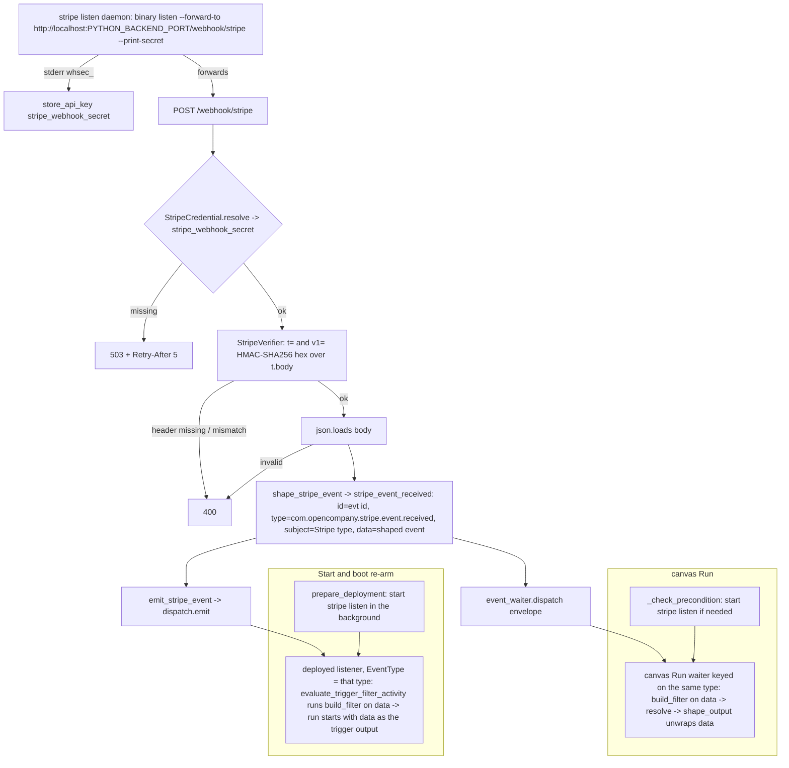

# Stripe Receive (`stripeReceive`)

| Field | Value |
|------|-------|
| **Category** | payments / trigger (class `group = ("payments", "trigger")`) |
| **Backend handler** | [`server/nodes/stripe/stripe_receive.py`](../../../server/nodes/stripe/stripe_receive.py) (`StripeReceiveNode`, on `WebhookTriggerNode`); daemon + webhook plumbing in [`_source.py`](../../../server/nodes/stripe/_source.py) (`StripeListenSource`, `StripeWebhookSource`, `shape_stripe_event`); the CloudEvents factory and deployed-path emit in [`_events.py`](../../../server/nodes/stripe/_events.py); framework base [`services/events/triggers.py`](../../../server/services/events/triggers.py), [`services/events/webhook.py`](../../../server/services/events/webhook.py), verifier [`services/events/verifiers/stripe.py`](../../../server/services/events/verifiers/stripe.py) |
| **Tests** | [`server/tests/nodes/test_stripe_plugin.py`](../../../server/tests/nodes/test_stripe_plugin.py), `TestTriggerPrepareDeployment` in [`server/tests/test_deployment_canary_listener.py`](../../../server/tests/test_deployment_canary_listener.py) |
| **Skill (if any)** | none as a tool (the [stripe-skill](../../../server/skills/payments_agent/stripe-skill/SKILL.md) teaches it in prose; its `allowed-tools` names only `stripe_action`) |
| **Dual-purpose tool** | no (trigger) |

## Purpose

Fire a workflow when Stripe delivers a webhook event, on a canvas Run and in a
deployed workflow. A supervised `stripe listen` daemon forwards every event for
the logged-in account to `POST /webhook/stripe`; the source verifies the
`Stripe-Signature` header against the `whsec_` secret captured from the
daemon's own stderr, flattens the Stripe event into the trigger's output
(`shape_stripe_event`), and wraps it in one `WorkflowEvent` type,
`com.opencompany.stripe.event.received`, with the Stripe type in `subject` and
`data.event_type`. It hands that envelope to the in-process event waiter (a
canvas Run, or a deploy that runs without Temporal) and to
`services.events.dispatch.emit` (deployed listeners on Temporal). The node
contributes the event-type and livemode filter, the daemon start (on a canvas
Run and on deploy), and the output unwrap.

## Inputs (handles)

None - this is a trigger; it is the head of a run.

## Parameters

`StripeReceiveParams(BaseTriggerParams)`, `extra="ignore"`.

| Name | Type | Default | Required | displayOptions.show | Description |
|------|------|---------|----------|---------------------|-------------|
| `event_type_filter` | string | `all` | no | - | `all`, an exact Stripe type (`charge.succeeded`), or a `prefix.*` glob (`charge.*`). Matched against `data.event_type`; a leading `stripe.` is accepted and stripped, for patterns written when the node required it |
| `livemode_filter` | `all \| test \| live` | `all` | no | - | Compared with `data.livemode`: `live` admits live-mode events only, `test` test-mode events only |

## Outputs (handles)

| Handle | Shape | Description |
|--------|-------|-------------|
| `output-main` | object | `StripeReceiveOutput`: the shaped event (`shape_stripe_event`), identical on a canvas Run and in a deployed run |

### Output payload (TypeScript shape)

`extra="allow"`. All fields are `Optional` on the model.

```ts
{
  event_id: string;             // Stripe's evt_ id ("" when the payload had none)
  event_type: string;           // Stripe's type, e.g. "charge.succeeded" ("unknown" when missing)
  created: number | null;       // Stripe's created (Unix seconds)
  livemode: boolean | null;
  api_version: string | null;
  request_id: string | null;    // request.id, or request when Stripe sends a bare value
  account: string | null;       // set only for Connect events
  data: object;                 // Stripe's data object {object, previous_attributes?}, {} when missing
}
```

## Logic Flow



## Decision Logic

- **One CloudEvents type**: every Stripe event is
  `com.opencompany.stripe.event.received`. A deployed trigger listens for
  exactly one type (`register_canary_trigger_type` records one string per
  node type, and the listener's `EventType` Search Attribute and the
  controller's `on_event` match it exactly), so per-event types such as
  `stripe.charge.succeeded` could never reach a deployed `stripeReceive`. The
  node sets `event_type` to the same constant, which keys the canvas-Run
  waiter.
- **Two delivery paths**: `WebhookSource.handle` dispatches into the
  in-process event waiter, which serves a canvas Run and the deploy path
  without Temporal: the deployment manager arms the in-process collector
  instead of a Temporal listener when no Temporal client is connected
  (`TEMPORAL_ENABLED=false`, or Temporal not up yet) or the event framework
  is off. `StripeWebhookSource.handle` then calls
  `emit_stripe_event`, which reaches deployed listeners on Temporal. The
  envelope carries no `workflow_id`, so every deployment with the trigger
  receives it.
- **Filter** (`build_filter`): both callers pass the envelope's `data` (the
  waiter and `evaluate_trigger_filter_activity`); an envelope is accepted
  too. `event_type_filter` is matched against `data.event_type` with
  `event_type_matches` (exact, or `prefix.*`; `all` / empty matches
  everything); `livemode_filter` compares `bool(data.livemode)`. A payload
  that is not a dict is rejected.
- **Output**: shaped once, in the source, because a deployed trigger hands
  downstream nodes `event.data` verbatim; `shape_output` returns that same
  `data`, so a canvas Run and a deployed run see the same fields.
- **Daemon start**:
  - *Canvas Run* (`_check_precondition`): if the listen source is not
    `_started`, `has_credential()` (a filesystem sniff for `_api_key` in
    the CLI's `config.toml`) must be true, else the run returns "Stripe not
    connected. Log in with Stripe in Credentials."; a failed start returns
    "Stripe daemon failed to start: <error>".
  - *Deploy* (`prepare_deployment`, called by
    `DeploymentManager._prepare_trigger_deployment` at Start and when the boot
    re-arm restores a running or paused generation): the same start, in a
    background task so a first-use CLI download never holds up Start. A
    failure or a missing login is logged as a warning and the trigger stays
    armed; logging in with Stripe starts the daemon, and events flow from
    then on.
  - The status refresh never starts the daemon.
- **Signature verification fails closed**: no captured secret -> HTTP 503
  with `Retry-After: 5`; missing header, missing `t=` / `v1=`, or no
  matching `v1=` candidate -> HTTP 400. Multiple `v1=` values are accepted
  (rotation).
- **Fallbacks**: `created` missing or non-integer -> `time = now(UTC)`;
  missing `id` -> empty `event_id`; missing `type` -> `event_type =
  "unknown"`; `data` not a dict -> `{}`; `account` absent -> `null`, and
  the envelope's `source` is `stripe://default`.

## Side Effects

- **Subprocess**: the `stripe listen` daemon (`StripeListenSource`,
  `process_name = "stripe-listen"`, `workflow_namespace = "_stripe"`, cwd
  `<DATA_DIR>/daemons/`), supervised by `ProcessService`, which logs its
  stdout / stderr and broadcasts them to the Terminal tab. `--forward-to`
  uses `Settings().port` (`PYTHON_BACKEND_PORT`).
- **Database writes**: `auth_service.store_api_key("stripe_webhook_secret",
  <whsec_...>, models=[])` whenever a `whsec_` token appears on the daemon's
  stderr (fire-and-forget task).
- **Event dispatch**: `event_waiter.dispatch` and `dispatch.emit` (wire
  routing key `stripe_event_received` for the in-process broadcast half of
  `emit`) for every verified delivery.
- **Broadcasts**: none of its own on a canvas Run (`TriggerNode.execute`
  registers the waiter without a `waiting` status; the generic trigger handler
  in `services/handlers/triggers.py` that sends one serves only
  `twitterReceive`). A deployed trigger shows `waiting` from the deployment
  manager (Temporal listener) or the in-process collector.
  `make_status_refresh` mirrors `source.status()` (`type` / `running` /
  `pid`, without login state) into `broadcaster._status["stripe"]` once at
  startup and broadcasts it as `stripe_status`, which no frontend code
  handles.
- **HTTP**: `POST /webhook/stripe` answered by the router after
  `handle()`; the source's `receive()` also enqueues the event on its
  internal push queue (nothing consumes that queue for this source).
- **WS handlers**: `stripe_connect` / `stripe_disconnect` /
  `stripe_reconnect` / `stripe_status` (lifecycle factory, `stripe_status`
  overridden to add `logged_in` / `connected`), `stripe_login`,
  `stripe_logout`, `stripe_trigger`.

## External Dependencies

- **Credentials**: `StripeCredential` (`id = "stripe"`, `auth = "custom"`) -
  `resolve()` exposes only `stripe_webhook_secret`; login state is the CLI's
  own `config.toml` (`$XDG_CONFIG_HOME/stripe/` or `~/.config/stripe/`).
- **Services**: the Stripe CLI (system PATH preferred, else pinned `1.40.9`
  download into `<DATA_DIR>/packages/stripe/bin/`); Stripe's webhook
  delivery through `stripe listen`.
- **Python packages**: `pydantic`, stdlib `hmac` / `hashlib`, `fastapi`.
- **Environment variables**: `PYTHON_BACKEND_PORT` (via `Settings().port`),
  `XDG_CONFIG_HOME`.

## Edge cases & known limits

- `TRIGGER_START_TO_CLOSE` (24 h) bounds the Temporal activity for a
  canvas Run; there is no shorter wait timeout.
- Redeliveries keep Stripe's `evt_` id as the envelope id, so a deployed
  listener drops a redelivery as a duplicate; a canvas Run resolves once
  anyway.
- Secret race: events forwarded before the `whsec_` line is captured get a
  503 and are retried by Stripe / the CLI.
- One account per install; the daemon is a single global process.
- No auto-restart on daemon crash, and nothing reports it: the source's
  `_started` flag is cleared only by `stop()`, so `stripe_status` still says
  `running: true`, the precondition and the deploy hook both skip the start,
  and the Credentials modal still shows Stripe as connected. Disconnect, then
  Login with Stripe, restarts it.
- No hire uses `stripeReceive` as a trigger yet: `config/employee_apps.json`
  keeps Stripe a tool-only app.

## Related

- **Sibling**: [`stripeAction`](./stripeAction.md) (`trigger <event>` is the easiest way to exercise this node)
- **Architecture docs**: [Stripe Service](../../stripe_service.md), [Event Waiter System](../../event_waiter_system.md), [Event Framework](../../event_framework.md)
