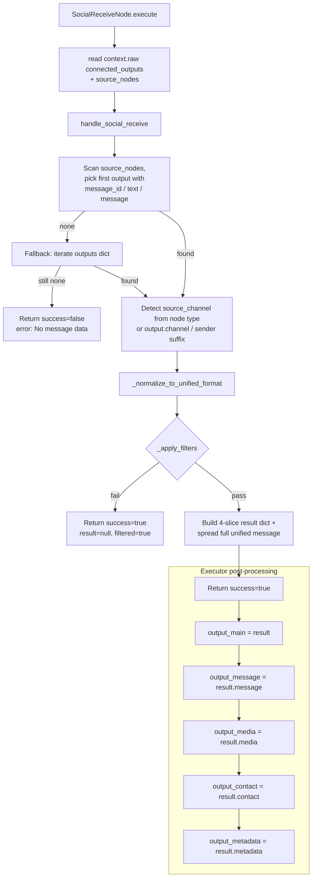

# Social Receive (`socialReceive`)

| Field | Value |
|------|-------|
| **Category** | social |
| **Backend handler** | plugin [`server/nodes/social/social_receive/__init__.py`](../../../server/nodes/social/social_receive/__init__.py) (`SocialReceiveNode`, custom `execute` override) delegating to [`server/nodes/social/_base.py::handle_social_receive`](../../../server/nodes/social/_base.py) |
| **Tests** | [`server/tests/nodes/test_telegram_social.py`](../../../server/tests/nodes/test_telegram_social.py) |
| **Skill (if any)** | none |
| **Dual-purpose tool** | no |

## Purpose

Normalizes messages from any platform-specific trigger (WhatsApp, Telegram,
Chat, Webchat, Discord, Slack, ...) into the unified "inbound message" schema.
Applies channel / message-type / sender / keyword filters, then fans the
result out across four dedicated handles (`message`, `media`, `contact`,
`metadata`) so downstream agents can grab just the slice they need.

`socialReceive` is in the executor's `_NEEDS_CONNECTED_OUTPUTS` set, so the
executor injects upstream outputs as `connected_outputs` / `source_nodes` into
the execution context. `SocialReceiveNode.execute` overrides the default
envelope wrap (reading `context.raw["connected_outputs"]` and
`context.raw["source_nodes"]`) so the `filtered` / `reason` keys the handler
emits survive to the top-level result dict.

## Inputs (handles)

The plugin declares **no explicit input handle** (`component_kind = "agent"`,
the `handles` tuple lists only the four right-side output handles). Upstream
trigger outputs reach the node via the executor's `connected_outputs` injection
(`socialReceive` is in `_NEEDS_CONNECTED_OUTPUTS`), keyed by source node
**type**, so the handler walks `source_nodes` and looks up
`connected_outputs[source_type]`. Typical sources: `whatsappReceive`,
`telegramReceive`, `chatTrigger`.

## Parameters

All field names are snake_case (no camelCase aliases on `SocialReceiveParams`).

| Name | Type | Default | Required | displayOptions.show | Description |
|------|------|---------|----------|---------------------|-------------|
| `channel_filter` | options | `all` | no | - | `all`/`whatsapp`/`telegram`/`discord`/`slack`/`signal`/`sms`/`webchat`/`email`/`matrix`/`teams` - exact match against detected `channel` |
| `message_type_filter` | options | `all` | no | - | `all`/`text`/`image`/`video`/`audio`/`document`/`sticker`/`location`/`contact`/`poll`/`reaction` |
| `sender_filter` | options | `all` | no | - | `all`/`any_contact`/`contact`/`group`/`keywords` |
| `contact_phone` | string | `""` | yes when `sender_filter=contact` | `sender_filter: ['contact']` | Exact phone compare |
| `group_id` | string | `""` | yes when `sender_filter=group` | `sender_filter: ['group']` | Exact chat_id compare |
| `keywords` | string | `""` | no | `sender_filter: ['keywords']` | Comma-separated, lower-case substring match |
| `ignore_own_messages` | boolean | `true` | no | - | Drop messages where `is_from_me=True` |
| `ignore_bots` | boolean | `false` | no | - | Drop messages where `is_bot=True` |
| `include_media_data` | boolean | `false` | no | - | Include base64 media payload (memory-intensive) |

## Outputs (handles)

`NodeExecutor` stores the handler's `result.result` under `output_main`
**and** splits it into four additional output-store keys so different
downstream handles can consume different slices (node_executor.py:188-192):

| Handle / key | Shape | Description |
|--------------|-------|-------------|
| `output_main` | object | Full unified message (backwards-compatible) |
| `output_message` | string | `result.message` - plain text for LLM input |
| `output_media` | object | `result.media` - `{ url, type, mimetype, caption, size, thumbnail, filename }` (empty `{}` when no media) |
| `output_contact` | object | `result.contact` - `{ sender, sender_phone, sender_name, sender_username, channel, is_group, group_info, chat_title }` |
| `output_metadata` | object | `result.metadata` - `{ message_id, chat_id, timestamp, message_type, is_from_me, is_forwarded, reply_to, thread_id }` |

### Output payload (`result`)

```ts
{
  // Per-handle slices (also written to dedicated output keys):
  message: string;
  media: { url, type, mimetype, caption, size, thumbnail, filename } | {};
  contact: { sender, sender_phone, sender_name, sender_username, channel, is_group, group_info, chat_title };
  metadata: { message_id, chat_id, timestamp, message_type, is_from_me, is_forwarded, reply_to, thread_id };

  // Plus the full unified message at the top level (spread):
  message_id: string;
  channel: string;
  sender: string;
  sender_phone: string;
  sender_name: string;
  sender_username: string;
  chat_id: string;
  chat_title: string;
  chat_type: 'dm' | 'group' | string;
  message_type: string;
  text: string;
  timestamp: string;
  is_group: boolean;
  is_from_me: boolean;
  is_forwarded: boolean;
  is_bot: boolean;
  is_admin: boolean;
  thread_id?: any;
  account_id?: any;
  session_id?: any;
  group_info?: any;
  location?: any;
  contact?: any;
  poll?: any;
  reaction?: any;
  reply_to?: any;
  mentions?: any;
  raw: object;
}
```

When a message is filtered out the handler returns
`{ success: true, result: null, filtered: true, reason: "Message did not pass filters" }`.

## Logic Flow



## Decision Logic

- **Source resolution (primary path)**: Loop over `source_nodes`, look up
  `outputs[source_type]`, accept the first dict that has any of
  `message_id` / `text` / `message`.
- **Source resolution (fallback)**: If the primary path fails, iterate
  `outputs.items()` and apply the same detection. Channel detection here also
  sniffs `sender.endswith('@s.whatsapp.net')` to tag WhatsApp.
- **Channel detection** (case-insensitive substring on node type or key):
  `whatsapp`/`telegram`/`discord`/`slack`/`chat` (-> `webchat`). Falls back to
  `output.channel` if present, else `"unknown"`.
- **Chat type**: `_determine_chat_type` returns `data.chat_type` if set, else
  `"group"` if `is_group` else `"dm"`.
- **Filters** (`_apply_filters`):
  - `channel_filter`: exact match against normalized `channel`.
  - `message_type_filter`: exact match against `message_type`.
  - `sender_filter=any_contact`: rejects group messages only.
  - `sender_filter=contact`: rejects when `sender_phone != contact_phone` (only
    if `contact_phone` is truthy).
  - `sender_filter=group`: rejects when `chat_id != group_id` (only if `group_id` is truthy).
  - `sender_filter=keywords`: lower-cased substring match on the `text`; empty
    `keywords` accepts all.
  - `ignore_own_messages` (default `true`): drops `is_from_me`.
  - `ignore_bots`: drops `is_bot`.
- **Message id synthesis**: If upstream omits `message_id`, a random 8-char
  hex (`uuid4().hex[:8]`) is assigned.
- **Webchat defaults**: When `source_channel == 'webchat'`, missing `sender` is
  set to `webchat_<session_id>`, `chat_id` defaults to the session id, and
  `sender_name` defaults to `"User"`.

## Side Effects

- **Database writes**: none.
- **Broadcasts**: none from the handler; executor writes the five output-store
  keys.
- **External API calls**: none.
- **File I/O**: none.
- **Subprocess**: none.

## External Dependencies

- **Credentials**: none.
- **Services**: none directly; relies on upstream trigger nodes feeding
  `outputs` via the executor.
- **Python packages**: stdlib only (`uuid`, `time`, `datetime`, `typing`).
- **Environment variables**: none.

## Edge cases & known limits

- **First-match wins**: When multiple upstream triggers feed `socialReceive`
  in the same execution, only the first candidate (by `source_nodes` iteration
  order) is normalized; the others are silently ignored.
- **Channel heuristic is fragile**: Detection uses `.lower() in source_type`
  and `sender.endswith('@s.whatsapp.net')`. A node type named `chatty_*`
  becomes `webchat`, and a Telegram message without a matching node type
  falls back to `"unknown"`.
- **Filtered messages still succeed**: When filters reject a message, the
  envelope is `success=true, result=null, filtered=true`. Downstream nodes
  receive `null` via the output store - anything that expects a dict must
  handle this.
- **`_apply_filters` default for `ignore_own_messages` is `True`**: Loopback
  messages (echo bots, self-tests) are silently dropped unless explicitly
  turned off in the UI.
- **Top-level spread**: `{ ...unified_message }` overwrites the dedicated
  `contact` / `media` keys the handler just built, with the raw versions from
  the upstream message. Code that reads `result.contact` via the output-store
  key `output_contact` sees the handler's structured slice; code that reads
  `result['contact']` from `output_main` may see the upstream raw contact
  dict instead (they are not the same shape).
- **UUID `message_id` on fallback**: Not cryptographically unique across
  sessions; two workflows receiving chatTrigger messages at the same time
  can generate colliding ids.
- **Empty connected outputs**: `execute` reads `context.raw["connected_outputs"]`
  and `["source_nodes"]`, defaulting to `{}` / `[]`. The handler still accepts
  `outputs=None` / `source_nodes=None` and falls back to `context["outputs"]` -
  useful for direct unit tests, but a broken executor injection would silently
  return "No message data received" instead of failing fast.

## Related

- **Sibling nodes**: [`socialSend`](./socialSend.md), [`telegramReceive`](./telegramReceive.md)
- **Upstream triggers**: [`telegramReceive`](./telegramReceive.md); WhatsApp/Chat triggers live in other categories
- **Shared handler body**: [`server/nodes/social/_base.py`](../../../server/nodes/social/_base.py)
- **Output handle split**: `server/services/node_executor.py:188-192` (`_NEEDS_CONNECTED_OUTPUTS` injection + 4-key split)
