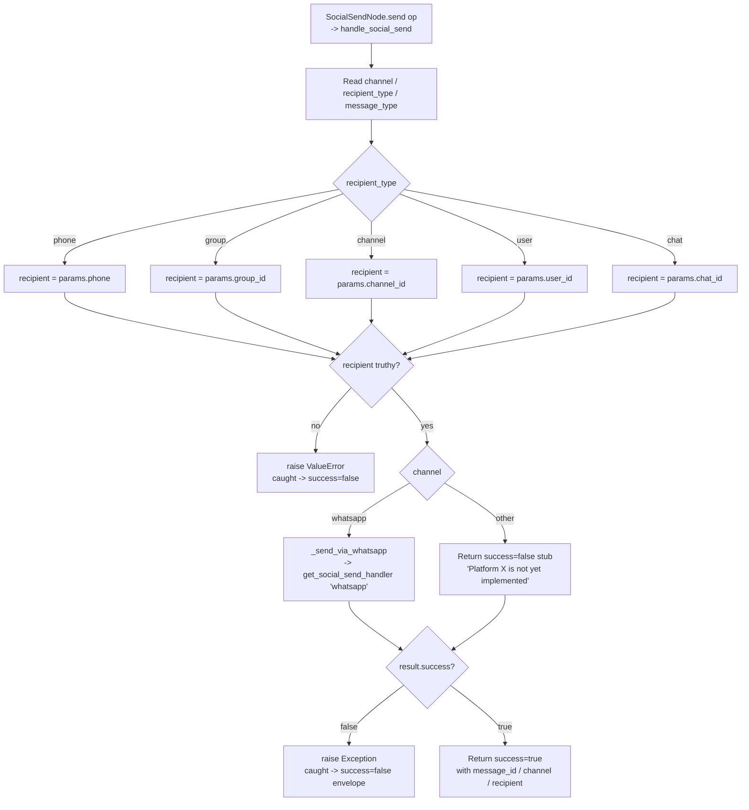

# Social Send (`socialSend`)

| Field | Value |
|------|-------|
| **Category** | social / tool (dual-purpose) |
| **Backend handler** | plugin [`server/nodes/social/social_send/__init__.py`](../../../server/nodes/social/social_send/__init__.py) (`SocialSendNode`, dispatch via `BaseNode.execute()` -> `@Operation("send")`) delegating to [`server/nodes/social/_base.py::handle_social_send`](../../../server/nodes/social/_base.py) |
| **Tests** | [`server/tests/nodes/test_telegram_social.py`](../../../server/tests/nodes/test_telegram_social.py) |
| **Skill (if any)** | none |
| **Dual-purpose tool** | yes - `group = ("social", "tool")`, `usable_as_tool = True`; works as a workflow node and as an AI Agent tool |

## Purpose

Platform-agnostic outbound messaging. Routes the payload to the platform
identified by `channel` - currently only `whatsapp` is implemented; every
other value (`telegram`, `discord`, `slack`, `signal`, `sms`, `webchat`,
`email`, `matrix`, `teams`) falls through to an "not yet implemented" stub
and surfaces as a failed envelope.

## Inputs (handles)

`component_kind = "agent"` (multi-handle layout). Four left-side input handles
(all `role: main`):

| Handle | Connection type | Required | Purpose |
|--------|-----------------|----------|---------|
| `input-message` | main | no | Upstream message text (consumed via template resolution on `message`) |
| `input-media` | main | no | Upstream media payload |
| `input-contact` | main | no | Upstream contact payload |
| `input-metadata` | main | no | Upstream metadata payload |

## Parameters

All field names are snake_case (the `SocialSendParams` model uses no camelCase
aliases). 40 fields total; abbreviated below by group.

| Name | Type | Default | displayOptions.show | Description |
|------|------|---------|---------------------|-------------|
| `channel` | options | `whatsapp` | - | `whatsapp`/`telegram`/`discord`/`slack`/`signal`/`sms`/`webchat`/`email`/`matrix`/`teams` - only `whatsapp` is wired |
| `recipient_type` | options | `phone` | - | `phone`/`group`/`channel`/`user`/`chat` |
| `phone` | string | `""` | `recipient_type: ['phone']` | Destination phone (no `+` prefix) |
| `group_id` | string | `""` | `recipient_type: ['group']` | Group identifier |
| `channel_id` | string | `""` | `recipient_type: ['channel']` | Channel identifier |
| `user_id` | string | `""` | `recipient_type: ['user']` | User identifier |
| `chat_id` | string | `""` | `recipient_type: ['chat']` | Generic chat identifier |
| `thread_id` | string | `""` | - | Thread to reply in (optional) |
| `message_type` | options | `text` | - | `text`/`image`/`video`/`audio`/`document`/`sticker`/`location`/`contact`/`poll`/`buttons`/`list` |
| `message` | string | `""` | `message_type: ['text']` | Message body |
| `format` | options | `plain` | `message_type: ['text']` | `plain`/`markdown`/`html` |
| `media_source` | options | `url` | media types | `url`/`base64`/`file` |
| `media_url` / `media_data` / `file_path` | string | `""` | media types + matching `media_source` | Media payload |
| `mime_type`, `caption`, `filename` | string | `""` | media types | Extra media fields |
| `latitude`, `longitude` | float | `0.0` | `message_type: ['location']` | Location coords |
| `location_name`, `address` | string | `""` | `message_type: ['location']` | Location text |
| `contact_name`, `contact_phone`, `vcard` | string | `""` | `message_type: ['contact']` | Contact fields |
| `poll_question`, `poll_options` | string | `""` | `message_type: ['poll']` | Poll text |
| `poll_allow_multiple` | boolean | `false` | `message_type: ['poll']` | Multi-select |
| `button_text`, `buttons` | string | `""` / `"[]"` | `message_type: ['buttons']` | Buttons (JSON array) |
| `list_title`, `list_button_text`, `list_sections` | string | `""` / `"View Options"` / `"[]"` | `message_type: ['list']` | List message |
| `reply_to_message` | boolean | `false` | - | Quote an existing message |
| `reply_message_id` | string | `""` | `reply_to_message: [true]` | Message id to reply to |
| `reply_to_current` | boolean | `false` | `reply_to_message: [true]` | Reply to the triggering message |
| `audio_as_voice` | boolean | `false` | `message_type: ['audio']` | Send audio as voice |
| `disable_preview` | boolean | `false` | `message_type: ['text']` | Disable link preview |
| `silent` | boolean | `false` | - | Send without notification |
| `protect_content` | boolean | `false` | - | Prevent forwarding/saving |

## Outputs (handles)

The plugin declares no explicit output handle (the `handles` tuple lists only
the four input handles); the operation result flows out through the default
`output_main` store key. When wired into an agent's `input-tools` the same
payload is returned to the LLM (`usable_as_tool = True`).

| Handle / key | Shape | Description |
|--------------|-------|-------------|
| `output_main` | object | Send result envelope (validated against `SocialSendOutput`: `sent`/`message_id` + `extra="allow"`) |

### Output payload (`result`)

```ts
{
  success: true;
  message_id: string | null;
  channel: string;         // e.g. 'whatsapp'
  recipient: string;       // resolved phone / group_id / channel_id / user_id / chat_id
  recipient_type: string;
  message_type: string;
  timestamp: string;       // ISO
}
```

`handle_social_send` already returns the full `{ success, node_id, node_type,
result, execution_time, timestamp }` envelope; the plugin's `send` op returns
`response["result"]` on success and raises `RuntimeError(error)` otherwise.

## Logic Flow



## Decision Logic

- **Recipient resolution**: Hard-coded mapping from `recipient_type` to a
  specific parameter key (`phone`->`phone`, `group`->`group_id`,
  `channel`->`channel_id`, `user`->`user_id`, `chat`->`chat_id`). An unknown
  `recipient_type` leaves `recipient = None` and the handler raises
  `ValueError("Recipient (<type>) is required")`.
- **Channel dispatch**: Python `if/elif` on `channel`. Only `"whatsapp"` is
  wired. Every other value returns
  `{"success": False, "error": "Platform '<x>' is not yet implemented"}`
  which is then re-raised as a generic `Exception` and becomes the envelope's
  `error` string.
- **Message type branching**: `_send_via_whatsapp` converts the social-send
  parameter shape into the whatsapp-send shape (camelCase -> snake_case,
  media sources, reply flags). Unknown `messageType` values fall through
  without setting any media/content fields - the downstream WhatsApp handler
  is responsible for rejecting them.
- **Reply handling**: Only set when `replyToMessage` is truthy; sets
  `is_reply=True` and copies `replyMessageId -> reply_message_id`.

## Side Effects

- **Database writes**: none directly. The WhatsApp handler this delegates
  to may record usage.
- **Broadcasts**: none from `handle_social_send` itself; broadcasts originate
  in the underlying platform handler.
- **External API calls**: delegated to the WhatsApp send handler resolved via
  `get_social_send_handler("whatsapp")` (the whatsapp plugin self-registers it
  from `nodes/whatsapp/__init__.py`), which hits the WhatsApp RPC service
  (default `http://localhost:9400`).
- **File I/O**: none from this handler. `mediaSource=file` reads are delegated.
- **Subprocess**: none.

## External Dependencies

- **Credentials**: none at this layer - the WhatsApp handler manages its own
  RPC connection.
- **Services**: the registered `"whatsapp"` social-send handler resolved via
  `get_social_send_handler("whatsapp")` inside `_send_via_whatsapp`.
- **Python packages**: stdlib only (`time`, `datetime`, `typing`).
- **Environment variables**: none.

## Edge cases & known limits

- **Only WhatsApp is implemented**: The node advertises 10 channels but silently
  degrades to `"Platform '<x>' is not yet implemented"` for the other 9.
- **Lossy exception surface**: A failed WhatsApp call returns
  `{"success": False, "error": "..."}`, which the outer code re-raises as a
  generic `Exception(result.get('error', 'Send failed'))`. The traceback is
  swallowed; only the string survives.
- **Recipient defaults**: When `recipientType` is something the code does not
  handle, `recipient` stays `None` and the ValueError message reports the
  received `recipient_type` string back to the user. Good for debugging, bad
  for LLM tool use (the LLM then retries with a different type).
- **`group_id` used for non-phone `recipient_type`**: Inside `_send_via_whatsapp`,
  anything that is not `phone` maps onto `group_id` in the WhatsApp params,
  including `channel`/`user`/`chat`. This means channels/users/chats end up
  being sent as WhatsApp groups, which the RPC will likely reject.
- **Manual param mapping**: `_send_via_whatsapp` rebuilds the whatsapp-send param
  dict field-by-field from `SocialSendParams`. Both schemas are snake_case now,
  but the mapping is still hand-written and can drift when new fields are added
  on either side.

## Related

- **Sibling nodes**: [`socialReceive`](./socialReceive.md), [`telegramSend`](./telegramSend.md)
- **Downstream handler**: registered `"whatsapp"` social-send handler (`nodes/whatsapp/__init__.py`)
- **Shared handler body**: [`server/nodes/social/_base.py`](../../../server/nodes/social/_base.py)
- **Architecture docs**: WhatsApp Integration section in the root [`CLAUDE.md`](../../../CLAUDE.md)
