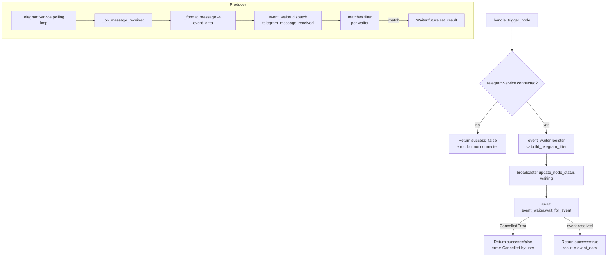

# Telegram Receive (`telegramReceive`)

| Field | Value |
|------|-------|
| **Category** | social / trigger |
| **Backend handler** | [`server/services/handlers/triggers.py::handle_trigger_node`](../../../server/services/handlers/triggers.py) (generic) + [`server/services/event_waiter.py::build_telegram_filter`](../../../server/services/event_waiter.py) |
| **Tests** | [`server/tests/nodes/test_telegram_social.py`](../../../server/tests/nodes/test_telegram_social.py) |
| **Skill (if any)** | none |
| **Dual-purpose tool** | no (trigger only) |

## Purpose

Wait for an incoming Telegram message and emit it as the workflow trigger
event. Implementation is split between the generic `handle_trigger_node`
(registers a waiter and blocks on `event_waiter.wait_for_event`) and the
Telegram-specific filter builder that pre-compiles a `matches()` closure
from the node parameters. Events are produced by the `TelegramService`
long-polling loop inside `_on_message_received` and dispatched via
`event_waiter.dispatch("telegram_message_received", <event_data>)`.

## Inputs (handles)

Trigger node - no inputs.

## Parameters

| Name | Type | Default | Required | displayOptions.show | Description |
|------|------|---------|----------|---------------------|-------------|
| `contentTypeFilter` | options | `all` | no | - | One of `all`/`text`/`photo`/`video`/`audio`/`voice`/`document`/`sticker`/`location`/`contact`/`poll` |
| `senderFilter` | options | `all` | no | - | `all`/`self`/`private`/`group`/`supergroup`/`channel`/`specific_chat`/`specific_user`/`keywords` |
| `chat_id` | string | `""` | yes when `senderFilter=specific_chat` | `senderFilter: ['specific_chat']` | Numeric chat id or `@username` |
| `from_user` | string | `""` | yes when `senderFilter=specific_user` | `senderFilter: ['specific_user']` | Numeric user id |
| `keywords` | string | `""` | yes when `senderFilter=keywords` | `senderFilter: ['keywords']` | Comma-separated, matched case-insensitively |
| `ignoreBots` | boolean | `true` | no | - | Skip messages where `is_bot=True` (ignored when `senderFilter=self`) |

Legacy alias: `chatTypeFilter` is still read when `senderFilter` is absent and
reconstructs the new-style value.

## Outputs (handles)

| Handle | Shape | Description |
|--------|-------|-------------|
| `output-main` | object | Formatted event from `TelegramService._format_message` |

### Output payload

```ts
{
  message_id: number;
  chat_id: number;
  chat_type: 'private' | 'group' | 'supergroup' | 'channel';
  chat_title: string | null;
  from_id: number | null;
  from_username: string | null;
  from_first_name: string | null;
  from_last_name: string | null;
  is_bot: boolean;
  text: string;                 // msg.text or msg.caption or ''
  content_type: 'text' | 'photo' | 'video' | 'audio' | 'voice'
              | 'document' | 'sticker' | 'location' | 'contact' | 'poll';
  date: string;                 // ISO timestamp
  reply_to_message_id: number | null;
  photo?:    { file_id; file_unique_id; width; height; file_size };
  document?: { file_id; file_name; mime_type; file_size };
  location?: { latitude; longitude };
  contact?:  { phone_number; first_name; last_name; user_id };
}
```

Wrapped in the standard success envelope when an event is received.

## Logic Flow



## Decision Logic

- **Pre-check**: Handler inspects `TelegramService.connected` before registering
  a waiter. Prevents hanging forever when the bot token was never added.
- **Sender filter branches** (inside `build_telegram_filter.matches`):
  - `self`: compares `m.from_id` to a lazily-resolved `owner_chat_id`. If no
    owner is known, the message is rejected (but no error surfaces to the
    user).
  - `private`/`group`/`supergroup`/`channel`: direct `m.chat_type` comparison.
  - `specific_chat` / `specific_user`: string-compared to `chat_id` / `from_user`.
  - `keywords`: lower-cased substring match against `m.text`.
  - `all`: accepts everything (subject to `ignore_bots`).
- **Content type filter**: Always applied first; if set and not `all`, rejects
  anything with a non-matching `content_type`.
- **`ignore_bots`**: Applied last; silently skipped when `senderFilter == 'self'`.
- **Legacy fallback**: If `senderFilter` is unset the code reconstructs it
  from `chat_id`/`from_user`/`keywords`/`chatTypeFilter` so old workflows keep
  working.

## Side Effects

- **Database writes**: none from the trigger path. (First private message to
  the bot causes `TelegramService._on_message_received` to call
  `auth_service.store_api_key("telegram_owner_chat_id", ...)`, but that is
  producer-side, not trigger-side.)
- **Broadcasts**: `status_broadcaster.update_node_status(node_id, "waiting", {...}, workflow_id=...)`
  when the waiter is registered.
- **External API calls**: none from the handler. Producer makes continuous
  `getUpdates` calls via python-telegram-bot long polling.
- **File I/O**: none.
- **Subprocess**: none.

## External Dependencies

- **Credentials**: bot token via `auth_service.get_api_key("telegram")`
  (read by the service on connect, not by the handler).
- **Services**: `TelegramService`, `event_waiter`, `StatusBroadcaster`.
- **Python packages**: `python-telegram-bot` v22.x.
- **Environment variables**: `TELEGRAM_OWNER_CHAT_ID` (service fallback).

## Edge cases & known limits

- **`self` filter with no owner**: Until the bot receives a private message (or
  `TELEGRAM_OWNER_CHAT_ID` is set), every message is rejected. There is no
  user-visible error; the node just stays in "waiting".
- **Keyword matching**: Case-insensitive substring, no word boundaries. `"hi"`
  matches `"chicken"`. Empty `keywords` accepts all messages.
- **String comparison for IDs**: `specific_chat`/`specific_user` compare via
  `str(...)`. A leading `@` or whitespace difference will silently mismatch.
- **`ignore_bots` override**: Hard-coded to be bypassed for `senderFilter=self`
  so bot-owners who are themselves bots still match.
- **Cancellation path**: If the trigger is cancelled mid-wait, the handler
  returns `success=false, error="Cancelled by user"` rather than swallowing.
- **Handler accepts unknown trigger types**: `handle_trigger_node` has a guard
  for missing `TriggerConfig`, but because the registry entry for
  `telegramReceive` is hard-coded this branch is unreachable in practice.
- **No timeout**: The node waits indefinitely. The only exit routes are an
  event match, an explicit `cancel_event_wait` WebSocket call, or the server
  restarting.

## Related

- **Sibling nodes**: [`telegramSend`](./telegramSend.md), [`socialReceive`](./socialReceive.md)
- **Event waiter architecture**: [Event Waiter System](../../event_waiter_system.md)
- **Service**: [`server/services/telegram_service.py`](../../../server/services/telegram_service.py)
