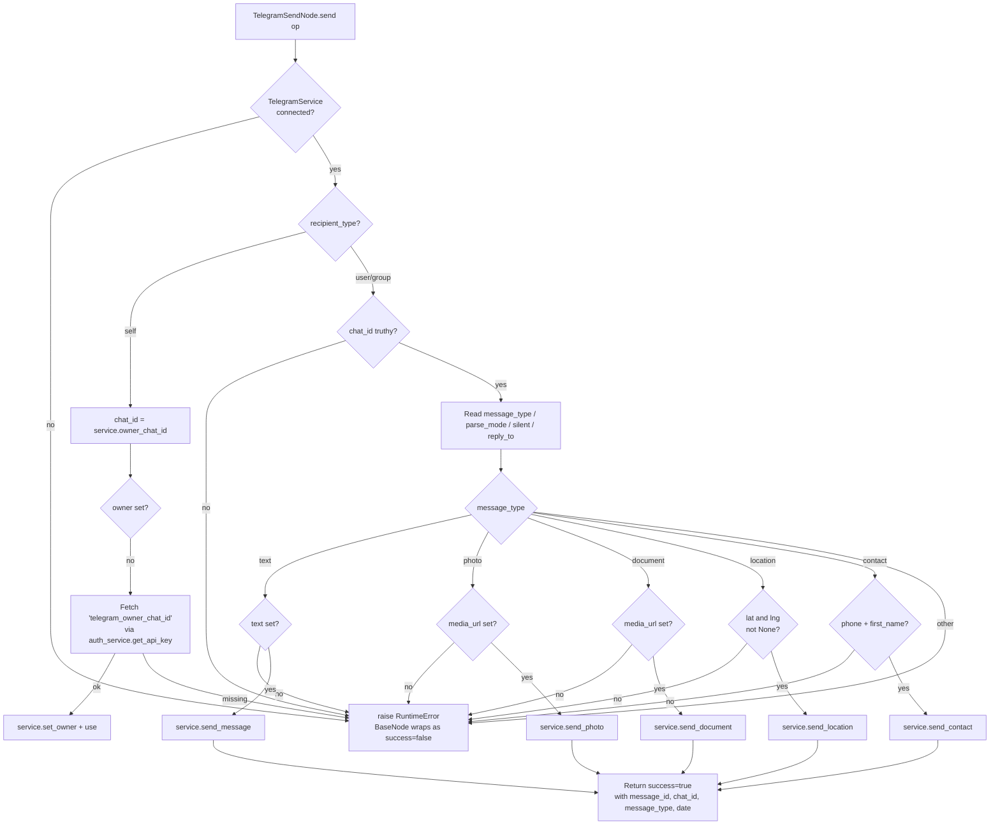

# Telegram Send (`telegramSend`)

| Field | Value |
|------|-------|
| **Category** | social (workflow-only) |
| **Backend handler** | [`server/nodes/telegram/telegram_send.py`](../../../server/nodes/telegram/telegram_send.py) (`TelegramSendNode`); dispatch via `BaseNode.execute()` -> `@Operation("send")` |
| **Tests** | [`server/tests/nodes/test_telegram_social.py`](../../../server/tests/nodes/test_telegram_social.py) |
| **Skill (if any)** | none |
| **Dual-purpose tool** | no - group is `("social",)` only; `usable_as_tool` not set (AI-tool exposure was dropped in Wave 11) |

## Purpose

Send text, photo, document, location, or contact messages through a connected
Telegram bot (python-telegram-bot v22.x). The node leans on the `TelegramService`
singleton for the actual Bot API calls; the `send` operation only does recipient
resolution, parameter validation, and envelope packaging. The operation body is
inlined directly in the plugin file (no `handlers/telegram.py` shim).

## Inputs (handles)

| Handle | Connection type | Required | Purpose |
|--------|-----------------|----------|---------|
| `input-main` | main | no | Upstream data - not read directly by the handler; parent nodes typically resolve templates into `text` / `caption` via ParameterResolver before the call. |

## Parameters

| Name | Type | Default | Required | displayOptions.show | Description |
|------|------|---------|----------|---------------------|-------------|
| `recipient_type` | options | `self` | no | - | One of `self` / `user` / `group` |
| `chat_id` | string | `""` | yes when `recipient_type != self` | `recipient_type: ['user','group']` | Numeric chat id or `@username` |
| `message_type` | options | `text` | no | - | `text` / `photo` / `document` / `location` / `contact` |
| `text` | string | `""` | yes when `message_type=text` | `message_type: ['text']` | Message text |
| `media_url` | string | `""` | yes when `message_type` in `photo`/`document` | `message_type: ['photo','document']` | Remote URL or `file_id` |
| `caption` | string | `""` | no | `message_type: ['photo','document']` | Optional caption |
| `latitude` | number (Optional[float], default `None`) | `None` | yes when `message_type=location` | `message_type: ['location']` | Latitude. `None` (not `0`) so deliberate `0.0` (Null Island) is distinguishable from "unset" |
| `longitude` | number (Optional[float], default `None`) | `None` | yes when `message_type=location` | `message_type: ['location']` | Longitude |
| `phone_number` | string | `""` | yes when `message_type=contact` | `message_type: ['contact']` | Contact phone |
| `first_name` | string | `""` | yes when `message_type=contact` | `message_type: ['contact']` | Contact first name |
| `last_name` | string | `""` | no | `message_type: ['contact']` | Contact last name |
| `parse_mode` | options | `Auto` | no | `message_type: ['text','photo','document']` | `Auto` / `""` / `HTML` / `Markdown` / `MarkdownV2` |
| `silent` | boolean | `false` | no | - | Sends without notification (`disable_notification=True`) |
| `reply_to_message_id` | number | `0` | no | - | If truthy, coerced to `int` and passed as `reply_to_message_id` |

## Outputs (handles)

| Handle | Shape | Description |
|--------|-------|-------------|
| `output-main` | object | Standard envelope containing Bot API message metadata |

### Output payload

The operation returns this dict (validated against `TelegramSendOutput`, which
declares `message_id` / `chat_id` / `sent` and `extra="allow"`):

```ts
{
  message_id: number;
  chat_id: number;
  message_type: 'text' | 'photo' | 'document' | 'location' | 'contact';
  date: string; // ISO timestamp from Telegram
}
```

`BaseNode.execute()` wraps it as `{ success: true, result: <payload>, execution_time, timestamp, node_id, node_type }`.

## Logic Flow



## Decision Logic

- **Connection gate**: If `service.connected` is False the op raises
  `RuntimeError("Telegram bot not connected. Add bot token in Credentials.")`
  (wrapped by `BaseNode.execute()` into a `success=false` envelope). No retry.
- **Self recipient**: Uses `service.owner_chat_id` (auto-captured on the first
  private message). If not set, the op tries
  `get_auth_service().get_api_key("telegram_owner_chat_id")` and restores the owner by
  calling `service.set_owner(int(saved))`. Any exception during restore is
  logged at WARNING and swallowed - the op continues and ultimately raises
  the "Bot owner not detected" `RuntimeError` when the chat_id is still falsy.
- **Parse mode**: Passed through to the service. The service itself implements
  `Auto` (GFM -> Telegram HTML via `markdown_formatter.to_telegram_html`) plus the
  `BadRequest "can't parse entities"` fallback that retries with `parse_mode=None`
  and the original unescaped text.
- **Message type dispatch**: Uses an `if/elif/else` chain on `message_type`. An
  unknown value falls into the `else` and raises
  `RuntimeError("Unsupported message type: <x>")`.
- **Reply-to coercion**: `reply_to_message_id` is cast via `int(...)` only when
  truthy. A non-numeric string here raises `ValueError`, which `BaseNode.execute()`
  catches and surfaces as an error envelope.

## Side Effects

- **Database writes**: none from the op directly. The owner is persisted via
  `auth_service.store_api_key("telegram_owner_chat_id", ...)` only inside
  `TelegramService._on_message_received`, not from the send path.
- **Broadcasts**: none from the send op. The service broadcasts the typed
  `telegram.status` CloudEvents envelope (wire key `telegram_status`) on
  connect / disconnect only - see `server/nodes/telegram/_events.py`.
- **External API calls**: Telegram Bot API via `python-telegram-bot` (`bot.send_message`,
  `bot.send_photo`, `bot.send_document`, `bot.send_location`, `bot.send_contact`).
- **File I/O**: none.
- **Subprocess**: none.

## External Dependencies

- **Credentials**: `auth_service.get_api_key("telegram_owner_chat_id")` when
  restoring the self-owner. Bot token comes from `auth_service.store_api_key("telegram", ...)`
  and is consumed by `TelegramService.connect()` elsewhere, not by this op.
  Declared on the plugin via `credentials = (TelegramCredential,)`.
- **Services**: `TelegramService` singleton (`server/nodes/telegram/_service.py::get_telegram_service`).
- **Python packages**: `python-telegram-bot` (v22.x), `markdown-it-py` (via
  `markdown_formatter`).
- **Environment variables**: `TELEGRAM_OWNER_CHAT_ID` (read by the service as a
  fallback for `owner_chat_id`).

## Edge cases & known limits

- **Swallowed owner-restore exceptions**: Any error looking up
  `telegram_owner_chat_id` is logged at WARNING and continues; the user only
  sees the downstream "Bot owner not detected" error.
- **Silent ValueError on `reply_to_message_id`**: A non-numeric value raises
  `ValueError`, surfaced by `BaseNode.execute()` as the error message.
- **`recipient_type` is a `Literal["self","user","group"]`**: Pydantic rejects
  any other value at param validation. For `user`/`group` an empty `chat_id`
  raises `RuntimeError("chat_id is required")`.
- **Markdown fallback leaks unescaped text**: If `send_message` raises
  `BadRequest("can't parse entities ...")`, the service retries with the
  ORIGINAL (unescaped) text at `parse_mode=None`, not the escaped copy. If the
  original contains markup, it is visible to the recipient as literal characters.
- **`reply_to_message_id=0`**: Falsy, so the handler does NOT pass it through -
  the node silently drops the reply reference.
- **`parse_mode='None'` (string)**: Not treated as "no parse mode"; passed
  through to Telegram, which will reject it. The frontend uses empty string
  `""` for "None" so this is a misconfiguration hazard only for manual JSON
  imports.

## Related

- **Sibling nodes**: [`telegramReceive`](./telegramReceive.md), [`socialSend`](./socialSend.md)
- **Service**: [`server/nodes/telegram/_service.py`](../../../server/nodes/telegram/_service.py)
- **Markdown formatter**: [`server/services/markdown_formatter.py`](../../../server/services/markdown_formatter.py)
- **Architecture docs**: [Credentials Encryption](../../credentials_encryption.md), [Status Broadcaster](../../status_broadcaster.md)
