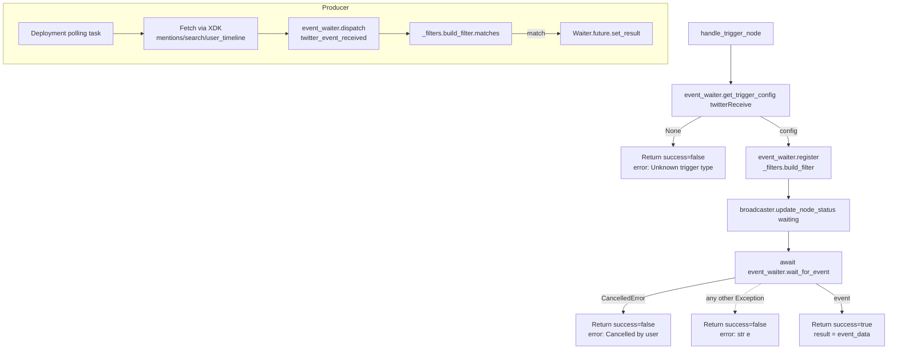

# Twitter Receive (`twitterReceive`)

| Field | Value |
|------|-------|
| **Category** | social / trigger |
| **Backend handler** | Plugin [`server/nodes/twitter/twitter_receive/__init__.py`](../../../server/nodes/twitter/twitter_receive/__init__.py); `execute()` delegates to [`server/services/handlers/triggers.py::handle_trigger_node`](../../../server/services/handlers/triggers.py) (generic). Filter: [`server/nodes/twitter/_filters.py::build_filter`](../../../server/nodes/twitter/_filters.py). Events: [`server/nodes/twitter/_events.py`](../../../server/nodes/twitter/_events.py). |
| **Tests** | [`server/tests/nodes/test_twitter.py`](../../../server/tests/nodes/test_twitter.py) |
| **Skill (if any)** | none |
| **Dual-purpose tool** | no (trigger only) |

## Purpose

Wait for a Twitter/X event (mention, search match, or timeline update) and emit
it as the workflow trigger payload. The trigger is polling-based (X API v2 has
no push webhooks on the free tier); polling is driven by the deployment layer
(`server/services/deployment/`) while the *execution* side reuses the same
`handle_trigger_node` path that WhatsApp/Webhook/Telegram triggers use -
register a waiter, block on `event_waiter.wait_for_event`, and surface the
matching event.

**Canary status**: `twitterReceive` is the lone **deferred** trigger plugin —
it is NOT in the canary registry (`register_canary_trigger_type` is not
called). Adoption of the controlled Temporal path requires the node to subclass
`PollingTriggerNode` and declare the four hooks (the `GmailReceiveNode` shape),
so `WorkflowControlWorkflow` can own its polling activity. Until that refactor
lands it runs on the legacy `event_waiter` collector/processor path.
`TriggerListenerWorkflow` / `PollingTriggerWorkflow` are compatibility
implementations, not the target architecture. `_events.py` carries the
typed `WorkflowEvent` factory + dual-path dispatcher (`dispatch_twitter_event_received`)
ready for canary opt-in.

Filtering is done by the closure returned from `build_filter` in
`nodes/twitter/_filters.py` (auto-registered into `event_waiter.FILTER_BUILDERS`).

## Inputs (handles)

Trigger node - no inputs.

## Parameters

| Name | Type | Default | Required | displayOptions.show | Description |
|------|------|---------|----------|---------------------|-------------|
| `trigger_type` | options | `mentions` | yes | - | One of `mentions` / `search` / `timeline`. Filter compares against the event's `trigger_type` field. |
| `search_query` | string | `""` | yes when `trigger_type=search` | `trigger_type: ['search']` | Substring-matched (case-insensitive) against event `query`. |
| `user_id` | string | `""` | no | `trigger_type: ['timeline']` | When set, must exactly match event `user_id`. Empty -> authenticated user (resolved by the poller, not the filter). |
| `filter_retweets` | boolean | `true` | no | - | Accepted by frontend; **not consumed** by the execution-side filter. Any effect must be implemented by the poller. |
| `filter_replies` | boolean | `false` | no | - | Same as above - frontend-only hint. |
| `poll_interval` | number | `60` | no | - | Seconds between polls (15-3600). Consumed by `deployment/` when deploying the workflow, not by `handle_trigger_node`. |

## Outputs (handles)

| Handle | Shape | Description |
|--------|-------|-------------|
| `output-main` | `TwitterReceiveOutput` | Raw event data returned by `event_waiter.wait_for_event`. The declared `Output` model (`tweet_id`, `text`, `author`, plus `extra="allow"`) passes through the full dispatched payload. |

### Output payload (contract)

The event shape is produced by whichever polling loop dispatches
`twitter_event_received` (legacy `event_type`, preserved in `_events.py`).
Documented fields the filter and downstream nodes rely on:

```ts
{
  trigger_type: 'mentions' | 'search' | 'user_timeline';
  tweet_id: string;
  text: string;
  author_id: string;
  author_username?: string;
  created_at: string;
  // search-specific:
  query?: string;
  // timeline-specific:
  user_id?: string;
  // optionally: metrics, referenced_tweets, entities
}
```

The handler wraps this in `{ success: true, result: <event_data>, execution_time }`.

## Logic Flow



## Decision Logic (filter)

`build_filter(params)` (in `nodes/twitter/_filters.py`) returns a `matches(data)`
closure that rejects non-matching events:

- `trigger_type != 'all'` and `data['trigger_type'] != trigger_type` -> reject.
  (Frontend only exposes `mentions` / `search` / `timeline`; there is no way to
  select `all` from the UI.)
- **search branch**: if `trigger_type == 'search'` and `search_query` set,
  compare lowercase-substring against `data['query']`. Empty `search_query`
  accepts any search event.
- **user_timeline branch**: if `trigger_type == 'user_timeline'` and `user_id`
  is set, require `data['user_id'] == user_id` (exact). Empty `user_id`
  accepts any timeline event.
- No `filter_retweets` / `filter_replies` logic exists in `build_filter`.

### Execution-side handler branches

- Unknown `trigger_type`: `handle_trigger_node` looks up the config and returns
  an error envelope if missing. For `twitterReceive` the config is hard-coded in
  `TRIGGER_REGISTRY`, so this branch is unreachable in practice.
- `asyncio.CancelledError` from `wait_for_event` -> success=false,
  `error="Cancelled by user"`.
- Any other exception -> success=false, `error=str(e)`.

## Side Effects

- **Database writes**: none from the handler. The poller in `deployment/` may
  write independently.
- **Broadcasts**: `status_broadcaster.update_node_status(node_id, "waiting", {message, event_type: "twitter_event_received", waiter_id}, workflow_id=...)` when the waiter is registered.
- **External API calls**: none from the handler. The polling loop makes
  periodic `GET /2/users/:id/mentions`, `GET /2/tweets/search/recent`, or
  `GET /2/users/:id/tweets` requests.
- **File I/O**: none.
- **Subprocess**: none.

## External Dependencies

- **Credentials**: OAuth tokens via `auth_service.get_oauth_tokens("twitter")`
  (read by the poller, not by the handler).
- **Services**: `event_waiter`, `StatusBroadcaster`, `deployment/` polling
  infrastructure.
- **Python packages**: `xdk`.
- **Environment variables**: none.

## Edge cases & known limits

- **`filter_retweets` / `filter_replies` ignored**: despite the UI toggles, the
  execution-side filter does nothing with them. Unless the poller honours them
  downstream, retweets and replies will surface.
- **Frontend <-> filter mismatch**: frontend offers `trigger_type='timeline'`
  but the filter compares against `event_type == 'user_timeline'`. The poller
  must dispatch events tagged `trigger_type: 'user_timeline'` (note the prefix)
  or matching will fail silently.
- **Substring match on `search_query`**: case-insensitive substring - no
  boolean operators, no token-awareness. `"AI"` inside `query="raid"` matches.
- **`user_id` comparison is exact**: leading `@` or whitespace mismatches
  silently.
- **No timeout on wait**: the handler waits indefinitely. Only exits on event,
  cancellation, or server restart.
- **Polling latency**: `poll_interval` default is 60s - expect up to a minute
  between a tweet being created and the node firing.
- **No dedup at the filter**: consecutive polls producing the same `tweet_id`
  rely on the poller for deduplication. The filter will happily match the same
  tweet twice.

## Related

- **Sibling nodes**: [`twitterSend`](./twitterSend.md), [`twitterSearch`](./twitterSearch.md), [`twitterUser`](./twitterUser.md)
- **Event waiter architecture**: [Event Waiter System](../../event_waiter_system.md)
- **Deployment / polling triggers**: [`server/services/deployment/`](../../../server/services/deployment/)
