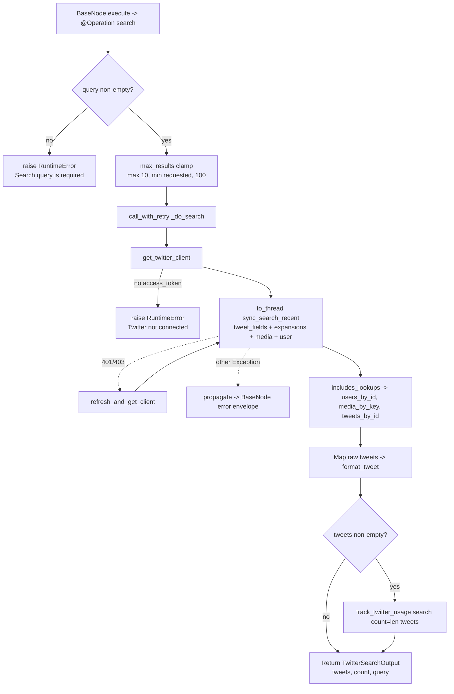

# Twitter Search (`twitterSearch`)

| Field | Value |
|------|-------|
| **Category** | social / tool (dual-purpose) |
| **Backend handler** | [`server/nodes/twitter/twitter_search/__init__.py`](../../../server/nodes/twitter/twitter_search/__init__.py) — dispatch via `BaseNode.execute()` + `@Operation("search")` -> `_do_search` (helpers in [`_base.py`](../../../server/nodes/twitter/_base.py)) |
| **Tests** | [`server/tests/nodes/test_twitter.py`](../../../server/tests/nodes/test_twitter.py) |
| **Skill (if any)** | [`server/skills/social_agent/twitter-search-skill/SKILL.md`](../../../server/skills/social_agent/twitter-search-skill/SKILL.md) |
| **Dual-purpose tool** | yes - tool name `twitter_search` |

## Purpose

Search recent tweets via `GET /2/tweets/search/recent` using the official `xdk`
SDK. Returns enriched tweet objects: URLs are expanded out of the `entities`
block, author profile is joined in from the `includes.users` expansion, media
objects are joined in from `includes.media`, referenced tweets (quoted / replied
to) are joined in from `includes.tweets`, and long-form `note_tweet` content
replaces the 280-char `text` when present. This is the tool LLMs get when a
`twitterSearch` node is wired to `input-tools`.

The first result page is returned - pagination is not surfaced to the user.

## Inputs (handles)

| Handle | Connection type | Required | Purpose |
|--------|-----------------|----------|---------|
| `input-main` | main | no | Upstream data; not consumed directly - all inputs come from `parameters` |

## Parameters

| Name | Type | Default | Required | displayOptions.show | Description |
|------|------|---------|----------|---------------------|-------------|
| `query` | string | `""` | yes | - | X search query. Supports full operator set (`from:`, `lang:`, `-is:retweet`, ...). |
| `max_results` | number | `10` | no | - | Clamped to `max(10, min(requested, 100))` - API minimum is 10. |
| `sort_order` | options | `recency` | no | - | Accepted by frontend but **ignored by the handler** (not passed to the SDK call). |
| `start_time`, `end_time` | string (ISO8601) | `""` | no | - | Accepted by frontend but **ignored by the handler**. |
| `include_metrics`, `include_author` | boolean | `true` | no | - | Accepted by frontend but **ignored** - the handler unconditionally requests the full field set. |

## Outputs (handles)

| Handle | Shape | Description |
|--------|-------|-------------|
| `output-main` | `TwitterSearchOutput` | Search results; also returned to the LLM when invoked via `input-tools` |

### Output payload

`_do_search` returns `TwitterSearchOutput(tweets=..., count=..., query=...)` (`extra="allow"`). Validated + dumped by `BaseNode._serialize_result`:

```ts
{
  tweets: Array<{
    id: string;
    text: string;                 // note_tweet.text if present, else tweet.text
    display_text: string;         // text with t.co URLs replaced by expanded_url
    author_id: string | null;
    created_at: string;           // str(...) - may be '' if missing
    lang: string | null;
    source: string | null;
    conversation_id: string | null;
    in_reply_to_user_id: string | null;
    possibly_sensitive: boolean;
    public_metrics: {             // {} if the API omitted them
      retweet_count?: number;
      reply_count?: number;
      like_count?: number;
      quote_count?: number;
      bookmark_count?: number;
      impression_count?: number;
    };
    author?: {                    // from includes.users[author_id]
      id: string;
      username: string;
      name: string;
      profile_image_url?: string;
      // + any other user_fields returned
    };
    urls?: Array<{                // only present when entities.urls non-empty
      url: string;                // t.co shortlink
      expanded_url: string;
      display_url: string;
    }>;
    media?: Array<{               // from includes.media via attachments.media_keys
      media_key: string;
      type: 'photo' | 'video' | 'animated_gif';
      url?: string;
      preview_image_url?: string;
      alt_text?: string;
      variants?: any[];
    }>;
    referenced_tweets?: Array<{
      type: 'quoted' | 'replied_to' | 'retweeted';
      id: string;
      text: string | null;        // null when includes.tweets lacked the referenced id
      author_id: string | null;
    }>;
  }>;
  count: number;                  // len(tweets)
  query: string;
}
```

## Logic Flow



## Decision Logic

- **Validation**: missing/empty `query` raises `RuntimeError` in `search()`
  before any client is acquired or API call made.
- **max_results clamp**: `max(10, min(params.max_results, 100))`. Requests below
  10 are silently raised; above 100 are silently capped.
- **SDK call**: `sync_search_recent` iterates `client.posts.search_recent(...)`
  once and returns `{tweets, includes}` for the first page. Subsequent pages
  are discarded.
- **Expansions assembled**:
  - `users_by_id[author_id]` from `includes.users`
  - `media_by_key[media_key]` from `includes.media`
  - `tweets_by_id[referenced.id]` from `includes.tweets`
- **`format_tweet` enrichment**:
  - Replaces every `t.co` shortlink in `text` with `expanded_url` in `display_text`.
  - If `note_tweet.text` exists, it replaces both `text` and `display_text`.
  - Attaches `author`, `urls`, `media`, `referenced_tweets` as optional keys
    (only set when data is non-empty).
  - Coerces Pydantic objects -> dicts via `model_dump()` where needed.
- **Auth refresh**: same lazy-refresh loop as `twitterSend` (`call_with_retry`) -
  a single retry via `refresh_and_get_client` on `_is_auth_error(e)`.
- **Usage tracking**: `resource_count` equals the number of tweets returned,
  not 1. Skipped entirely when results are empty.

## Side Effects

- **Database writes**: one `api_usage_metrics` row per non-empty search (op
  `search`, `resource_count=len(tweets)`) via `track_twitter_usage` ->
  `database.save_api_usage_metric`.
- **Broadcasts**: none.
- **External API calls**:
  - `GET https://api.twitter.com/2/tweets/search/recent` with `expansions=author_id,attachments.media_keys,referenced_tweets.id,referenced_tweets.id.author_id`, `tweet_fields=author_id,created_at,entities,public_metrics,possibly_sensitive,lang,source,conversation_id,in_reply_to_user_id,referenced_tweets,note_tweet`, `media_fields=url,preview_image_url,type,alt_text,variants`, `user_fields=username,name,profile_image_url`.
  - Optional refresh: `POST https://api.twitter.com/2/oauth2/token`.
- **File I/O**: none.
- **Subprocess**: none.

## External Dependencies

- **Credentials**: OAuth tokens via `auth_service.get_oauth_tokens("twitter")`.
- **Services**: `PricingService`, `Database`, `TwitterOAuth` (refresh path).
- **Python packages**: `xdk`.
- **Environment variables**: none.

## Edge cases & known limits

- **`max_results < 10`**: silently bumped to 10.
- **Unused frontend params**: `sort_order`, `start_time`, `end_time`,
  `include_metrics`, `include_author` are wired in the UI but the handler
  does not forward any of them to the SDK.
- **Only first page returned**: `sync_search_recent` breaks out of the
  generator after the first page regardless of `next_token`.
- **Empty-includes tolerance**: when the API returns no `includes`, `author`,
  `media`, `urls`, and `referenced_tweets` are simply omitted from each tweet -
  consumers must treat them as optional.
- **Referenced tweet id not in includes**: `referenced_tweets[].text` is
  `null` rather than raising.
- **Object/dict duality in `includes`**: `format_tweet` handles both Pydantic
  objects and raw dicts - changes to XDK's model shapes may silently drop
  fields.
- **Long-form tweets**: `note_tweet.text` replaces the 280-char `text`; callers
  expecting always-short `text` will see the full note-tweet body.
- **No streaming**: whole response is read into memory before returning.

## Related

- **Skills using this as a tool**: [`twitter-search-skill/SKILL.md`](../../../server/skills/social_agent/twitter-search-skill/SKILL.md)
- **Sibling nodes**: [`twitterSend`](./twitterSend.md), [`twitterUser`](./twitterUser.md), [`twitterReceive`](./twitterReceive.md)
- **Architecture docs**: [Pricing Service](../../pricing_service.md)
