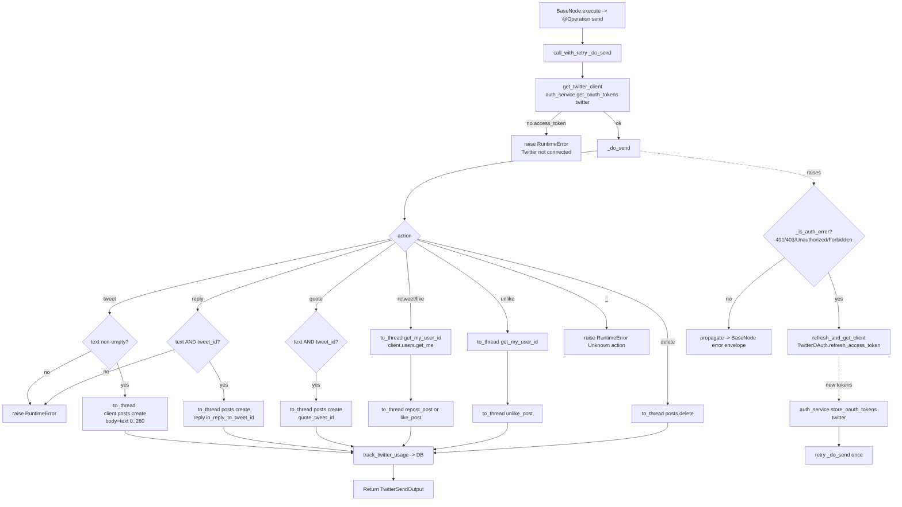

# Twitter Send (`twitterSend`)

| Field | Value |
|------|-------|
| **Category** | social / tool (dual-purpose) |
| **Backend handler** | [`server/nodes/twitter/twitter_send/__init__.py`](../../../server/nodes/twitter/twitter_send/__init__.py) — dispatch via `BaseNode.execute()` + `@Operation("send")` -> `_do_send` (helpers in [`_base.py`](../../../server/nodes/twitter/_base.py)) |
| **Tests** | [`server/tests/nodes/test_twitter.py`](../../../server/tests/nodes/test_twitter.py) |
| **Skill (if any)** | [`server/skills/social_agent/twitter-send-skill/SKILL.md`](../../../server/skills/social_agent/twitter-send-skill/SKILL.md) |
| **Dual-purpose tool** | yes - tool name `twitter_send` |

## Purpose

Perform write actions against the authenticated user's Twitter/X account via the
official `xdk` Python SDK. Supports creating an original tweet, replying, native
retweeting, liking, unliking, and deleting. Runs both as a workflow node and as
an AI agent tool when connected to `input-tools`.

All SDK calls are synchronous (`requests`-based) inside the XDK; the handler
wraps every call in `asyncio.to_thread(...)` so the event loop is never blocked.

## Inputs (handles)

| Handle | Connection type | Required | Purpose |
|--------|-----------------|----------|---------|
| `input-main` | main | no | Upstream data; not consumed directly - all inputs come from `parameters` |

## Parameters

| Name | Type | Default | Required | displayOptions.show | Description |
|------|------|---------|----------|---------------------|-------------|
| `action` | options (Literal) | `tweet` | yes | - | One of `tweet` / `reply` / `retweet` / `quote` / `like` / `unlike` / `delete`. All implemented in `_do_send`. |
| `text` | string (rows: 4) | `""` | yes (tweet/reply/quote) | `action: ['tweet','reply','quote']` | Tweet content. `_do_send` truncates to 280 chars via slice (`text[:280]`). |
| `tweet_id` | string | `""` | yes (reply/retweet/quote/like/unlike/delete) | `action: ['reply','retweet','quote','like','unlike','delete']` | Target tweet ID. Used by reply (`reply.in_reply_to_tweet_id`), quote (`quote_tweet_id`), and the id-based actions. |
| `include_media` | boolean | `false` | no | `action: ['tweet','reply','quote']` | **Accepted by Params but ignored by `_do_send`** — the operation never attaches media. |
| `media_urls` | string | `""` | no | `action: ['tweet','reply','quote']`, `include_media: [true]` | **Accepted by Params but ignored by `_do_send`.** Comma-separated URLs; max 4 images or 1 video. |
| `include_poll` | boolean | `false` | no | `action: ['tweet']` | **Accepted by Params but ignored by `_do_send`.** |
| `poll_options` | string | `""` | no | `action: ['tweet']`, `include_poll: [true]` | **Accepted but ignored.** Comma-separated 2-4 options, 25 chars each. |
| `poll_duration` | number (5-10080) | `1440` | no | `action: ['tweet']`, `include_poll: [true]` | **Accepted but ignored.** Poll duration in minutes. |

## Outputs (handles)

| Handle | Shape | Description |
|--------|-------|-------------|
| `output-main` | `TwitterSendOutput` | Result of the action; also returned to the LLM when invoked via `input-tools` |

### Output payload

`_do_send` returns a `TwitterSendOutput` (`ConfigDict(extra="allow")`); `BaseNode._serialize_result` validates and dumps it:

```ts
{
  action: string;   // "tweet_sent" | "reply_sent" | "quoted" | "retweeted" | "liked" | "unliked" | "deleted"
  data: object;      // _format_response(...) of the XDK result (e.g. { id, text, ... } for create)
}
```

> Note: the runtime `Output` model above is the plugin's authoritative shape. The frontend drag-source schema in [`node_output_schemas.py`](../../../server/services/node_output_schemas.py) (`TwitterSendOutput`: `tweet_id`, `text`, `author_id`, `created_at`, `action`) is a separate, flatter advertised shape and does not match the live envelope field-for-field.

## Logic Flow



## Decision Logic

- **Client acquisition**: `get_twitter_client()` (in `_base.py`) reads OAuth
  tokens via `auth_service.get_oauth_tokens("twitter", customer_id="owner")`.
  Raises `RuntimeError("Twitter not connected. Please authenticate via Credentials.")`
  when the access token is missing.
- **No eager validation**: never calls `get_me()` up-front to verify the
  token; it jumps straight into the action call to conserve rate limits.
- **Lazy refresh (`call_with_retry`)**: any exception bubbling out of `_do_send`
  is inspected by `_is_auth_error` (substring match on `401`, `403`,
  `Unauthorized`, `Forbidden`). On match, a new client is built via
  `refresh_and_get_client()` which calls `TwitterOAuth.refresh_access_token`,
  re-stores tokens via `store_oauth_tokens`, and `_do_send` is retried once.
  Non-auth errors propagate to `BaseNode.execute()`'s error envelope.
- **Validation** (raise `RuntimeError` on failure):
  - `tweet`: requires non-empty `text`, sliced to 280 chars.
  - `reply`/`quote`: require both `text` and `tweet_id`.
  - `retweet`/`like`/`unlike`/`delete`: require `tweet_id`.
- **User id fetch**: `retweet`/`like`/`unlike` need the authenticated user id;
  `get_my_user_id` calls `client.users.get_me()` via `asyncio.to_thread`.
- **Unknown action**: any value outside the `Literal` set raises
  `RuntimeError(f"Unknown action: {action}")` (unreachable via the UI dropdown).

## Side Effects

- **Database writes**: one row per successful action in `api_usage_metrics` via
  `track_twitter_usage` -> `database.save_api_usage_metric(...)` with
  `service='twitter'` and `operation` from `PricingService.calculate_api_cost`.
  Action -> op name: `tweet`, `reply`, `quote`, `retweet`, `like`, `unlike`, `delete`.
- **Broadcasts**: none from the handler.
- **External API calls**:
  - `POST https://api.twitter.com/2/tweets` (tweet, reply)
  - `POST https://api.twitter.com/2/users/{id}/retweets` (retweet)
  - `POST https://api.twitter.com/2/users/{id}/likes` (like)
  - `DELETE https://api.twitter.com/2/users/{id}/likes/{tweet_id}` (unlike)
  - `DELETE https://api.twitter.com/2/tweets/{id}` (delete)
  - `GET https://api.twitter.com/2/users/me` (implicit, on retweet/like/unlike)
  - `POST https://api.twitter.com/2/oauth2/token` (refresh path, via
    `TwitterOAuth`).
- **File I/O**: none.
- **Subprocess**: none.
- **Token store writes**: on refresh, `auth_service.store_oauth_tokens("twitter", ...)`
  updates the encrypted OAuth credentials row.

## External Dependencies

- **Credentials**: OAuth access + refresh token via
  `auth_service.get_oauth_tokens("twitter", customer_id="owner")`. Stored via
  System 1 (`EncryptedOAuthToken` table); NOT via `get_api_key("twitter_access_token")`.
  Client id + secret are stored via `get_api_key("twitter_client_id")` /
  `get_api_key("twitter_client_secret")` and only consulted on refresh.
- **Services**: `TwitterOAuth` (`server/nodes/twitter/_oauth.py`) for token
  refresh. `PricingService` for cost calculation. `Database` for metric row.
- **Python packages**: `xdk` (X SDK), `httpx` (used transitively inside
  `TwitterOAuth`).
- **Environment variables**: none at runtime (OAuth flow uses stored creds).

## Edge cases & known limits

- **`quote` action is implemented**: builds `posts.create(body={"text":..., "quote_tweet_id": tweet_id})`.
- **Media and polls ignored**: the `include_media` / `include_poll` /
  `media_urls` / `poll_options` / `poll_duration` parameters are never read by
  `_do_send` - the node silently sends a text-only tweet.
- **280-char silent truncation**: `text[:280]` is applied without warning; the
  emitted tweet may be shorter than the user typed.
- **Single retry on auth error**: refresh + retry happens at most once; a
  second 401 propagates to the error envelope.
- **Refresh failure message**: if `refresh_access_token` fails, the user sees
  `Twitter token refresh failed. Please re-authenticate.`; the missing-refresh-token
  case surfaces `Twitter token expired. Please re-authenticate.`
- **`_is_auth_error` uses substring matching**: any error whose `str(e)`
  contains `401`, `403`, `Unauthorized`, or `Forbidden` triggers the refresh
  path, even if the real cause is something else (e.g. a log message quoting
  those strings).
- **Usage tracking only on success**: the `_track_twitter_usage` call happens
  after the SDK call returns; raised errors skip tracking entirely.

## Related

- **Skills using this as a tool**: [`twitter-send-skill/SKILL.md`](../../../server/skills/social_agent/twitter-send-skill/SKILL.md)
- **Sibling nodes**: [`twitterSearch`](./twitterSearch.md), [`twitterUser`](./twitterUser.md), [`twitterReceive`](./twitterReceive.md)
- **Architecture docs**: [Pricing Service](../../pricing_service.md), [Credentials Encryption](../../credentials_encryption.md)
