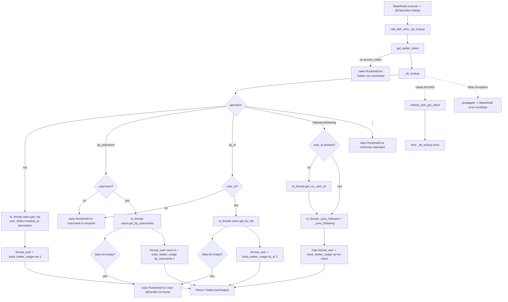

# Twitter User (`twitterUser`)

| Field | Value |
|------|-------|
| **Category** | social / tool (dual-purpose) |
| **Backend handler** | [`server/nodes/twitter/twitter_user/__init__.py`](../../../server/nodes/twitter/twitter_user/__init__.py) — dispatch via `BaseNode.execute()` + `@Operation("lookup")` -> `_do_lookup` (helpers in [`_base.py`](../../../server/nodes/twitter/_base.py)) |
| **Tests** | [`server/tests/nodes/test_twitter.py`](../../../server/tests/nodes/test_twitter.py) |
| **Skill (if any)** | [`server/skills/social_agent/twitter-user-skill/SKILL.md`](../../../server/skills/social_agent/twitter-user-skill/SKILL.md) |
| **Dual-purpose tool** | yes - tool name `twitter_user` |

## Purpose

Look up Twitter users and their social graph via `GET /2/users/me`,
`GET /2/users/by/username/:username`, `GET /2/users/:id`,
`GET /2/users/:id/followers`, and `GET /2/users/:id/following`. Works as a
workflow node and an AI agent tool. Every SDK call is wrapped in
`asyncio.to_thread(...)` since XDK is sync-only.

## Inputs (handles)

| Handle | Connection type | Required | Purpose |
|--------|-----------------|----------|---------|
| `input-main` | main | no | Upstream data; not consumed directly - all inputs come from `parameters` |

## Parameters

| Name | Type | Default | Required | displayOptions.show | Description |
|------|------|---------|----------|---------------------|-------------|
| `operation` | options | `me` | yes | - | `me` / `by_username` / `by_id` / `followers` / `following` |
| `username` | string | `""` | yes (by_username) | `operation: ['by_username']` | Handle without `@`. |
| `user_id` | string | `""` | yes (by_id), optional (followers/following) | `operation: ['by_id','followers','following']` | If omitted for followers/following, the authenticated user is used via `get_my_user_id`. |
| `max_results` | number | `100` | no | `operation: ['followers','following']` | Clamped `max(1, min(requested, 1000))`. |

## Outputs (handles)

| Handle | Shape | Description |
|--------|-------|-------------|
| `output-main` | `TwitterUserOutput` | Lookup result; also returned to the LLM when invoked via `input-tools` |

### Output payload

`_do_lookup` returns a `TwitterUserOutput(operation, user?, users?, count?)` (`extra="allow"`); validated + dumped by `BaseNode._serialize_result`.

`me` / `by_username` / `by_id` -> `{ operation, user }` where `user` is `format_user(...)`:

```ts
{
  operation: string;
  user: {
    id: string;
    username: string;
    name: string;
    profile_image_url: string | null;
    verified: boolean;            // defaults to false when API omits it
    description: string | null;
    created_at: string;           // str(...) - empty string when missing
  }
}
```

`followers` / `following` -> `{ operation, users, count }`:

```ts
{
  operation: string;
  users: Array<UserData>;       // same shape as user above
  count: number;
}
```

## Logic Flow



## Decision Logic

- **Operation dispatch** uses an `if`/`elif` chain in `_do_lookup`. Any value
  outside the five `Literal` operations raises `RuntimeError(f"Unknown operation: {op}")`
  (unreachable via the UI dropdown).
- **Validation**:
  - `by_username`: empty `username` -> `RuntimeError("Username is required")`.
  - `by_id`: empty `user_id` -> `RuntimeError("User ID is required")`.
  - `followers` / `following`: missing `user_id` is **not** an error -
    falls back to `get_my_user_id`.
- **Not-found handling**: `by_username` / `by_id` raise `RuntimeError` when the
  SDK returns an empty `data` list; it propagates to `BaseNode.execute()`'s
  error envelope.
- **Lazy auth refresh**: identical to `twitterSend` (`call_with_retry`) - any
  exception whose `str(e)` contains `401`/`403`/`Unauthorized`/`Forbidden`
  triggers one refresh-and-retry.
- **max_results clamping**: `max(1, min(requested, 1000))` for followers /
  following. Anything else is ignored.
- **Usage tracking**:
  - `me`/`by_username`/`by_id`: 1 resource.
  - `followers`/`following`: `len(users)` resources; skipped when the result
    list is empty.

## Side Effects

- **Database writes**: one `api_usage_metrics` row per successful operation
  (when at least one resource was returned).
- **Broadcasts**: none.
- **External API calls**:
  - `GET https://api.twitter.com/2/users/me` (always on `me`; also on
    followers/following when `user_id` omitted).
  - `GET https://api.twitter.com/2/users/by?usernames=...` (by_username).
  - `GET https://api.twitter.com/2/users?ids=...` (by_id).
  - `GET https://api.twitter.com/2/users/:id/followers` (followers).
  - `GET https://api.twitter.com/2/users/:id/following` (following).
  - Optional refresh: `POST https://api.twitter.com/2/oauth2/token`.
- **File I/O**: none.
- **Subprocess**: none.

## External Dependencies

- **Credentials**: OAuth tokens via `auth_service.get_oauth_tokens("twitter")`.
- **Services**: `PricingService`, `Database`, `TwitterOAuth` (refresh).
- **Python packages**: `xdk`.
- **Environment variables**: none.

## Edge cases & known limits

- **`max_results < 1`**: silently clamped to 1.
- **`max_results > 1000`**: silently clamped to 1000. The SDK may still paginate
  internally; only the first page is returned regardless.
- **Only first page for followers/following**: `_sync_followers` /
  `_sync_following` return after the first page - `next_token` is discarded.
- **Not-found vs. empty**: when the target user exists but has zero
  followers/following, the handler returns `{users: [], count: 0}` - it does
  NOT raise. `by_username` / `by_id` treat empty data as an error.
- **`get_my_user_id` cost not tracked**: the implicit `users/me` call made on
  followers/following with empty `user_id` is not reflected in
  `api_usage_metrics`.
- **`verified` default is `False`**: even when the API omits the field the
  output will claim the user is not verified. Treat as unreliable unless
  expansions guaranteed.

## Related

- **Skills using this as a tool**: [`twitter-user-skill/SKILL.md`](../../../server/skills/social_agent/twitter-user-skill/SKILL.md)
- **Sibling nodes**: [`twitterSend`](./twitterSend.md), [`twitterSearch`](./twitterSearch.md), [`twitterReceive`](./twitterReceive.md)
- **Architecture docs**: [Pricing Service](../../pricing_service.md)
