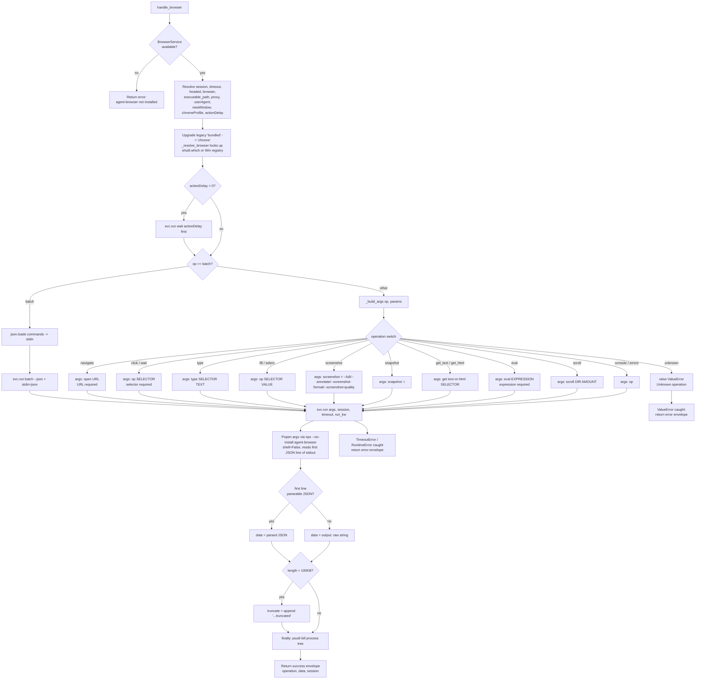

# Browser (`browser`)

| Field | Value |
|------|-------|
| **Category** | web_automation / tool (dual-purpose) |
| **Backend handler** | [`server/nodes/browser/browser/__init__.py::BrowserNode`](../../../server/nodes/browser/browser/__init__.py) |
| **Service** | [`server/nodes/browser/_service.py::BrowserService`](../../../server/nodes/browser/_service.py) |
| **Tests** | [`server/tests/nodes/test_web_automation.py`](../../../server/tests/nodes/test_web_automation.py) |
| **Skill (if any)** | [`server/skills/web_agent/browser-skill/SKILL.md`](../../../server/skills/web_agent/browser-skill/SKILL.md) |
| **Dual-purpose tool** | yes - tool name `browser` |

## Purpose

Interactive browser automation via the `agent-browser` CLI (a pinned npm dependency
invoked through `npx --no-install`). Exposes 14 discrete operations (navigate,
click, type, fill, screenshot, snapshot, get_text, get_html, eval, wait, scroll,
select, console, errors) plus a `batch` meta-op. The preferred workflow for an
AI agent is `navigate` -> `snapshot` -> `click`/`fill` using the stable `@eN`
element refs returned by snapshot -> `snapshot` again to verify.

Session state (cookies, open tabs, auth) persists across sequential operations
that share the same `session` value. If no session is provided the handler
derives `machina_<execution_id>` from the current execution context. The
execution_id is stable for the whole run — threaded through MachinaWorkflow
node contexts, AgentWorkflow tool payloads (deterministic
`workflow.info().run_id` fallback), the legacy in-process tool dispatch, and
delegated child agents — so every browser call in one workflow/agent run
(including delegated sub-agents) reuses ONE browser instance, while separate
runs stay isolated.

Concurrent instances are capped: each distinct `--session` name maps to one
browser instance, and `BrowserService` gates new sessions against
agent-browser's own registry (`session list --json`), closing the oldest
listed session via per-session `close` when `BROWSER_MAX_INSTANCES`
(default 3) would be exceeded. Idle browsers self-reap via
`AGENT_BROWSER_IDLE_TIMEOUT_MS`, injected into every spawn from
`BROWSER_IDLE_TIMEOUT_MS` (default 600000 ms; 0 disables). Canonical values
for both knobs live in `.env.template`.

## Inputs (handles)

| Handle | Connection type | Required | Purpose |
|--------|-----------------|----------|---------|
| `input-main` | main | no | Upstream trigger; not consumed directly |

## Parameters

| Name | Type | Default | Required | displayOptions.show | Description |
|------|------|---------|----------|---------------------|-------------|
| `toolName` | string | `browser` | no | - | Tool name exposed to the AI agent |
| `toolDescription` | string | (see frontend) | no | - | Tool description shown to LLM |
| `operation` | options | `navigate` | no | - | One of `navigate`, `click`, `type`, `fill`, `screenshot`, `snapshot`, `get_text`, `get_html`, `eval`, `wait`, `scroll`, `select`, `console`, `errors`, `batch` |
| `session` | string | `""` | no | - | Session id; if empty, handler uses `machina_<execution_id>` |
| `timeout` | number | `30` | no | - | Per-operation timeout in seconds |
| `headed` | boolean | `true` | no | - | Passes `--headed` to agent-browser |
| `autoConnect` | boolean | `false` | no | - | Passes `--auto-connect` |
| `browser` | options | `chrome` | no | - | `chrome` / `edge` / `chromium` / `custom` / `bundled` / `bundled_explicit`. Legacy `bundled` silently upgraded to `chrome` |
| `executablePath` | string | `""` | no | `browser=custom` | Explicit browser path when `browser=custom` |
| `newWindow` | boolean | `true` | no | - | Appended as `--args --new-window`; only honoured when an explicit `executable_path` resolved |
| `chromeProfile` | string | `""` | no | - | Chrome user-data-dir profile |
| `userAgent` | string | `""` | no | - | Custom UA string |
| `proxy` | string | `""` | no | - | `host:port` or `user:pass@host:port` |
| `actionDelay` | number | `0` | no | - | Seconds to wait before the real op (a pre-command `wait` is issued first) |
| `url` | string | `""` | yes (op=navigate) | `operation=navigate` | Target URL |
| `selector` | string | `""` | yes (ops that act on an element) | see below | CSS selector or `@eN` ref from snapshot |
| `text` | string | `""` | no | `operation=type` | Text to type |
| `value` | string | `""` | no | `operation in [fill, select]` | Value to fill / dropdown value |
| `expression` | string | `""` | yes (op=eval) | `operation=eval` | JS expression to evaluate |
| `direction` | options | `down` | no | `operation=scroll` | `up` / `down` / `left` / `right` |
| `amount` | number | `500` | no | `operation=scroll` | Pixels to scroll |
| `fullPage` | boolean | `false` | no | `operation=screenshot` | Passes `--full` |
| `annotate` | boolean | `false` | no | `operation=screenshot` | Passes `--annotate` |
| `screenshotFormat` | options | `png` | no | `operation=screenshot` | `png` / `jpeg` / `webp` |
| `screenshotQuality` | number | - | no | `operation=screenshot, screenshotFormat=jpeg` | 1-100, only forwarded for jpeg |
| `commands` | string (JSON array) | `"[]"` | yes (op=batch) | `operation=batch` | JSON array of command dicts piped to stdin |

Operations that **require** `selector`: `click`, `type`, `fill`, `get_text`,
`get_html`, `wait`, `select`.

## Outputs (handles)

| Handle | Shape | Description |
|--------|-------|-------------|
| `output-main` | object | Standard envelope payload |
| `output-tool` | object | Same payload when wired to an AI agent |

### Output payload

```ts
{
  operation: string;  // echoes the requested op
  data: any;          // Parsed JSON from agent-browser's first stdout line
  session: string;    // Resolved session id
}
```

Wrapped in the standard envelope: `{ success: true, result: <payload>, execution_time: number }`.
On failure: `{ success: false, error: <string>, execution_time: number }`.

## Logic Flow



## Decision Logic

- **Service missing**: `get_browser_service()` returns `None` when `npx` is not on
  PATH -> immediate `agent-browser not installed` error envelope.
- **Session resolution**: empty `session` -> `machina_<execution_id>` via the
  typed `ctx.execution_id` accessor (handles present-but-None on the agent
  tool-dispatch path). Only the stripped value is considered empty; whitespace
  triggers the fallback. The resolved session is logged in the `[Browser]`
  info line.
- **Instance cap**: before each command, `_enforce_instance_cap` admits the
  session (once per process, `_gated_sessions` fast-path). Unknown sessions
  trigger one `session list --json` probe; if admitting would exceed
  `BROWSER_MAX_INSTANCES`, the oldest listed sessions are closed first
  (`close --session <name>`). The probe fails open — gating never blocks an
  actual browser operation.
- **Browser upgrade**: `""` or `bundled` both normalised to `chrome`. Users who
  specifically want the bundled Chromium must pick `bundled_explicit`.
- **Executable resolution**: `shutil.which()` against Linux/macOS PATH names,
  then Windows `HKLM/HKCU\\SOFTWARE\\...\\App Paths\\<exe>` registry. If neither
  resolves, `executable_path=None` and agent-browser uses its own bundled Chrome.
- **`newWindow`**: gated on `executable_path` actually resolving - if a user
  requests new-window while `browser=bundled_explicit`, the flag is silently
  dropped.
- **`actionDelay > 0`**: issues a `wait <seconds>` command to agent-browser
  BEFORE the real operation. Failures in the delay call propagate as errors.
- **`batch`**: reads `commands` JSON string (defaults to `"[]"`) and pipes
  `json.dumps(cmds).encode()` to the subprocess' stdin with flags `batch --json`.
- **Required params**: `_req(p, "url")` and `_req(p, "expression")` raise
  `ValueError` on empty strings; `_req_sel(s)` does the same for `selector`.
  These surface as the error envelope via the outer `except (ValueError, ...)`.
- **Unknown operation**: `_build_args` raises `ValueError("Unknown operation: <op>")`.

## Side Effects

- **Database writes**: none.
- **Broadcasts**: none.
- **External API calls**: none (all work happens via subprocess).
- **File I/O**: agent-browser itself may write screenshots or a profile dir to
  its own cache - not under this handler's control.
- **Subprocess**: spawns `npx --no-install agent-browser ...` via
  `subprocess.Popen` with `shell=False`. Reads only the FIRST stdout line
  (daemon holds stdout open), caps at 100 KB, then force-kills the entire
  process tree via `psutil.Process.children(recursive=True) -> kill()`.
  Always calls `proc.wait()` in a finally block.
- **Long-lived daemon**: agent-browser spawns a persistent daemon between
  calls. `shutdown_browser_service()` (registered in FastAPI lifespan) runs
  `agent-browser close --all` to stop it.

## External Dependencies

- **Credentials**: none.
- **Services**: `BrowserService` singleton; `npx` on PATH; `agent-browser`
  pinned in the project's `package.json` and installed under `node_modules`.
- **Python packages**: `psutil` (for process-tree kill).
- **Environment variables**: `BROWSER_MAX_INSTANCES` (concurrent session cap,
  default 3), `BROWSER_IDLE_TIMEOUT_MS` (daemon idle auto-shutdown in ms,
  default 600000, 0 disables) — canonical values in `.env.template`, mirrored
  by `Settings` defaults. `AGENT_BROWSER_IDLE_TIMEOUT_MS` is injected into
  every agent-browser spawn from the latter.

## Edge cases & known limits

- **Output truncation**: responses > 100 KB are truncated with a literal
  `...(truncated)` suffix appended BEFORE `json.loads`, so a truncated JSON
  payload falls through the `JSONDecodeError` path and returns
  `{"output": "<raw truncated string>"}` instead of structured data.
- **Empty first line**: if agent-browser writes nothing to stdout the service
  reads stderr and raises `RuntimeError` with the stderr content (or the
  literal fallback `agent-browser returned empty output`).
- **Silent `bundled` -> `chrome` upgrade**: a user who saved a workflow when
  `bundled` was the default will now actually use system Chrome on execution.
- **`newWindow` silently disabled**: see Decision Logic.
- **Only `ValueError`, `TimeoutError`, `RuntimeError` are caught**: other
  exceptions (e.g. `OSError` from subprocess, `psutil.Error`) propagate and
  the executor wraps them in its generic envelope.
- **Process tree kill race**: `psutil.NoSuchProcess` is swallowed for both the
  parent and every child, so a fast-exiting daemon never leaks an exception
  but may leave orphaned Chromium processes if the tree changed shape between
  the `children()` call and the `kill()` call.
- **`actionDelay` is billable**: the preliminary `wait` call consumes part of
  `timeout` because each subprocess invocation resets the timer.

## Related

- **Skills using this as a tool**: [`browser-skill/SKILL.md`](../../../server/skills/web_agent/browser-skill/SKILL.md)
- **Companion nodes**: [`crawleeScraper`](./crawleeScraper.md), [`apifyActor`](./apifyActor.md)
- **Architecture docs**: [Proxy Service](../../proxy_service.md)
