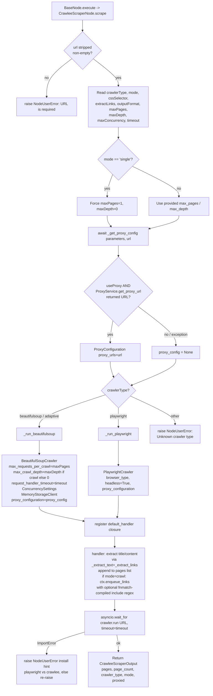

# Crawlee Scraper (`crawleeScraper`)

| Field | Value |
|------|-------|
| **Category** | web_automation / tool (dual-purpose) |
| **Backend handler** | [`server/nodes/scraper/crawlee_scraper/__init__.py::CrawleeScraperNode`](../../../server/nodes/scraper/crawlee_scraper/__init__.py) — dispatch via `BaseNode.execute()` -> `@Operation("scrape")` |
| **Tests** | [`server/tests/nodes/test_web_automation.py`](../../../server/tests/nodes/test_web_automation.py) |
| **Skill (if any)** | [`server/skills/web_agent/crawlee-scraper-skill/SKILL.md`](../../../server/skills/web_agent/crawlee-scraper-skill/SKILL.md) |
| **Dual-purpose tool** | yes |

## Purpose

Python-based web scraping on top of the `crawlee` library. Supports two runtime
engines:

- `beautifulsoup` - fast static HTML scraping via `BeautifulSoupCrawler`.
- `playwright` - full headless browser for JS-rendered pages via `PlaywrightCrawler`.
- `adaptive` - currently aliased to `beautifulsoup` in this handler.

Two modes control how many URLs are visited: `single` (only the seed URL, hard
caps `max_pages=1` / `max_depth=0`) and `crawl` (follow links matching
`linkSelector` + optional `urlPattern` up to `maxPages` / `maxDepth`).

Unlike `httpRequest` or `browser`, Crawlee manages concurrency, retry
back-off, request queues, and storage internally; the handler only feeds in
config and collects a page list from the route handler closure.

## Inputs (handles)

| Handle | Connection type | Required | Purpose |
|--------|-----------------|----------|---------|
| `input-main` | main | no | Upstream trigger; not consumed directly |

## Parameters

Params model is `CrawleeScraperParams` (field names are snake_case).

| Name | Type | Default | Required | displayOptions.show | Description |
|------|------|---------|----------|---------------------|-------------|
| `tool_name` | string | `web_scraper` | no | - | Name shown to the LLM when used as a tool (note: class `tool_name` is `web_reader`) |
| `tool_description` | string | (see default) | no | - | Description shown to the LLM |
| `url` | string | `""` | **yes** | - | Seed URL |
| `crawler_type` | options (Literal) | `beautifulsoup` | no | - | `beautifulsoup` / `playwright` / `adaptive` |
| `mode` | options (Literal) | `single` | no | - | `single` or `crawl` |
| `css_selector` | string | `""` | no | - | CSS selector used for text/HTML extraction. Empty -> whole page |
| `extract_links` | boolean | `false` | no | - | Include `links[]` on each page |
| `output_format` | options (Literal) | `text` | no | - | `text` / `html` / `markdown`. `markdown` falls back to text if `html2text` not installed |
| `max_pages` | int (1-1000) | `10` | no | - | Clamped to 1 when `mode=single` |
| `max_concurrency` | int (1-50) | `5` | no | - | Forwarded as `max_concurrency`; `desired_concurrency = min(max_concurrency, 10)` |
| `timeout` | int (1-3600) | `60` | no | - | Per-request handler timeout AND outer `asyncio.wait_for` timeout |
| `link_selector` | string | `""` | no | `mode=crawl` | Defaults to `a[href]` when empty |
| `url_pattern` | string | `""` | no | `mode=crawl` | `fnmatch`-style pattern compiled with `fnmatch.translate` -> passed to `enqueue_links(include=[regex])` |
| `max_depth` | int (0-50) | `2` | no | `mode=crawl` | Set to 0 when `mode=single` |
| `browser_type` | options (Literal) | `chromium` | no | `crawler_type=playwright` | `chromium` / `firefox` / `webkit` |
| `wait_for_selector` | string | `""` | no | `crawler_type=playwright` | Awaits selector before extracting |
| `wait_timeout` | int (0-600000) | `30000` | no | `crawler_type=playwright` | Milliseconds for `wait_for_selector` |
| `take_screenshot` | boolean | `false` | no | `crawler_type=playwright` | Capture base64 PNG per page |
| `block_resources` | boolean | `false` | no | `crawler_type=playwright` | Declared in Params; currently not consumed by the run helpers |
| `use_proxy` | boolean | `false` | no | - | Route through `ProxyService` (see Decision Logic) |
| `proxy_provider` | string | `auto` | no | `use_proxy=true` | Provider hint passed to `ProxyService.get_proxy_url` |
| `proxy_country` | string | `""` | no | `use_proxy=true` | ISO country hint |
| `session_type` | options (Literal: rotating/sticky) | `rotating` | no | `use_proxy=true` | Proxy session type |
| `sticky_duration` | int (>=1) | `600` | no | `use_proxy=true, session_type=sticky` | Sticky session duration (s) |

## Outputs (handles)

| Handle | Shape | Description |
|--------|-------|-------------|
| `output-main` | object | Standard envelope payload |
| `output-tool` | object | Same payload when wired to an AI agent's `input-tools` (`usable_as_tool=True`, class tool name `web_reader`) |

### Output payload

```ts
{
  pages: Array<{
    url: string;
    title: string;
    content: string;
    links?: string[];        // when extractLinks=true
    screenshot?: string;     // base64 PNG, playwright + take_screenshot=true
  }>;
  page_count: number;
  crawler_type: 'beautifulsoup' | 'playwright' | 'adaptive';
  mode: 'single' | 'crawl';
  proxied: boolean;
}
```

## Logic Flow



## Decision Logic

- **Empty URL**: `url.strip() == ""` -> `NodeUserError("URL is required")`, no
  crawler is constructed.
- **`mode='single'`**: hard clamps `max_pages=1` and `max_depth=0`, regardless
  of what the user set. In `crawl` mode the requested values are forwarded.
- **`crawlerType='adaptive'`**: routed to `_run_beautifulsoup` - there is no
  true adaptive detection in this handler today.
- **Proxy bridge**: `_get_proxy_config` only runs when `useProxy=True`.
  `ProxyService.get_proxy_url` returning `None` or raising any `Exception` is
  logged at WARN and the crawl proceeds unproxied.
- **Link filter**: when `urlPattern` is set in `crawl` mode the pattern is
  passed through `fnmatch.translate` and compiled to a regex for
  `enqueue_links(include=[...])`.
- **Content extraction**: `_extract_text` returns text, html, or markdown.
  For markdown the handler falls back to plain text if `html2text` is missing
  (`ImportError` swallowed). All output is capped at 100 000 chars
  (`_MAX_CONTENT_LENGTH`).
- **Error handling**: only `ImportError` is caught inside `scrape`:
  - message contains `playwright` -> `NodeUserError` install hint for
    `pip install 'crawlee[playwright]' && playwright install chromium`.
  - message contains `crawlee` -> `NodeUserError` install hint for
    `pip install 'crawlee[beautifulsoup]'`.
  - any other `ImportError` is re-raised.
  - All non-`ImportError` exceptions propagate to `BaseNode.execute()`'s generic
    handler (full-traceback envelope); `NodeUserError` (empty URL / unknown
    crawler type) yields a single-WARN structured envelope. The plugin does not
    swallow errors into `str(e)`.

## Side Effects

- **Database writes**: none.
- **Broadcasts**: none.
- **External API calls**: HTTP(S) requests to the target site(s), optionally
  via a proxy returned by `ProxyService`.
- **File I/O**: none by default. `MemoryStorageClient` keeps the request queue
  in memory only.
- **Subprocess**: PlaywrightCrawler launches a browser subprocess under the
  hood (managed by Playwright), but this handler does not spawn anything
  directly.

## External Dependencies

- **Credentials**: none directly. Proxy auth, if any, is embedded in the
  proxy URL returned by `ProxyService.get_proxy_url`.
- **Services**: `ProxyService` (only when `useProxy=True`).
- **Python packages**: `crawlee[beautifulsoup]`, `crawlee[playwright]`
  (optional), `bs4`, `html2text` (optional, for markdown), `playwright` (for
  playwright mode).
- **Environment variables**: none.

## Edge cases & known limits

- **Content truncation**: per-page content is silently capped at 100 KB by
  `_MAX_CONTENT_LENGTH` - longer pages are truncated without a marker.
- **Single mode ignores user caps**: `maxPages` and `maxDepth` are
  overridden to 1 and 0 respectively when `mode=single`.
- **`adaptive` is a lie**: currently aliased to `beautifulsoup`; there is no
  runtime detection to escalate to Playwright for JS-heavy pages.
- **Markdown silently downgrades to text** if `html2text` is not installed.
- **Timeout is applied twice**: once as `request_handler_timeout` inside the
  crawler and again as `asyncio.wait_for(crawler.run(...), timeout=timeout)`
  wrapping the whole run. Long multi-page crawls hit the outer limit first.
- **Proxy failures are swallowed**: any exception from `ProxyService` causes
  the crawl to proceed UN-proxied and returns `proxied=False`, which may leak
  the user's real IP to the target.
- **No usage tracking**: unlike `proxyRequest` / `httpRequest`, this handler
  does not record cost or bytes metrics.

## Related

- **Skills using this as a tool**: [`crawlee-scraper-skill/SKILL.md`](../../../server/skills/web_agent/crawlee-scraper-skill/SKILL.md)
- **Companion nodes**: [`browser`](./browser.md), [`apifyActor`](./apifyActor.md),
  [`httpRequest`](../http_proxy/httpRequest.md)
- **Architecture docs**: [Proxy Service](../../proxy_service.md)
