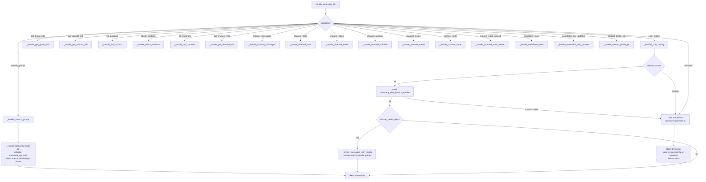

# WhatsApp DB (`whatsappDb`)

| Field | Value |
|------|-------|
| **Category** | whatsapp / tool (dual-purpose) |
| **Backend handler** | [`server/nodes/whatsapp/whatsapp_db.py`](../../../server/nodes/whatsapp/whatsapp_db.py) (`WhatsAppDbNode`); dispatched via `BaseNode.execute()` -> `@Operation("query")`, which delegates to [`server/nodes/whatsapp/_base.py::handle_whatsapp_db`](../../../server/nodes/whatsapp/_base.py) |
| **Tests** | [`server/tests/nodes/test_whatsapp.py`](../../../server/tests/nodes/test_whatsapp.py) |
| **Skill (if any)** | [`server/skills/social_agent/whatsapp-db-skill/SKILL.md`](../../../server/skills/social_agent/whatsapp-db-skill/SKILL.md) |
| **Dual-purpose tool** | yes - tool name `whatsapp_db` |

## Purpose

Query and operate on the WhatsApp state owned by the Go `whatsapp-rpc` service:
chat/message history, contacts, groups, and newsletter channels (list, info,
messages, stats, follow/unfollow, create, mute, mark-viewed, react, live
updates, profile pictures). One node, 18 operations switched via the
`operation` parameter. Also works as an AI agent tool.

## Inputs (handles)

| Handle | Connection type | Required | Purpose |
|--------|-----------------|----------|---------|
| `input-main` | main | no | Template source for operation parameters |

## Parameters

The top-level parameter is `operation`. Each operation takes its own subset of
parameters, all rendered conditionally via `displayOptions.show` in the
frontend.

### `operation` enum

| Operation | Required params | Optional params | RPC method |
|-----------|----------------|-----------------|------------|
| `chat_history` | `chat_type` + (`phone` \| `group_id`) | `group_filter`, `sender_phone`, `message_filter`, `limit`, `offset`, `include_media_data` | `chat_history` (router) |
| `search_groups` | - | `query`, `limit` | `groups` |
| `get_group_info` | `group_id_for_info` or `group_id` | `participant_limit` | `group_info` |
| `get_contact_info` | `contact_phone` or `phone` | - | `contact_info` |
| `list_contacts` | - | `query`, `limit` | `contacts` |
| `check_contacts` | `phones` (comma-separated) | - | `contact_check` |
| `list_channels` | - | `refresh`, `limit` | `newsletters` |
| `get_channel_info` | `channel_jid` (JID or invite link) | `refresh` | `newsletter_info` |
| `channel_messages` | `channel_jid` | `channel_count`, `before_server_id`, `message_offset`, `since`, `until`, `media_type`, `search`, `refresh`, `include_media_data` | `newsletter_messages` |
| `channel_stats` | `channel_jid` | `channel_count` | `newsletter_stats` |
| `channel_follow` | `channel_jid` | - | `newsletter_follow` |
| `channel_unfollow` | `channel_jid` | - | `newsletter_unfollow` |
| `channel_create` | `channel_name` | `channel_description`, `picture` | `newsletter_create` |
| `channel_mute` | `channel_jid` | `mute` (bool, default true) | `newsletter_mute` |
| `channel_mark_viewed` | `channel_jid`, `server_ids` (comma list) | - | `newsletter_mark_viewed` |
| `newsletter_react` | `channel_jid`, `react_server_id` | `reaction` (emoji) | `newsletter_react` |
| `newsletter_live_updates` | `channel_jid`, `server_ids` | - | `newsletter_live_updates` |
| `contact_profile_pic` | `profile_pic_jid` or `phone` | `preview` | `contact_profile_pic` |

## Outputs (handles)

| Handle | Shape | Description |
|--------|-------|-------------|
| `output-main` | object | The handler `result` dict with `operation` field + operation-specific fields. Plugin `Output` model is `WhatsAppDbOutput` (`operation`, `messages`, `contacts`, `groups`, `channels`, `total`, `extra="allow"`). |

When wired into an AI agent's `input-tools` handle (`usable_as_tool=True`, tool name `whatsapp_db`) the same payload is returned to the LLM.

All payloads include the read-back `operation` and `timestamp`. Collection
operations (`search_groups`, `list_contacts`, `list_channels`) apply a soft
`limit` and return `total` / `returned` / `has_more` plus a human-readable
`hint` if truncated.

## Logic Flow

## Decision Logic

- **Operation dispatch**: single `if/elif` chain; unknown operation raises `ValueError` captured by the outer `try/except`.
- **Invite link vs JID resolution for channel ops**:
  - `_resolve_channel_identifier(value)`: returns `{'invite': url}` if value starts with `http://` or `https://`, else `{'jid': value}`. Used where the RPC accepts either (`newsletter_info`, `newsletter_stats`).
  - `_resolve_to_jid(value, rpc_call)`: if value is an invite link, calls `newsletter_info` first to look up the JID, then returns that JID. Used where the RPC only accepts `jid` (`newsletter_messages`, `newsletter_follow`, `newsletter_unfollow`, `newsletter_mute`, `newsletter_mark_viewed`, `newsletter_react`, `newsletter_live_updates`). Raises `ValueError` if lookup fails.
- **Result truncation for LLM safety** (prevents context overflow):
  - `search_groups`: returns only `{jid, name}` per group, default `limit=20`
  - `get_group_info`: returns only `{phone, name, is_admin}` per participant, default `participant_limit=50`
  - `list_contacts`: returns only `{phone, name, jid}`, default `limit=50`
  - `list_channels`: returns only `{jid, name, subscriber_count}`, default `limit=20`
- **Media enrichment** (`include_media_data=true`):
  - Filters `messages` to those whose `message_type` (or `type`) is in `{image, video, audio, document, sticker}` - the `MEDIA_MESSAGE_TYPES` frozenset.
  - Runs `_enrich_messages_with_media` with `asyncio.Semaphore(5)` and `asyncio.gather(..., return_exceptions=True)` - per-message failures are swallowed into `media_error` rather than propagating.
  - Each message mutated in place: `media_data` (base64) and `media_mime_type` on success, `media_error` on failure.
- **Success flag handling is defensive**: many RPC responses are plain lists (e.g. `groups`, `newsletters`, `contact_check`). The handler accepts both `list` (treated as success) and `dict` (checks `success != False`).
- **`server_ids` parsing**: `channel_mark_viewed` and `newsletter_live_updates` accept a comma-separated string, split, strip, and `int()` each token. Non-integer values raise `ValueError`.

## Side Effects

- **Database writes**: none.
- **Broadcasts**: none - standard `node_status` comes from `BaseNode.execute()`.
- **External calls**: WebSocket RPC to the Go service (`whatsapp_rpc_call` and `handle_whatsapp_chat_history` in [`nodes/whatsapp/_service.py`](../../../server/nodes/whatsapp/_service.py)). For `channel_messages` and `chat_history` with `include_media_data=true`, one additional `media` RPC call per media message (up to 5 in parallel).
- **File I/O**: none.
- **Subprocess**: none.

## External Dependencies

- **Credentials**: none.
- **Services**: `whatsapp-rpc` Go service (default `ws://localhost:9400/ws/rpc`).
- **Python packages**: `asyncio`.
- **Environment variables**: `WHATSAPP_RPC_URL`.

## Edge cases & known limits

- **Channel ops silently transform invite links**: a user-supplied invite link becomes a JID via an extra `newsletter_info` round-trip in `_resolve_to_jid`. If that lookup fails, the envelope error is `Could not resolve invite link to channel JID: <value>`.
- **`_enrich_messages_with_media` swallows per-item errors**: failed downloads become `media_error` fields, never a failed envelope. The count of failures is not summarised.
- **Truncation hints are best-effort**: `hint` is only populated when `total > limit`. Callers must not rely on it being a specific string - only on the truncation itself.
- **`search_groups` is client-side filtering**: the RPC returns all groups, the handler filters by `query.lower() in group.name.lower()` and then truncates. For very large group counts this still pulls the full list from the Go service.
- **Return shape inconsistency**: operations that return `result` merge it via `**result` into the envelope, which may add unexpected top-level keys if the RPC evolves.
- **Unknown operation** raises in-band; callers get `success=false` with `error = "Unknown operation: X"`.

## Related

- **Skills using this as a tool**: [`whatsapp-db-skill/SKILL.md`](../../../server/skills/social_agent/whatsapp-db-skill/SKILL.md)
- **Companion nodes**: [`whatsappSend`](./whatsappSend.md), [`whatsappReceive`](./whatsappReceive.md)
- **Architecture docs**: `CLAUDE.md` -> "WhatsApp Channel (Newsletter) Architecture" and "WhatsApp Integration" sections
