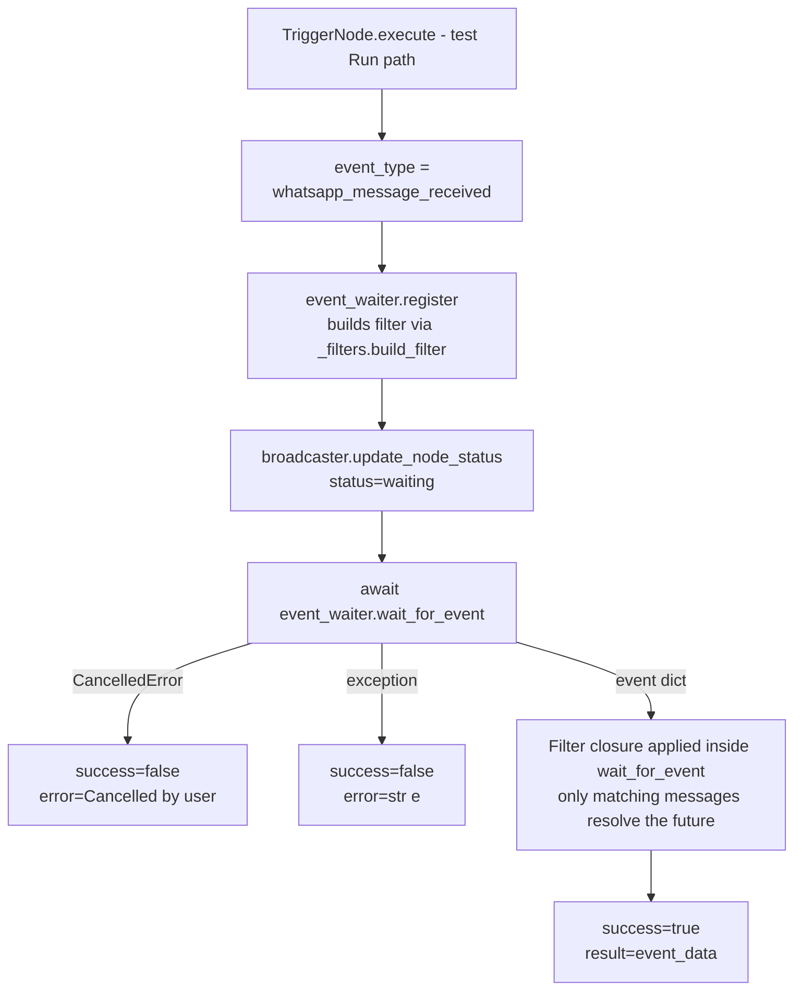
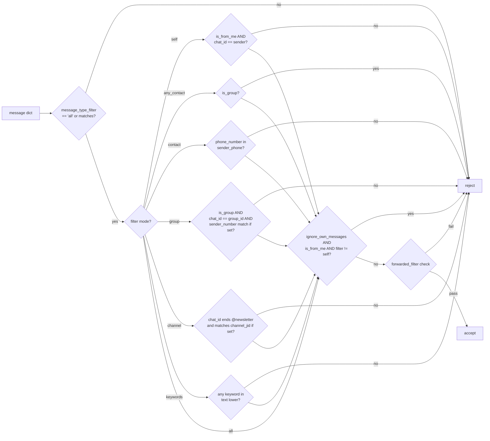

# WhatsApp Receive (`whatsappReceive`)

| Field | Value |
|------|-------|
| **Category** | whatsapp / trigger |
| **Backend handler** | [`server/nodes/whatsapp/whatsapp_receive.py`](../../../server/nodes/whatsapp/whatsapp_receive.py) (`WhatsAppReceiveNode`, a `TriggerNode`); filtering is built by [`server/nodes/whatsapp/_filters.py`](../../../server/nodes/whatsapp/_filters.py). CloudEvents type: `com.opencompany.whatsapp.message.received`; controlled deployment routes through `WorkflowControlWorkflow`. |
| **Tests** | [`server/tests/nodes/test_whatsapp.py`](../../../server/tests/nodes/test_whatsapp.py) |
| **Skill (if any)** | n/a |
| **Dual-purpose tool** | no - pure trigger node |

## Purpose

Event-driven trigger that waits for incoming WhatsApp messages and starts a
workflow run when one matches. `whatsappReceive` is registered with CloudEvents
type `com.opencompany.whatsapp.message.received`. In a controlled deployment,
the manager signals its trigger definition into `WorkflowControlWorkflow`;
`dispatch.emit` signals the controller, which filters/deduplicates the envelope
and starts a child `MachinaWorkflow` only for a real match. There is no separate
listener workflow run. Single-node "Run" (non-deployed test)
still uses the `TriggerNode.execute` event-waiter path: register a waiter with
the filter closure, broadcast `waiting`, then await a
`whatsapp_message_received` event. In both paths `build_filter` decides which
inbound messages match.

## Inputs (handles)

Triggers have no data inputs - they are workflow starting points.

## Parameters

Field names are snake_case throughout (JSON Schema keys match the Pydantic field names exactly, no camelCase aliases).

| Name | Type | Default | Required | displayOptions.show | Description |
|------|------|---------|----------|---------------------|-------------|
| `message_type_filter` | options | `all` | no | - | `all`, `text`, `image`, `video`, `audio`, `document`, `location`, `contact` |
| `filter` | options | `all` | no | - | `all`, `self`, `any_contact`, `contact`, `group`, `channel`, `keywords` |
| `phone_number` | string | `""` | conditional | `filter == 'contact'` | Phone number substring matched against resolved `sender_phone` |
| `group_id` | string | `""` | conditional | `filter == 'group'` | Group JID (component `GroupIdSelector`) |
| `sender_number` | string | `""` | no | `filter == 'group'` | Optional phone substring to match a specific sender within the group (component `SenderNumberSelector`, `dependsOn: group_id`) |
| `channel_jid` | string | `""` | conditional | `filter == 'channel'` | Optional exact channel JID; empty = any `@newsletter` chat (component `ChannelJidSelector`) |
| `keywords` | string | `""` | conditional | `filter == 'keywords'` | Comma-separated keywords, case-insensitive substring match against `text` |
| `forwarded_filter` | options | `all` | no | - | `all`, `only_forwarded`, `ignore_forwarded` |
| `ignore_own_messages` | boolean | `true` | no | `filter in [all, any_contact, contact, group, channel, keywords]` | Skip `is_from_me == true` (except when `filter == 'self'`) |
| `include_media_data` | boolean | `false` | no | - | Download base64 media data with the event |

## Outputs (handles)

| Handle | Shape | Description |
|--------|-------|-------------|
| `output-main` | object | Raw WhatsApp event payload from the Go RPC |

### Output payload

```ts
{
  message_id: string;
  sender: string;              // JID (may be LID for groups, but sender_phone is already resolved)
  sender_phone: string;        // Resolved phone (Go RPC resolves LIDs before dispatch)
  chat_id: string;             // Chat JID, ends with '@newsletter' for channel messages
  message_type: string;
  text: string;                // text messages
  timestamp: string;
  is_group: boolean;
  is_from_me: boolean;
  push_name: string;
  is_forwarded: boolean;
  forwarding_score: number;
  media?: object;              // for media types
  group_info?: {
    group_jid: string;
    sender_jid: string;
    sender_phone: string;      // resolved
    sender_name: string;
  };
  newsletter_meta?: { edit_ts: number; original_ts: number };
}
```

Additionally, group/sender display names are persisted alongside JIDs/phones
in the node parameters (`group_name`, `sender_name`) so that reopening the
parameter panel shows human-readable labels instead of raw JIDs. See
CLAUDE.md "WhatsApp Group/Sender Name Persistence".

## Logic Flow



### Filter closure (`_filters.build_filter`)



## Decision Logic

- **Filter priority**: message_type -> sender filter -> own-message -> forwarded. Every check is a short-circuit reject.
- **Sender phone fallback**: uses `group_info.sender_phone` for group messages, falls back to root `sender_phone`, and if both empty splits the JID at `@` to extract the phone prefix.
- **`filter == 'self'` is special**: disables the `ignore_own_messages` gate (otherwise every self-message would be filtered out).
- **Keyword match is substring**, not token match: `"hi"` matches `"this"`.
- **Channel filter** requires `chat_id` to end exactly with `@newsletter`; if `channel_jid` is provided it must match exactly, otherwise any channel passes.
- **Pre-check**: unlike `telegramReceive`, this trigger does not check WhatsApp pairing state before registering - it will wait forever if the Go RPC is disconnected.

## Side Effects

- **Database writes**: none from the handler directly (frontend may save `group_name`/`sender_name` back to node parameters via the WebSocket `save_node_parameters` handler - that is UI-driven, not part of trigger execution).
- **Broadcasts**: `update_node_status(node_id, "waiting", {...})` once before awaiting.
- **External calls**: none outbound. Inbound `whatsapp_message_received` events are produced by the WhatsApp WS handlers / Go RPC bridge and routed via [`nodes/whatsapp/_events.py`](../../../server/nodes/whatsapp/_events.py) (`broadcast_whatsapp_message`), which both broadcasts the legacy raw frame and emits the typed CloudEvents envelope through `dispatch.emit`.
- **File I/O**: none.
- **Subprocess**: none.

## External Dependencies

- **Credentials**: none - pairing is held by the Go service.
- **Services**: `whatsapp-rpc` (Go) for inbound message events, surfaced via `nodes/whatsapp/_events.py::broadcast_whatsapp_message`.
- **Python packages**: `asyncio`.
- **Environment variables**: none in the handler.

## Edge cases & known limits

- **No pairing pre-check**: if the phone is unpaired the trigger silently waits forever until user cancel.
- **LID-to-phone resolution is implicit**: the Go RPC already populates `sender_phone` with the resolved phone before dispatch, so the filter never needs to call back into the RPC. Missing `sender_phone` is still tolerated via the JID-prefix fallback.
- **`filter == 'self'` semantics are narrow**: requires `is_from_me` AND `chat_id == sender` (true only for notes-to-self chats). Self-messages sent to other chats are rejected.
- **`keywords` is trivially tokenized**: splits on `,` and `.strip().lower()` each; there is no escaping or whole-word matching.
- **Parameter field names are snake_case** (`message_type_filter`, `phone_number`, `sender_number`, `forwarded_filter`, `ignore_own_messages`). `message_type_filter` has no `sticker` option (unlike `whatsappSend`'s `message_type`).
- **Cancellation path** returns `success=false` with `error="Cancelled by user"` - this is the documented path for the Cancel button, not a real error.
- **Filter closure is built once at register-time**: changes to node parameters during a waiting run are not reflected; user must cancel and re-run.

## Related

- **Companion nodes**: [`whatsappSend`](./whatsappSend.md), [`whatsappDb`](./whatsappDb.md)
- **Architecture docs**: `CLAUDE.md` -> "Event-Driven Trigger Node System", "WhatsApp Integration"
- **Trigger infrastructure**: [`event_waiter.py`](../../../server/services/event_waiter.py), [`_filters.py`](../../../server/nodes/whatsapp/_filters.py), [`_events.py`](../../../server/nodes/whatsapp/_events.py), canary path in [`canary_registry.py`](../../../server/services/deployment/canary_registry.py)
