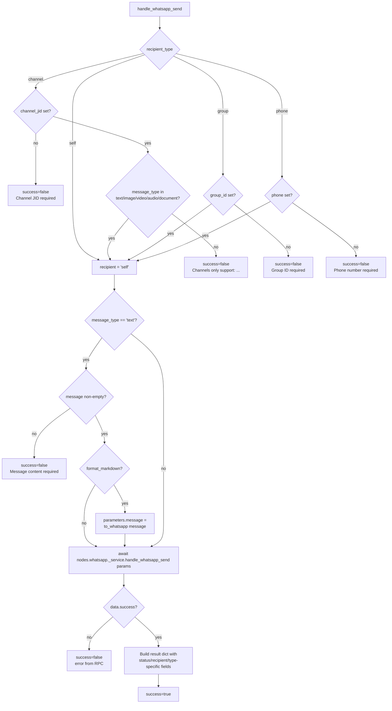

# WhatsApp Send (`whatsappSend`)

| Field | Value |
|------|-------|
| **Category** | whatsapp / tool (dual-purpose) |
| **Backend handler** | [`server/nodes/whatsapp/whatsapp_send.py`](../../../server/nodes/whatsapp/whatsapp_send.py) (`WhatsAppSendNode`); dispatched via `BaseNode.execute()` -> `@Operation("send")`, which delegates to [`server/nodes/whatsapp/_base.py::handle_whatsapp_send`](../../../server/nodes/whatsapp/_base.py) |
| **Tests** | [`server/tests/nodes/test_whatsapp.py`](../../../server/tests/nodes/test_whatsapp.py) |
| **Skill (if any)** | [`server/skills/social_agent/whatsapp-send-skill/SKILL.md`](../../../server/skills/social_agent/whatsapp-send-skill/SKILL.md) |
| **Dual-purpose tool** | yes - tool name `whatsapp_send` |

## Purpose

Send WhatsApp messages of any supported type (text, image, video, audio,
document, sticker, location, contact) to an individual phone number, a group
JID, a newsletter channel JID, or the connected account itself ("self" - used
for notes-to-self). All traffic is proxied through the Go `whatsapp-rpc`
service over a persistent WebSocket RPC (not HTTP). Also works as an AI agent
tool when wired to an agent's `input-tools` handle.

## Inputs (handles)

| Handle | Connection type | Required | Purpose |
|--------|-----------------|----------|---------|
| `input-main` | main | no | Upstream data for template substitution into `message`, `media_url`, etc. |

## Parameters

Key parameters (see frontend definition for the full list and `displayOptions.show` rules):

| Name | Type | Default | Required | Notes |
|------|------|---------|----------|------|
| `recipient_type` | options | `self` | no | One of `self`, `phone`, `group`, `channel` |
| `phone` | string | `""` | conditional | Required when `recipient_type == 'phone'` |
| `group_id` | string | `""` | conditional | Required when `recipient_type == 'group'` |
| `channel_jid` | string | `""` | conditional | Required when `recipient_type == 'channel'`, must end `@newsletter` |
| `message_type` | options | `text` | yes | `text`, `image`, `video`, `audio`, `document`, `sticker`, `location`, `contact` |
| `message` | string | `""` | conditional | Required when `message_type == 'text'` |
| `format_markdown` | boolean | `true` | no | When true and text message, convert GFM to WhatsApp syntax via `markdown_formatter.to_whatsapp` |
| `media_source` | options | `base64` | conditional | `base64`, `file`, or `url` for media types |
| `media_data` | string | `""` | conditional | Base64 data when `media_source == 'base64'` |
| `file_path` | string/object | `""` | conditional | Either a path string or upload dict `{type: 'upload', filename, mimeType}` |
| `media_url` | string | `""` | conditional | URL when `media_source == 'url'` |
| `mime_type` | string | `""` | no | Optional override |
| `caption` | string | `""` | no | Caption for media messages |
| `filename` | string | `""` | no | Filename for document messages |
| `latitude` | number | `0` | conditional | Required for `message_type == 'location'` |
| `longitude` | number | `0` | conditional | Required for `message_type == 'location'` |
| `location_name` | string | `""` | no | Location name |
| `address` | string | `""` | no | Location address |
| `contact_name` | string | `""` | conditional | Required for `message_type == 'contact'` |

## Outputs (handles)

| Handle | Shape | Description |
|--------|-------|-------------|
| `output-main` | object | The handler `result` dict (see below). The plugin `Output` model is `WhatsAppSendOutput` (`message_id`, `sent`, `extra="allow"`). |

When wired into an AI agent's `input-tools` handle (`usable_as_tool=True`, tool name `whatsapp_send`) the same `result` payload is returned to the LLM.

### Output payload

```ts
{
  status: 'sent';
  recipient: string;            // 'self' | phone | group_id | channel_jid
  recipient_type: 'self' | 'phone' | 'group' | 'channel';
  message_type: string;
  timestamp: string;            // ISO
  preview?: string;             // text messages (first 100 chars)
  media_source?: string;        // media types
  caption?: string;
  filename?: string;
  mime_type?: string;
  uploaded_file?: string;       // when file_path is an upload dict
  location?: { latitude, longitude, name, address };
  contact_name?: string;
}
```

## Logic Flow



## Decision Logic

- **Validation (short-circuit)** - raised as `ValueError` and caught by the outer `try`, turned into a `success=false` envelope:
  - `channel_jid` missing when `recipient_type == 'channel'`
  - Channel message type not in `{text, image, video, audio, document}` - specifically blocks `sticker`, `location`, `contact` for channels
  - `group_id` missing when `recipient_type == 'group'`
  - `phone` missing when `recipient_type == 'phone'`
  - Empty `message` when `message_type == 'text'`
- **Markdown transform**: only runs when `message_type == 'text'` AND `format_markdown` truthy. Overwrites `parameters['message']` in place before RPC call.
- **Type-specific result fields**: `match message_type` adds `preview`, `media_source`, `caption`, `filename`, `mime_type`, `uploaded_file`, `location`, or `contact_name` based on message type.
- **File upload detection**: if `file_path` is a dict with `type == 'upload'`, the `_service.py` send handler uploads bytes and the result includes `uploaded_file` and `mime_type` from the upload dict.

## Side Effects

- **Database writes**: none directly from this handler. (API-usage cost is recorded by the `@Operation` `cost` metadata via `BaseNode.execute()`.)
- **Broadcasts**: none directly - standard node_status transitions come from `BaseNode.execute()`.
- **External calls**: WebSocket RPC to the Go `whatsapp-rpc` service via [`nodes/whatsapp/_service.py::whatsapp_rpc_call`](../../../server/nodes/whatsapp/_service.py). Default URL `ws://localhost:9400/ws/rpc` (overridable via `WHATSAPP_RPC_URL`). For media URLs, `_service.py` additionally downloads via `httpx`.
- **File I/O**: none in this handler - file uploads are handled in `_service.py`.
- **Subprocess**: none.

## External Dependencies

- **Credentials**: none at the node handler level. Pairing state is owned by the Go service; the handler is credential-free.
- **Services**: `whatsapp-rpc` (Go) on port 9400 (default). `services.markdown_formatter.to_whatsapp` when `format_markdown` is enabled.
- **Python packages**: `asyncio`. (`httpx` is used inside `_service.py` for URL media fetches.)
- **Environment variables**: `WHATSAPP_RPC_URL` (optional, default `ws://localhost:9400/ws/rpc`).

## Edge cases & known limits

- **Channel message-type allowlist is hard-coded**: `{text, image, video, audio, document}`. Any other type returns `success=false` even though the RPC might technically accept it.
- **`format_markdown` mutates `parameters`**: the converted text overwrites the incoming `message` before the RPC call - downstream code inspecting the raw parameters post-execution will see the converted form.
- **All exceptions funnel to `success=false`**: the outer `try/except` captures every `ValueError`, RPC exception, and generic failure, returning the stringified error as the envelope `error`. The handler never raises to the executor.
- **`recipient = 'self'` is a sentinel string**, not a resolved phone number. The Go RPC resolves it to the connected account at send time.
- **Caption/filename/mime_type**: only added to the result payload when truthy in `parameters`; consumers must handle their absence.
- **Text preview is truncated** to 100 chars with `"..."` suffix when longer - this is output-only and does not change the sent message.

## Related

- **Skills using this as a tool**: [`whatsapp-send-skill/SKILL.md`](../../../server/skills/social_agent/whatsapp-send-skill/SKILL.md)
- **Companion nodes**: [`whatsappDb`](./whatsappDb.md), [`whatsappReceive`](./whatsappReceive.md)
- **Architecture docs**: [Markdown Formatter](../../../CLAUDE.md) (see "Markdown Formatter Service"), WhatsApp RPC via `nodes/whatsapp/_service.py`
