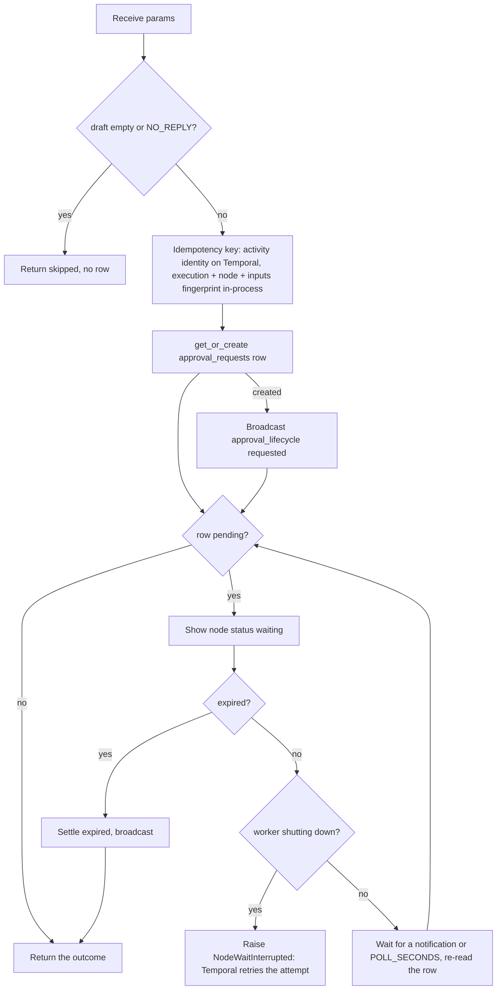

# Approval (`approvalGate`)

| Field | Value |
|------|-------|
| **Category** | workflow |
| **Backend handler** | [`server/nodes/workflow/approval_gate/__init__.py`](../../../server/nodes/workflow/approval_gate/__init__.py) - `ApprovalGateNode`; dispatched via `BaseNode.execute()` + the `@Operation("request")` method |
| **Tests** | [`server/tests/services/approvals/test_approval_gate.py`](../../../server/tests/services/approvals/test_approval_gate.py) |
| **Skill (if any)** | none |
| **Dual-purpose tool** | no - `usable_as_tool = False`, so no agent can approve its own draft |

## Purpose

Holds a draft until the owner sends or discards it. A Normal-mode employee
with "Ask me before sending anything" on answers through
`agent -> approvalGate -> reply`: the gate records the agent's draft (who it
goes to, what it says), shows it on the employee's card in Home, and waits.
Send lets the draft, or the owner's edit of it, through to the reply node;
Discard, expiry or a Reset lets nothing through. Hire builds this wiring
(`services/employees/builder.py`); the node is also usable by hand in the
editor. Feature overview: [Normal mode](../../normal_mode.md).

## Inputs (handles)

| Handle | Connection type | Required | Purpose |
|--------|-----------------|----------|---------|
| `input-main` | main | yes | The agent's reply (drives the `draft` template) and the trigger's data (the recipient) |

## Parameters

| Name | Type | Default | Required | displayOptions.show | Description |
|------|------|---------|----------|---------------------|-------------|
| `channel` | string | `""` | no | - | The app the reply goes out through (shown on the card) |
| `recipient` | string | `""` | no | - | Who the reply goes to, from the trigger (ints such as Telegram chat ids are coerced) |
| `recipient_label` | string | `""` | no | - | How the card names the recipient |
| `subject` | string | `""` | no | - | Subject line, for email |
| `draft` | string | `""` | no | - | The message waiting for approval (capped at 20,000 characters) |
| `context_excerpt` | string | `""` | no | - | The message being answered, shown above the draft (capped at 2,000) |
| `max_length` | int | `20000` | no | - | Longest edit the channel accepts (1-20,000) |
| `timeout_hours` | int | `168` | no | - | Hours before the draft expires (1-720) |

## Outputs (handles)

| Handle | Shape | Description |
|--------|-------|-------------|
| `output-main` | object | The decision (see below); fails closed |

### Output payload (TypeScript shape)

```ts
{
  approved: boolean;
  status: 'approved' | 'discarded' | 'expired' | 'cancelled' | 'skipped';
  skipped: boolean;
  text: string;            // the sent text (the edit if there was one); "" unless approved
  subject: string;         // "" unless approved
  recipient: string;       // "" unless approved
  recipient_label: string; // "" unless approved
  approval_id: string | null;
  edited: boolean;
}
```

The reply node reads `{{<gate label>.text}}` and `{{<gate label>.recipient}}`,
and its incoming edge carries `{"field": "result.approved", "operator": "is_true"}`
(`services/approvals/contract.py::approved_edge_condition`), so nothing is sent
unless the owner approved. The recipient always comes from the run's trigger,
never from the agent's text.

## Logic Flow



## Decision Logic

- **Validation**: parameters are coerced and capped by the Params validators;
  `extra="ignore"`.
- **Branches**: an empty draft, or exactly `NO_REPLY`, returns
  `status: "skipped"` and creates no row. The agent answers `NO_REPLY` when
  nothing should go out; the gate's own incoming edge also carries
  `result.response != NO_REPLY`.
- **Identity**: `t:{workflow_id}:{run_id}:{activity_id}` inside a Temporal
  activity, so a retry after a restart re-attaches to the same draft;
  `p:{execution}:{node}:{sha256(outputs)[:16]}` in-process, where one
  execution id can span several runs of a deployment.
- **Waiting**: a process-local waiter (`services/approvals/waiter.py`) wakes
  the gate the moment `decide_approval` settles the row; it also re-reads
  the row every `POLL_SECONDS` (10) to see decisions made in another process
  and expiry.
- **Error paths**: a worker shutting down mid-wait raises `NodeWaitInterrupted`,
  which `BaseNode.as_activity` turns into a retryable `ApplicationError`. On
  the in-process path there is no retry, and the run fails as for any error.

## Side Effects

- **Database writes**: one `approval_requests` row per draft
  ([`server/models/approvals.py`](../../../server/models/approvals.py)): the
  recipient, draft, final text, status, revision and expiry. Decisions are
  compare-and-swap on `revision`.
- **Broadcasts**: `approval_lifecycle` (CloudEvents type
  `com.opencompany.approval.{requested|decided|expired|cancelled}`, subject =
  approval id). Identity only, never the message body or the recipient; the
  card refetches through `list_approvals`. Node status `waiting` while it waits.
- **External API calls**: none.
- **File I/O**: none.
- **Subprocess**: none.

## External Dependencies

- **Credentials**: none.
- **Services**: the approvals package
  ([`server/services/approvals/`](../../../server/services/approvals/)):
  store, waiter, listeners, reconcile, queries, contract.
- **Python packages**: `temporalio` (activity identity and worker shutdown).
- **Environment variables**: none.

## Edge cases & known limits

- Runs on `TaskQueue.TRIGGERS_EVENT` with a 24-hour `start_to_close` and
  unlimited retries (`maximum_attempts=0`); expiry, not the retry policy,
  ends a wait. Each waiting draft holds one slot on that queue's worker.
- A Reset cancels the workflow's pending drafts (`reset_execution_state`), and
  deleting the workflow removes its rows (workflow-deleted hook).
- Rows left pending by a crashed process are cancelled by
  `reconcile_once`, which `list_approvals` runs: local rows created before
  this process started, and Temporal rows whose generation is no longer live.
- Deciding while the employee is paused is allowed; the response carries
  `will_send_on_resume: true` and the card says so.

## Related

- **WebSocket handlers**
  ([`_handlers.py`](../../../server/nodes/workflow/approval_gate/_handlers.py)):
  `list_approvals {workflow_id?, status?, limit <= 100}` returns the owner's
  drafts, per-workflow pending counts and `server_time`;
  `decide_approval {approval_id, decision: "send" | "discard", text?, subject?, decision_key}`
  is idempotent per `decision_key` and validates edits against `max_length`.
  Errors: `already_decided`, `expired`, `cancelled`, `not_found`, `invalid_request`.
- **Other nodes that consume this output**: the reply node of the app that
  received the message (`whatsappSend`, `telegramSend`, `discordSend`,
  `googleGmail`, `msMail`, `whatsappBusinessSend`).
- **Architecture docs**: [Normal mode](../../normal_mode.md),
  [Plugin System](../../plugin_system.md).
