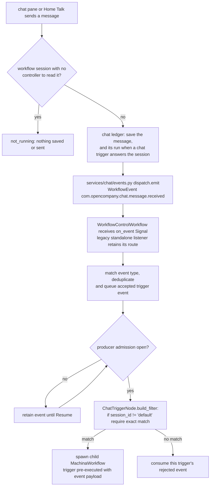

# Chat Trigger (`chatTrigger`)

| Field | Value |
|------|-------|
| **Category** | workflow / trigger / utility |
| **Backend handler** | Plugin [`server/nodes/trigger/chat_trigger/__init__.py`](../../../server/nodes/trigger/chat_trigger/__init__.py) (`ChatTriggerNode`). Deployed generations register its filter with [`WorkflowControlWorkflow`](../../../server/services/temporal/workflow_control_workflow.py), which receives Signals and starts graph runs with the trigger pre-executed. The base `TriggerNode.execute` event-waiter wait is the direct execution path; its `@Operation("wait")` body is a stub. Standalone legacy deployments retain `TriggerListenerWorkflow`. |
| **Tests** | [`server/tests/nodes/test_workflow_triggers.py`](../../../server/tests/nodes/test_workflow_triggers.py), [`server/tests/services/chat/test_handlers.py`](../../../server/tests/services/chat/test_handlers.py), [`server/tests/services/chat/test_stop.py`](../../../server/tests/services/chat/test_stop.py), [`server/tests/temporal/test_controller_accumulator.py`](../../../server/tests/temporal/test_controller_accumulator.py) |
| **Skill (if any)** | none |
| **Dual-purpose tool** | no |

## Purpose

Fires when the user sends a chat message: from the editor's chat pane
(Console Panel chat tab), or from Talk on an employee's Home page. The
producer [`server/services/chat/events.py`](../../../server/services/chat/events.py)
emits a CloudEvents `WorkflowEvent` (`type: com.opencompany.chat.message.received`,
source `opencompany://services/chat`) via `dispatch.emit`, never broadcast to
sockets. `chatTrigger` is canary-registered (`register_canary_trigger_type`).
For a generation with a durable controller, `DeploymentManager` sends
`register_trigger`; the controller retains its filter and graph context rather
than starting a separate listener. `dispatch.emit` discovers the controller
through Temporal Visibility and sends `on_event`. The controller filters each
registered trigger, queues the accepted event and starts a child
`MachinaWorkflow` when producer admission is open. Deployments without a
durable controller keep the standalone `TriggerListenerWorkflow` route.
A matching `session_id` (or `'default'`) makes the payload the trigger's
pre-executed output. This is the primary way a user feeds an interactive prompt
into an `aiAgent` or `chatAgent`.

A workflow's chat session id is the workflow id. Home's Talk and the editor's
chat pane send with `session_id` = that id (`'default'` only when the editor
has no workflow open), and `send_chat_message` then scopes the event to the
workflow (`EventWorkflowId`), so only that workflow's listeners receive it.
The trigger of a talk line (a chat hire's "Chat" trigger, or the "Talk"
trigger that Hire and Turn on Talk add beside another worker) has
`session_id` set to the workflow id, and its agent answers through
[`chatReply`](../chat_utility/chatReply.md) into the same thread. See
[Normal mode → Talk](../../normal_mode.md#talk).

## Inputs (handles)

| Handle | Connection type | Required | Purpose |
|--------|-----------------|----------|---------|
| (none) | - | - | Trigger nodes have no inputs. |

## Parameters

| Name | Type | Default | Required | displayOptions.show | Description |
|------|------|---------|----------|---------------------|-------------|
| `session_id` | string | `default` | no | - | Matches the `session_id` on the incoming chat event. If set to `default`, the filter accepts every event. Otherwise it only accepts events with the same `session_id`. Talk lines built by Hire and Turn on Talk use the workflow id. |
| `placeholder` | string | `Type a message...` | no | - | Frontend display only - not used by the handler. |

## Outputs (handles)

| Handle | Shape | Description |
|--------|-------|-------------|
| `output-main` | object | The chat event payload (see below). |

### Output payload

`services/chat/handlers.py::handle_send_chat_message` builds the event as:

```ts
{
  message: string;
  timestamp: string;   // ISO 8601; the client's, else the server's time (UTC)
  session_id: string;
  message_id: string;  // the saved message's id
  run_id?: string;     // the chat run the message started, when one did
}
```

Wrapped in the standard envelope, whose stable id is the run id when there is
one, otherwise the saved message id. Redelivery of that same envelope keeps its
identity; the controller's deduplication key is `<listener_id>:<event_id>`.
A run spawned from it claims that chat run (MachinaWorkflow,
`machina-chat-run-v1`) and passes `run_scope` to every node, so
[`chatReply`](../chat_utility/chatReply.md) saves its answer as the run's reply.
See [chat_protocol.md](../../chat_protocol.md#runs).

## Logic Flow



## Decision Logic

- **Filter** (`ChatTriggerNode.build_filter`):
  ```python
  if session_id and session_id != 'default':
      return event.get('session_id') == session_id
  return True
  ```
  So `session_id='default'` (the frontend default) is a wildcard - the
  trigger fires for every chat message regardless of which session the user
  is in.
- **Controlled Stop**: suspends admission on the owning generation. It does
  not cancel the trigger, withdraw its accepted event or terminalize the chat
  run. Already admitted work drains before `paused` is acknowledged; Resume
  releases the same continuation or pending event. See
  [Chat protocol → Controlled Stop acknowledgement](../../chat_protocol.md#controlled-stop-acknowledgement).
- **Direct-path cancellation**: the event-waiter path can yield
  `success=False, error="Cancelled by user"`. Reset/Clear and legacy terminal
  chat Stop retain their separate lifecycle behavior.

## Side Effects

- **Database writes**: none while it fires. (`send_chat_message` keeps the
  message in the session's thread first, with its chat run, through
  `services/chat/ledger.admit_message`, stamped with the live generation, and
  announces `chat.updated`.) On a workflow Reset its
  `reset_execution_state` clears the workflow's own thread (session = the
  workflow id, never a custom `session_id` another workflow may share),
  as `chatReply`'s does: the conversation ended with the generation. It
  matters for a graph with a trigger and no reply yet, such as the one
  Turn on Talk resets before its new reply node runs.
- **Broadcasts**: the producer emits a CloudEvents `WorkflowEvent` via
  `dispatch.emit` (Temporal Signal fan-out only: `broadcast=False`, since the
  envelope carries the owner's text). The
  controller (or legacy listener) emits firing-pulse status via
  `broadcast_trigger_status_activity` around child admission. Chat-run events
  are delivered only to authorized session subscribers; generation control
  status is broadcast separately.
- **External API calls**: none.
- **File I/O**: none.
- **Subprocess**: none.

## External Dependencies

- **Credentials**: none.
- **Services**: chat ledger/thread, `services.events.dispatch`, Temporal
  controller and graph execution, `services.status_broadcaster`; the direct
  event-waiter path uses `services.event_waiter`.
- **Python packages**: Temporal Python SDK for deployed execution; the plugin's
  filter/output logic uses the base node framework.
- **Environment variables**: none.

## Edge cases & known limits

- `session_id='default'` behaves as a wildcard; setting a unique session ID
  per trigger is the only way to scope messages to a specific node.
- Distinct registered `chatTrigger` nodes with the same session ID can all
  match a message: the first graph run to claim tracks the chat run and the
  others run untracked. Existing listener ids use the workflow slug and
  display-label slug, so duplicate trigger labels/types can collide before
  registration; this remains a naming limitation. Hire and Turn on Talk never add a second trigger on a
  workflow's own session: a chat hire's "Chat" trigger is already its talk
  line.
- The handler has no timeout; it waits forever until an event arrives or
  the run is cancelled.
- For a workflow's session, `send_chat_message` first reads the latest
  control. While it runs, starts or resumes, the response says
  `delivery: "now"`; a versioned Resume still holds producer admission until
  descendants are released. While it is paused or pausing, an event accepted
  by the controller stays queued for Resume (`delivery: "queued"`). In any other state the
  handler answers `not_running` and neither saves nor dispatches the message.
  Session `'default'` is saved and dispatched as before, so a message there is
  stored even when no `chatTrigger` is waiting. A workflow's message starts a
  chat run only when a deployed `chatTrigger` accepts its session; while a run
  is live the next message is refused with `run_in_progress`. Controlled Stop
  keeps that lane occupied and its run/reply ids unchanged; legacy Stop can
  withdraw a queued message and release the lane.
- The controller applies the [Event Accumulator](https://docs.temporal.io/design-patterns/event-accumulator)
  mechanics to accepted events: pending-key deduplication, bounded recent keys,
  FIFO overflow pages in the existing queue store, and queued-event carry
  through continue-as-new. Processing remains immediate when admission is open;
  there is no inactivity batching. Deduplication of completed historical events
  is bounded, not an indefinite exactly-once guarantee.
- `dispatch.emit` uses eventually consistent Visibility discovery and logs
  unavailable clients, query failures and Signal failures. Saving the message
  and returning `delivery` does not guarantee the Signal was accepted; no
  durable ingress outbox was added. Once Temporal accepts the Signal, replay
  and the controller's rollover fences preserve its accepted pending event.
  A repeated `client_message_id` returns the original message/run without
  redispatching, so client resend is not an ingress recovery mechanism.
- A control request timeout leaves `pausing` intact and lets status
  reconciliation continue; it does not cancel the current tool. Intentionally
  stopped controlled chat runs are protected from watchdog age expiry and get
  a fresh timeout window after successful Resume.

## Related

- **Skills using this as a tool**: none.
- **Sibling triggers**: [`webhookTrigger`](./webhookTrigger.md),
  [`taskTrigger`](./taskTrigger.md).
- **Answers into the thread**: [`chatReply`](../chat_utility/chatReply.md).
- **Architecture docs**: [Event Waiter System](../../event_waiter_system.md),
  [Status Broadcaster](../../status_broadcaster.md),
  [Normal mode → Talk](../../normal_mode.md#talk),
  [Temporal Workflow Control](../../temporal-workflow-control.md),
  [Temporal Workflow Messaging Patterns](https://docs.temporal.io/design-patterns/workflow-messaging-patterns)
