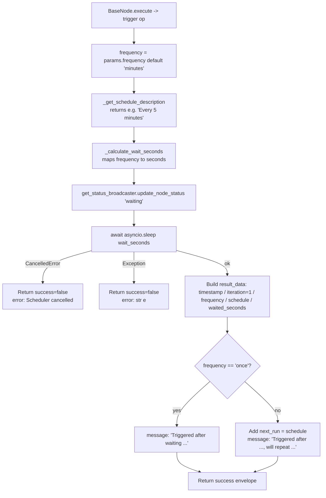

# Cron Scheduler (`cronScheduler`)

| Field | Value |
|------|-------|
| **Category** | workflow / trigger / tool (dual-purpose) |
| **Backend handler** | Plugin [`server/nodes/scheduler/cron_scheduler/__init__.py`](../../../server/nodes/scheduler/cron_scheduler/__init__.py) (`CronSchedulerNode`); dispatch via `BaseNode.execute()` + the `@Operation("trigger")` method. Deployed-workflow cron lifecycle lives in `DeploymentManager` (Temporal Schedules canary via `CronTriggerWorkflow`); this op only runs on a manual / AI-tool invocation. |
| **Tests** | [`server/tests/nodes/test_workflow_triggers.py`](../../../server/tests/nodes/test_workflow_triggers.py) |
| **Skill (if any)** | [`server/skills/task_agent/cron-scheduler-skill/SKILL.md`](../../../server/skills/task_agent/cron-scheduler-skill/SKILL.md) |
| **Dual-purpose tool** | yes - exposed on the `tool` output handle |

## Purpose

Recurring time-based trigger. In **deployed** workflows the scheduling
happens inside `DeploymentManager` via a Temporal Schedule (the
APScheduler path was retired in Wave 15.2); this handler only
runs when the node is executed directly (manual run) or as an AI tool. In
that mode it simply sleeps for the computed interval once, then returns
metadata describing the schedule. It is NOT an event-waiter - it does not
call `event_waiter.register()`.

## Inputs (handles)

| Handle | Connection type | Required | Purpose |
|--------|-----------------|----------|---------|
| (none) | - | - | Trigger nodes have no inputs. |

## Parameters

| Name | Type | Default | Required | displayOptions.show | Description |
|------|------|---------|----------|---------------------|-------------|
| `frequency` | options | `minutes` | no | - | One of `seconds`, `minutes`, `hours`, `days`, `weeks`, `months`, `once`. |
| `interval` | number | `30` | no | frequency == `seconds` | Interval in seconds. |
| `interval_minutes` | number | `5` | no | frequency == `minutes` | Interval in minutes. |
| `interval_hours` | number | `1` | no | frequency == `hours` | Interval in hours. |
| `daily_time` | options | `09:00` | no | frequency == `days` | Display-only in the handler. |
| `weekday` | options | `'1'` (Mon) | no | frequency == `weeks` | Display-only. |
| `weekly_time` | options | `09:00` | no | frequency == `weeks` | Display-only. |
| `month_day` | options | `'1'` | no | frequency == `months` | `1`..`28` or `L`. Display-only in this op. |
| `timezone` | options | `UTC` | no | - | Used in the description string only. |
| `cron_expression` | string | `0 * * * *` | no | - | Vestigial; kept for backward compatibility, unused by the op. |
| `monthly_time` | string | `09:00` | no | - | Vestigial; kept for backward compatibility, no displayOptions. |

Note: for `days` / `weeks` / `months` the op hard-codes the wait to 24h
/ 7d / ~30d respectively; the `daily_time` / `weekday` / `weekly_time` /
`month_day` / `monthly_time` parameters only flow into the human-readable
`schedule` string, not the actual wait duration.

## Outputs (handles)

| Handle | Shape | Description |
|--------|-------|-------------|
| `output-main` | object | Schedule metadata (see below). |

Dual-purpose: the plugin sets `usable_as_tool = True` with `tool_name = "cron_scheduler"`, so when wired to an agent's `input-tools` handle the LLM fills the same Params schema and receives the same payload. There is no separate `output-tool` handle declared.

### Output payload

```ts
{
  timestamp: string;         // ISO 8601 when the trigger fired
  iteration: 1;              // Always 1 in handler mode - see limits below
  frequency: string;
  timezone: string;
  schedule: string;          // Human-readable, e.g. "Every 5 minutes"
  scheduled_time: string;    // ISO 8601 of the originally-planned trigger time
  triggered_at: string;      // ISO 8601 when execution actually fired
  waited_seconds: number;    // How long the handler slept
  message: string;           // Status message
  next_run?: string;         // Only when frequency != 'once'
}
```

Wrapped in the standard envelope.

## Logic Flow



## Decision Logic

- **Interval mapping** (`_calculate_wait_seconds`):
  - `seconds` -> `interval` (default 30)
  - `minutes` -> `interval_minutes` * 60 (default 300)
  - `hours` -> `interval_hours` * 3600 (default 3600)
  - `days` -> 86400 (ignores `daily_time`)
  - `weeks` -> 604800 (ignores `weekday` / `weekly_time`)
  - `months` -> 2592000 (~30 days, ignores `month_day` / `monthly_time`)
  - `once` -> 0 (fire immediately)
  - unknown -> 300 (5 minutes fallback)
- **Once vs recurring**: determines whether `next_run` is added to the
  payload and which `message` template is used. Both branches still return
  `success=True`.
- **Cancellation / exception**: both produce a failed envelope with
  `success=False`.

## Side Effects

- **Database writes**: none.
- **Broadcasts**: `StatusBroadcaster.update_node_status(node_id, "waiting", {message, trigger_time, wait_seconds}, workflow_id)`.
- **External API calls**: none.
- **File I/O**: none.
- **Subprocess**: none.

## External Dependencies

- **Credentials**: none.
- **Services**: `services.status_broadcaster.get_status_broadcaster`.
- **Python packages**: `asyncio`, `datetime`, `time` (stdlib).
- **Environment variables**: none.

## Edge cases & known limits

- **This op is not the real scheduler.** Real cron semantics
  (exact-time-of-day, weekday selection, timezones) live in
  `DeploymentManager` + the Temporal Schedule canary (`CronTriggerWorkflow`).
  The manual-run op does not use any of that - it only sleeps for a fixed
  interval. `daily_time`, `weekday`, `weekly_time`, `month_day`,
  `monthly_time`, and `timezone` are **display-only** in this code path.
- `iteration` is always `1`. The op does not loop; repeated firings
  come from the deployed Schedule firing per tick (deployment mode).
- `interval`, `interval_minutes`, `interval_hours` are Pydantic-validated
  ints with ranges (`ge`/`le`); out-of-range values fail validation before
  the op runs.
- `weekday` is a Pydantic `Literal["0".."6"]`; the op casts it via
  `int(weekday)` inside `_get_schedule_description`, affecting only the
  description string.
- Unknown `frequency` values silently use 300s wait and produce
  `schedule: "Unknown schedule"`.

## Related

- **Skills using this as a tool**: [`cron-scheduler-skill`](../../../server/skills/task_agent/cron-scheduler-skill/SKILL.md)
- **Sibling triggers**: [`timer`](./timer.md) (one-shot delay),
  [`start`](./start.md) (manual entry).
- **Architecture docs**: [Execution Engine Design](../../DESIGN.md),
  [Temporal Architecture](../../TEMPORAL_ARCHITECTURE.md)
