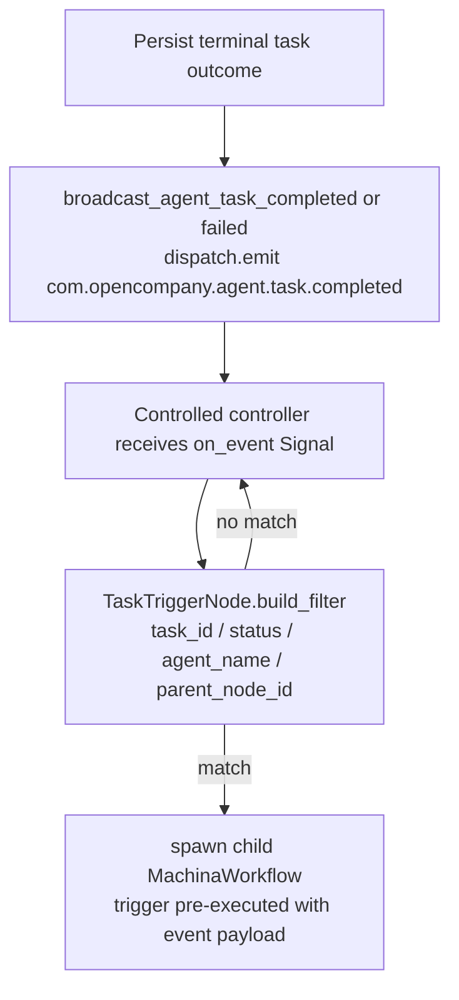

# Task Trigger (`taskTrigger`)

| Field | Value |
|------|-------|
| **Category** | workflow / trigger |
| **Backend handler** | Plugin [`server/nodes/trigger/task_trigger/__init__.py`](../../../server/nodes/trigger/task_trigger/__init__.py) (`TaskTriggerNode`); dispatch via `BaseNode.execute()`. The base `TriggerNode.execute` runs the event wait; the `@Operation("wait")` body is a stub. |
| **Tests** | [`server/tests/nodes/test_workflow_triggers.py`](../../../server/tests/nodes/test_workflow_triggers.py) |
| **Skill (if any)** | none |
| **Dual-purpose tool** | no |

## Purpose

Fires when a child agent dispatched from a durable Task Manager assignment completes or
errors. The Temporal `agent.finish_delegation` Activity in
`server/services/temporal/agent_activities.py` and the legacy coordinator in
`server/services/handlers/tools.py` persist the task outcome before calling
`nodes.agent._events.broadcast_agent_task_completed` or
`broadcast_agent_task_failed`. Both emit a CloudEvents `WorkflowEvent`
(`type: com.opencompany.agent.task.completed`, with the success/error
discriminator carried in `data.status`) via `dispatch.emit`. `taskTrigger` is
canary-registered. In controlled deployments its definition and accepted
Signals live in `WorkflowControlWorkflow`, which filters/queues the event and
starts a child graph per match. A separate `TriggerListenerWorkflow` remains
the legacy compatibility path. The assigning lead has already returned after
receiving `queued`. When
the detached runner submits or fails the task, this trigger starts the connected
lead's separate review invocation. The event preserves the owning execution,
so Task Manager reads the original durable task rather than the trigger run.

## Inputs (handles)

| Handle | Connection type | Required | Purpose |
|--------|-----------------|----------|---------|
| (none) | - | - | Trigger nodes have no inputs. |

## Parameters

| Name | Type | Default | Required | displayOptions.show | Description |
|------|------|---------|----------|---------------------|-------------|
| `task_id` | string | `""` | no | - | If set, only match events with this exact `task_id`. |
| `agent_name` | string | `""` | no | - | Case-insensitive substring match against `event.agent_name`. |
| `status_filter` | options | `all` | no | - | `all` / `completed` / `error`. |
| `parent_node_id` | string | `""` | no | - | If set, only match events with this exact `parent_node_id`. |

## Outputs (handles)

| Handle | Shape | Description |
|--------|-------|-------------|
| `output-main` | object | The `task_completed` event payload. |

### Output payload

Declared `TaskTriggerOutput` fields:

```ts
{
  task_id?: string;
  status?: 'completed' | 'error';
  agent_name?: string;
  result?: string;     // Present when status='completed'
  error?: string;      // Present when status='error'
  workflow_id?: string;
}
```

`TaskTriggerOutput` is `model_config extra="allow"`, so the producer's extra
fields (`agent_node_id`, `parent_node_id`, `team_id`, `execution_id`,
`root_execution_id`, `trace_id`) pass through to downstream nodes at runtime
even though they are not declared on the model. Wrapped in the standard
envelope.

## Logic Flow


```mermaid
flowchart TD
  P[Persist terminal task outcome] --> Q[broadcast_agent_task_completed or failed<br/>dispatch.emit com.opencompany.agent.task.completed]
  Q --> R[Controlled controller receives on_event Signal]
  R --> S[TaskTriggerNode.build_filter<br/>task_id / status / agent_name / parent_node_id]
  S -- match --> T[spawn child MachinaWorkflow<br/>trigger pre-executed with event payload]
  S -- no match --> R
```

## Decision Logic

`TaskTriggerNode.build_filter` applies all configured filters as AND:

- **task_id**: exact match if non-empty.
- **agent_name**: `agent_name_filter.lower() in event_agent.lower()` -
  substring match, case-insensitive.
- **status_filter**:
  - `completed` -> requires `event.status == 'completed'`
  - `error` -> requires `event.status == 'error'`
  - `all` (or anything else) -> no status restriction
- **parent_node_id**: exact match if non-empty.

If any filter rejects, the event is skipped and the waiter stays blocked.

## Side Effects

- **Database writes**: none.
- **Broadcasts**: the producer emits a CloudEvents `WorkflowEvent` via
  `dispatch.emit`. The controller (or legacy listener) emits firing-pulse
  status via `broadcast_trigger_status_activity` around each child spawn.
- **External API calls**: none.
- **File I/O**: none.
- **Subprocess**: none.

## External Dependencies

- **Credentials**: none.
- **Services**: `services.deployment` (canary listener), `services.events.dispatch`,
  `services.status_broadcaster`.
- **Upstream dispatchers**: `services.temporal.agent_activities.finish_agent_delegation`
  and the legacy `services.handlers.tools._execute_delegated_agent` use
  `nodes.agent._events` after persisting the outcome. A failed attempt that is
  requeued does not publish a terminal failure event.
- **Python packages**: stdlib only.
- **Environment variables**: none.

## Edge cases & known limits

- `agent_name` is a case-insensitive **substring** match, not an exact
  match. Two agents named `"TwitterAgent"` and `"TwitterAgentV2"` are both
  matched by `agent_name="Twitter"`.
- `status_filter` values other than `completed` / `error` are treated as
  `all`. There is no validation of unknown values.
- Waiter has no timeout; if the child agent never dispatches a
  `task_completed` event (e.g. it is still running or died silently) the
  trigger blocks until cancelled.
- Lead review requires a connected matching trigger path. External consumers
  may use the event without receiving authority to mutate another team.
- Terminal event IDs are stable (`terminal_event_id` when supplied, otherwise
  task ID plus persisted terminal status), so Activity redelivery can use the
  controller's per-trigger deduplication. This does not fix same-label/type
  trigger Workflow-ID collisions or guarantee producer delivery before a
  Signal is accepted.

## Related

- **Stop/Resume**: new versioned generations retain accepted completion
  events while stopped and start the review graph after Resume. Detached
  delegation runners enroll as independent execution roots, so Stop controls
  them even after their assigning parent finishes. Safe Apply's producer-only
  review drain cannot reopen a whole-generation Stop. Signal acceptance is
  receipt, not completion; producer delivery remains best effort before
  acceptance. See [Workflow control](../../temporal-workflow-control.md).

- **Skills using this as a tool**: none.
- **Architecture docs**: [Event Waiter System](../../event_waiter_system.md),
  [Agent Delegation](../../agent_delegation.md)
- **Sibling triggers**: [`chatTrigger`](./chatTrigger.md), [`webhookTrigger`](./webhookTrigger.md)
