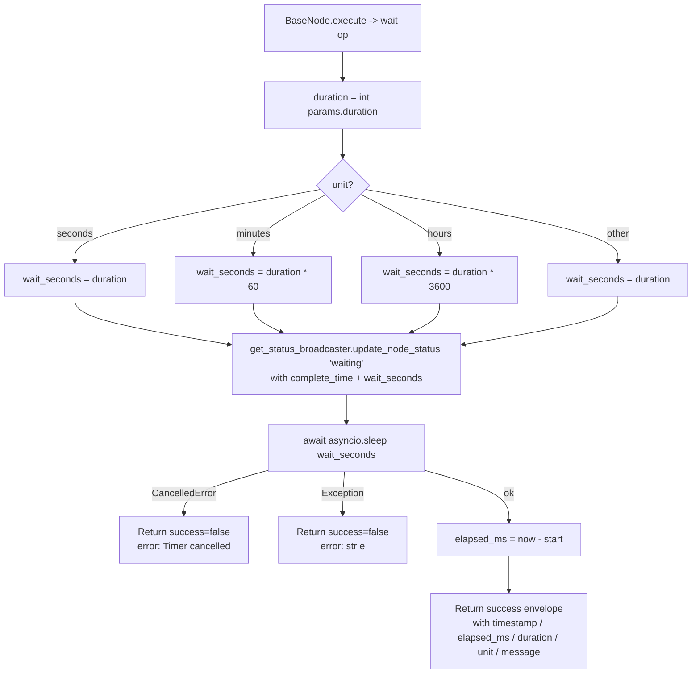

# Timer (`timer`)

| Field | Value |
|------|-------|
| **Category** | workflow / utility / tool (dual-purpose) |
| **Backend handler** | Plugin [`server/nodes/scheduler/timer/__init__.py`](../../../server/nodes/scheduler/timer/__init__.py) (`TimerNode`); dispatch via `BaseNode.execute()` + the `@Operation("wait")` method. |
| **Tests** | [`server/tests/nodes/test_workflow_triggers.py`](../../../server/tests/nodes/test_workflow_triggers.py) |
| **Skill (if any)** | none |
| **Dual-purpose tool** | yes - exposed on the `tool` output handle so AI agents can invoke it |

## Purpose

One-shot delay node. When executed, it broadcasts a `waiting` status to the
frontend, sleeps for the requested duration via `asyncio.sleep`, then returns
timing metadata. Unlike `cronScheduler`, it does not loop and has no concept
of next-run; it simply pauses the branch of the workflow it is on for
`duration` units.

## Inputs (handles)

| Handle | Connection type | Required | Purpose |
|--------|-----------------|----------|---------|
| `input-main` | main | no | Trigger to start the timer. Upstream data is not consumed by the handler. |

## Parameters

| Name | Type | Default | Required | displayOptions.show | Description |
|------|------|---------|----------|---------------------|-------------|
| `duration` | number | `1` | yes | - | How long to wait. Pydantic-validated `ge=1, le=86400`. |
| `unit` | options | `seconds` | no | - | One of `seconds` / `minutes` / `hours`. Unknown values are treated as `seconds`. |

## Outputs (handles)

| Handle | Shape | Description |
|--------|-------|-------------|
| `output-main` | object | Timing metadata (see below). |

Dual-purpose: the plugin sets `usable_as_tool = True` with `tool_name = "timer"`, so when wired to an agent's `input-tools` handle the LLM fills the same Params schema. There is no separate `output-tool` handle declared.

### Output payload

```ts
{
  timestamp: string;      // ISO 8601 - when the timer finished
  elapsed_ms: number;     // Wall-clock elapsed milliseconds
  duration: number;       // Input duration (echoed)
  unit: string;           // Input unit (echoed)
  message: string;        // "Timer completed after <duration> <unit>"
}
```

Wrapped in the standard envelope: `{ success: true, result: <payload>, execution_time, timestamp, node_id, node_type: "timer" }`.

## Logic Flow



## Decision Logic

- **Unit mapping**: `seconds` / `minutes` / `hours` multiply duration by
  1 / 60 / 3600. Any other value falls through to the `_` match case and is
  treated as raw seconds.
- **Cancellation**: `asyncio.CancelledError` is caught and returns
  `success=False` with `error="Timer cancelled"` rather than propagating.
- **Generic errors**: any other `Exception` is stringified into the error
  envelope.

## Side Effects

- **Database writes**: none.
- **Broadcasts**: `StatusBroadcaster.update_node_status(node_id, "waiting", {message, complete_time, wait_seconds}, workflow_id)`
  fires exactly once before the sleep.
- **External API calls**: none.
- **File I/O**: none.
- **Subprocess**: none.

## External Dependencies

- **Credentials**: none.
- **Services**: `services.status_broadcaster.get_status_broadcaster`.
- **Python packages**: `asyncio`, `time`, `datetime` (stdlib).
- **Environment variables**: none.

## Edge cases & known limits

- Only three unit strings are supported - anything else is silently treated
  as raw seconds. There is no surfaced validation error.
- `duration` is Pydantic-validated `ge=1, le=86400`; for `hours` that is up
  to 86400 hours, so a large value with `unit=hours` can sleep effectively
  indefinitely.
- Cancellation (`asyncio.CancelledError`) is re-raised as `RuntimeError("Timer
  cancelled")`, surfaced as a failed envelope. Downstream nodes that key off
  `success` will not execute when the timer is cancelled.

## Related

- **Skills using this as a tool**: `timer` is exposed on the `tool` handle
  but there is no dedicated SKILL.md file.
- **Sibling triggers**: [`cronScheduler`](./cronScheduler.md) for recurring
  schedules; [`start`](./start.md) for manual entry.
- **Architecture docs**: [Execution Engine Design](../../DESIGN.md)
