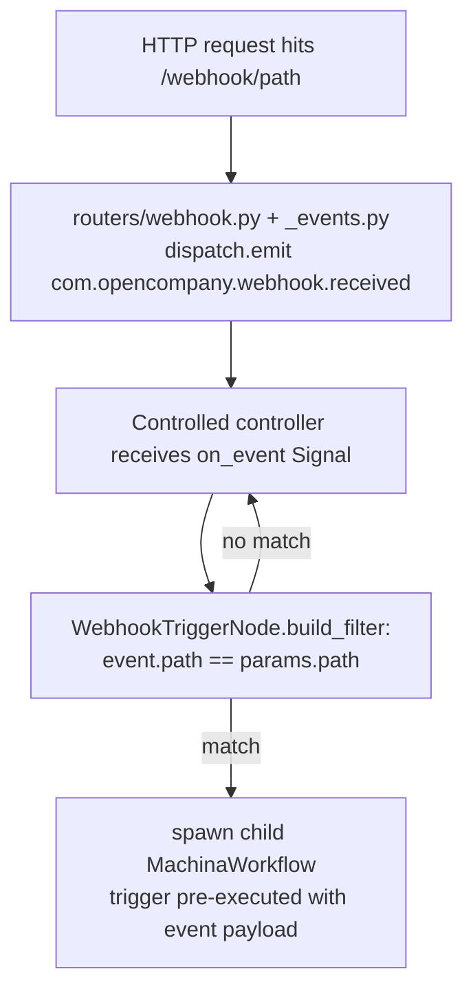

# Webhook Trigger (`webhookTrigger`)

| Field | Value |
|------|-------|
| **Category** | workflow / trigger |
| **Backend handler** | Plugin [`server/nodes/trigger/webhook_trigger/__init__.py`](../../../server/nodes/trigger/webhook_trigger/__init__.py) (`WebhookTriggerNode`); dispatch via `BaseNode.execute()`. The base `TriggerNode.execute` runs the event wait; the `@Operation("wait")` body is a stub. |
| **Tests** | [`server/tests/nodes/test_workflow_triggers.py`](../../../server/tests/nodes/test_workflow_triggers.py) |
| **Skill (if any)** | none |
| **Dual-purpose tool** | no |

## Purpose

Start a workflow when an HTTP request hits `/webhook/{path}`. The
`webhook` router in `server/routers/webhook.py` receives the request and the
producer [`server/nodes/trigger/webhook_trigger/_events.py`](../../../server/nodes/trigger/webhook_trigger/_events.py)
emits a CloudEvents `WorkflowEvent` (`type: com.opencompany.webhook.received`)
via `dispatch.emit`. `webhookTrigger` is canary-registered, so
the controlled `WorkflowControlWorkflow` receives the event via `on_event`
Signal and starts a child `MachinaWorkflow` per matching event (filtered by
`path`). Separate `TriggerListenerWorkflow` executions remain the legacy
compatibility path; the plugin's waiter body is used for direct canvas Run.

## Inputs (handles)

| Handle | Connection type | Required | Purpose |
|--------|-----------------|----------|---------|
| (none) | - | - | Trigger nodes have no inputs. |

## Parameters

| Name | Type | Default | Required | displayOptions.show | Description |
|------|------|---------|----------|---------------------|-------------|
| `path` | string | `""` | no | - | URL path segment - full URL is `http://host:5678/webhook/{path}`. Must match the incoming request's `path` for the filter to accept it. Empty path = wildcard (matches any). |
| `method` | options | `POST` | no | - | Filter for HTTP method at the router layer (not the plugin filter). Values: `GET` / `POST` / `PUT` / `DELETE` / `ALL`. |
| `response_mode` | options | `immediate` | no | - | `immediate` returns 200 OK right away; `responseNode` waits for a downstream `webhookResponse` node (see [`webhookResponse`](./webhookResponse.md)). |
| `authentication` | options | `none` | no | - | `none` or `header`. |
| `header_name` | string | `X-API-Key` | no | authentication == `header` | Expected header name. |
| `header_value` | string (secret) | `""` | no | authentication == `header` | Expected header value. |

## Outputs (handles)

| Handle | Shape | Description |
|--------|-------|-------------|
| `output-main` | object | The webhook event dict built by the router - see below. |

### Output payload

Exact fields depend on the dispatch site in `routers/webhook.py`, typically:

```ts
{
  method: string;
  path: string;
  headers: Record<string, string>;
  query: Record<string, string>;
  body: string;
  json?: unknown;
}
```

Wrapped in the standard envelope.

## Logic Flow



## Decision Logic

- **Filter match** (`WebhookTriggerNode.build_filter`): accepts any
  event whose `path` equals `params.path`. If `path` is empty the
  filter accepts anything.
- **Method / authentication** are NOT enforced inside the filter - they are
  supposed to be enforced at the router layer when the HTTP request lands.
  The handler/filter only looks at `path`.
- **Direct waiter cancellation**: user-initiated cancel via `cancel_event_wait` produces
  `success=False, error="Cancelled by user"`.

## Side Effects

- **Database writes**: none inside the plugin.
- **Broadcasts**: the producer emits a CloudEvents `WorkflowEvent` via
  `dispatch.emit`. The controller (or legacy listener) emits firing-pulse
  status via `broadcast_trigger_status_activity` around each child spawn.
- **External API calls**: none.
- **File I/O**: none.
- **Subprocess**: none.

## External Dependencies

- **Credentials**: none.
- **Services**: `services.deployment` (canary listener), `services.events.dispatch`,
  `services.status_broadcaster`, `routers.webhook` (receives the HTTP request and
  drives `_events.py` to emit the event).
- **Python packages**: stdlib only.
- **Environment variables**: none.

## Edge cases & known limits

- On direct canvas Run, the handler registers a waiter with `timeout=None`, so it waits forever
  until either an event arrives or the run is cancelled. There is no
  handler-side timeout.
- When multiple `webhookTrigger` nodes share the same `path` (different
  workflows), they all receive the event. There is no deduplication in the
  filter.
- `method` and `authentication` parameters are not re-checked inside the
  filter; if the HTTP router's enforcement is bypassed (direct dispatch for
  testing) the trigger will fire regardless.
- Any unexpected exception inside `wait_for_event` is caught and converted
  into a `success=False` envelope - no stack trace leaks to the caller.

## Related

- **Stop/Resume and delivery**: a versioned stopped generation queues accepted
  webhook Signals and delays graph admission until Resume. An HTTP response
  from the router is not an acknowledged graph-completion result, and
  `dispatch.emit` discovery/delivery remains best effort before Signal
  acceptance. A deferred HTTP response may time out during a long pause; its
  process-local future is not a durable Temporal result. See
  [Workflow control](../../temporal-workflow-control.md) and
  [Event Waiter delivery gap](../../event_waiter_system.md#known-gap-canvas-run-on-canary-push-triggers).

- **Skills using this as a tool**: none.
- **Companion node**: [`webhookResponse`](./webhookResponse.md) for
  `responseMode=responseNode`.
- **Sibling triggers**: [`chatTrigger`](./chatTrigger.md), [`taskTrigger`](./taskTrigger.md).
- **Architecture docs**: [Event Waiter System](../../event_waiter_system.md)
