# RFC: Temporal Execution Engine Architecture

| Field | Value |
|---|---|
| Status | Implemented; canonical current-state design |
| Date | 2026-07-20 |
| Owners | Workflow Platform, Agent Platform, Editor |
| Scope | Durable workflow control, trigger admission, graph execution, AI agents, team delegation, observability |
| Supersedes | The current-state portions of `TEMPORAL_ARCHITECTURE.md`; legacy execution remains documented there |

## 1. Executive summary

OpenCompany uses Temporal as its durable production execution engine. A saved
canvas workflow is a stable application identity. Each deployment has a
revision-guarded **control generation**, represented by a long-lived
`WorkflowControlWorkflow`. Each actual graph invocation is a
`MachinaWorkflow`. AI-agent nodes normally execute as `AgentWorkflow` child
workflows, and asynchronous teammate assignments execute through
`DelegatedTaskWorkflow` runners.

The application database and Temporal have deliberately different authority:

- The application database owns workflow authorization, graph snapshots,
  control generations, teams, tasks, immutable attempts, and UI indexes.
- Temporal owns durable command/event history, timers, retries, workflow and
  activity state, and actual execution identity.
- WebSocket broadcasts are a realtime projection. They are not authoritative.
- Process-local registries are caches and legacy compatibility surfaces. They
  must never be the only durable record of controlled execution.

Controlled push and polling triggers live inside the control workflow rather
than separate listener workflows. Only a real graph invocation appears as a
child workflow. Temporal cron schedules remain server-side Schedule resources;
their firings execute the plugin-owned `CronTriggerWorkflow` compatibility
path.

## 2. Goals and non-goals

### 2.1 Goals

1. Survive API-server and worker restarts without losing durable execution.
2. Execute independent graph branches and agent tool calls concurrently.
3. Isolate node, agent, teammate, memory, and tool capabilities.
4. Make Start, Pause, Resume, and Reset explicit, revision-safe operations.
5. Persist delegation before child startup and cap all descendants per root.
6. Preserve immutable task-attempt history and link it to actual Temporal runs.
7. Expose sanitized, bounded, searchable traces without exposing payloads or
   trusting caller-supplied Temporal IDs.
8. Keep plugin-owned activity schemas, retry behavior, and task queues
   extensible.

### 2.2 Non-goals

- Native Temporal Workflow Pause. The engine uses cooperative Signals and
  deterministic wait conditions.
- Temporal's history-rewind Reset. Product Reset terminates and archives the
  current application generation.
- Shared parent/child LLM transcripts. Delegated agents start with isolated
  conversations and return compact results.
- Raw Temporal payload or prompt access through Task Manager.
- Exactly-once side effects outside Temporal. Activities must be idempotent or
  protected by database idempotency records.

## 3. System context

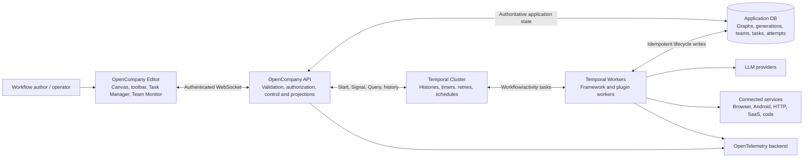

## 4. Logical architecture

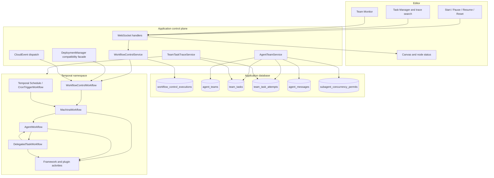

## 5. Identity model

| Identity | Lifetime | Authority | Purpose |
|---|---|---|---|
| `workflow_id` | Saved workflow lifetime | Application DB | Stable product identity and authorization scope |
| `generation` | One Start-to-Reset interval | Application DB | Separates clean deployment epochs |
| `execution_id` / `root_execution_id` | Application execution tree | Application DB | Teams, tasks, permits, and descendant correlation |
| Temporal Workflow ID | Temporal execution chain | Temporal | Stable address for Signal/Query/command routing |
| Temporal Run ID | One run in a workflow chain | Temporal | Exact history version and attempt link |
| `team_id` | Lead node in one execution | Application DB | Team membership and task authorization |
| `task_id` | Durable assignment | Application DB | Stable task identity across retries |
| `attempt_number` | One claim/run | Application DB | Immutable assignee, result, and Temporal links |
| `trace_id` | Cross-component correlation | Application DB / OTel | Opaque correlation only; never authorization |

Identity rules:

- New workflow IDs are backend-allocated positive integers (`1`, `2`, ...).
  Existing legacy records remain exactly as stored; the server does not run an
  identity migration or rewrite historical Temporal links.
- Application execution IDs are workflow-scoped sequences
  (`<workflow_id>:execution:<sequence>`). They are not Temporal Run IDs.
- Node instance IDs are `<workflow_id>:<plugin_type>:<ordinal>`. The plugin
  type is the fixed metadata identity; the ordinal distinguishes multiple
  instances, including multiple `aiAgent` nodes.
- Browser and model callers never choose a Temporal workflow/run ID for trace
  access. The server resolves it from an authorized task attempt.
- Workflow IDs and Run IDs are distinct. Resume signals the existing workflow;
  it does not manufacture a replacement Run ID.
- A Reset archives the current generation and returns control state `ready`.
  The next Start creates generation `N + 1`.
- Random IDs remain appropriate only for correlation, idempotency, events,
  leases, and provider-owned identities. They are not application workflow,
  execution, or node identities.

## 6. Deployment control plane

### 6.1 Persisted control record

`WorkflowControlExecution` stores the workflow, generation, execution/root
identities, controller workflow/run IDs, graph snapshot and hash, session,
status, revision, idempotency key, timestamps, and terminal reason. Unique
constraints protect `(workflow_id, generation)` and
`(workflow_id, idempotency_key)`.

### 6.2 State machine

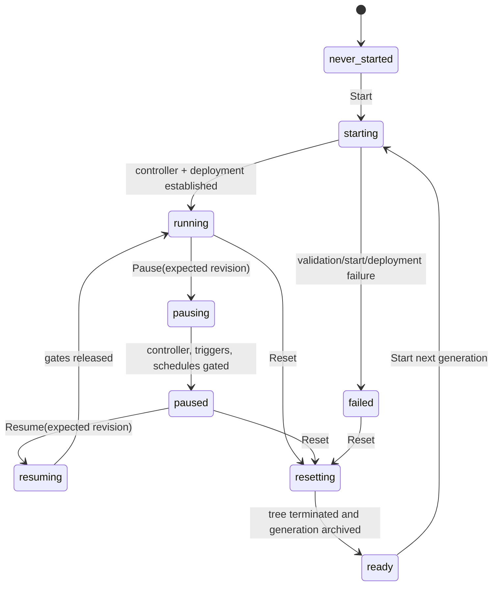

Public state `ready` is persisted internally as terminal status `reset`. This
distinguishes a workflow that has never run from one with archived generations,
while presenting Start in both cases.

### 6.3 Control command sequence

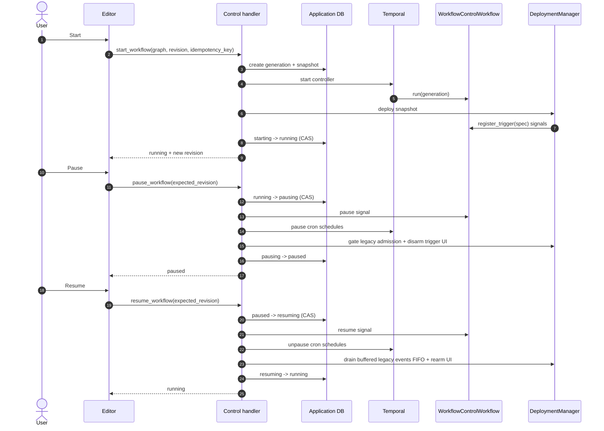

### 6.4 Cooperative pause semantics

Pause is an admission barrier, not suspension of operating-system threads:

- Push events are accepted as durable controller Signals and remain queued.
- The controller does not create new graph child workflows while paused.
- Poll cycles do not start new graph runs; a poll activity already in flight may
  finish and its events wait for Resume.
- Temporal cron schedules are explicitly paused.
- `MachinaWorkflow`, `AgentWorkflow`, and `DelegatedTaskWorkflow` gate new
  scheduling at deterministic wait conditions.
- Activities already started are allowed to finish. Their results remain in
  history and are consumed after the gate opens.
- Trigger nodes broadcast an idle/paused projection, stop their listening
  animation, and rearm on Resume.

### 6.5 Reset semantics

Reset transitions the generation to `resetting`, rejects new admission,
signals the controller to close, terminates visible descendants carrying the
application workflow search attribute, cancels local compatibility resources,
and archives the record as `reset`. It does **not** start the next generation.

Task history and historical Temporal histories are preserved. Existing
historical rows continue to appear in Temporal Web until namespace retention or
an explicit administrative deletion policy removes them.

## 7. Trigger architecture

### 7.1 Controlled push and polling triggers

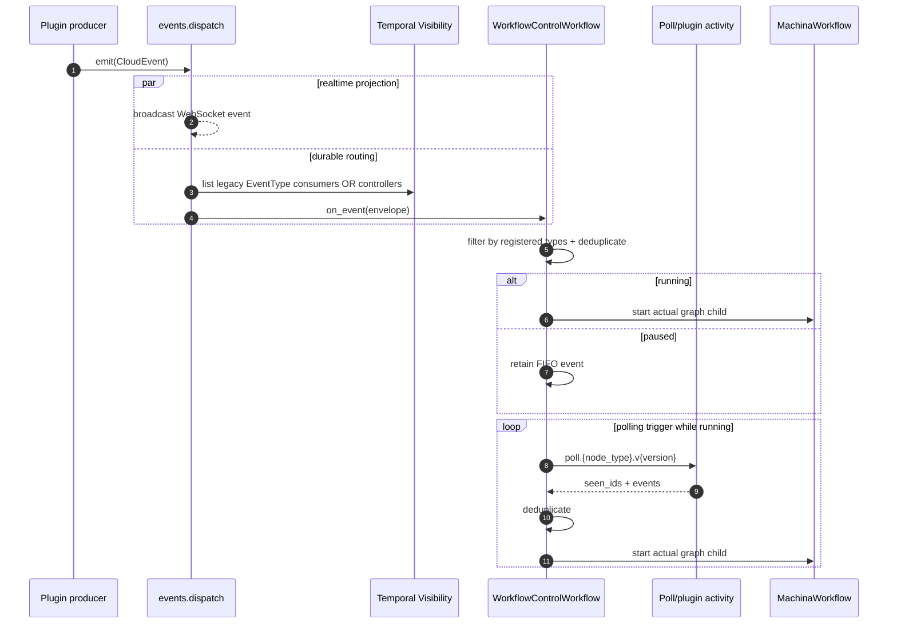

There are no `TriggerListenerWorkflow` or `PollingTriggerWorkflow` executions
for a controlled generation. Those workflow types stay registered only to
replay and serve legacy uncontrolled deployments.

### 7.2 Trigger graph materialization

Before a trigger starts `MachinaWorkflow`, the engine builds a downstream graph:

1. Mark the firing trigger `_pre_executed` with the event payload.
2. Mark sibling triggers as non-firing so they do not block dependency
   resolution.
3. Retain downstream executable nodes and their configuration attachments.
4. Optionally load the latest persisted graph through an activity; the saved
   deployment snapshot is the deterministic fallback.
5. Start a child ID derived from workflow slug, trigger label, and event ID.

### 7.3 Cron exception

Cron remains a Temporal Schedule because server-side calendar evaluation,
timezone handling, catch-up windows, and overlap policy belong to Temporal's
Schedule service. Pause/unpause operates on the Schedule resource. A firing
uses the plugin-owned `CronTriggerWorkflow`, which then starts the graph run.
This is a scheduled execution, not a continuously running listener.

## 8. Graph execution (`MachinaWorkflow`)

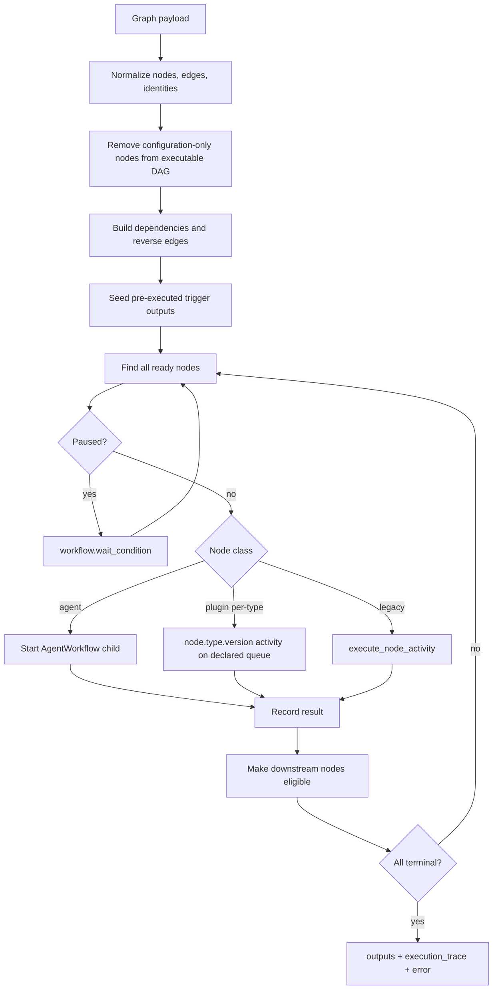

The scheduler follows a continuous ready-set/FIRST_COMPLETED pattern. It does
not wait for an entire topological layer when one branch finishes early.
Configuration handles (`input-tools`, `input-memory`, `input-model`,
`input-skill`, `input-task`, and `input-teammates`) bind capabilities but do not
normally create executable dependencies. `taskTrigger -> input-task` is the
explicit runtime-data exception.

### 8.1 Dispatch matrix

| Node | Primary dispatch | Compatibility dispatch |
|---|---|---|
| Ordinary plugin node | `node.{type}.v{version}` activity | `execute_node_activity` |
| Supported AI/team agent | `AgentWorkflow` child | Per-type/legacy agent activity when feature-disabled |
| RLM / CLI session agents | Per-type activity | Legacy dispatcher |
| Controlled push/poll trigger | Controller Signal/activity | Listener workflows for legacy deployments |
| Cron trigger | Temporal Schedule + plugin workflow | No in-memory APScheduler production path |

### 8.2 Retries and timeouts

- Framework activities use shared retry policies with user-correctable error
  classes marked non-retryable.
- Plugin activities may declare their own task queue, timeout, heartbeat, and
  retry settings.
- LLM steps use a longer LLM-specific retry/timeout policy.
- Tool failures are returned to the agent as structured tool errors after
  activity retries; sibling calls are not cancelled.
- Workflow code contains orchestration only. Network, database, LLM, filesystem,
  broadcast, and clock-dependent side effects belong in activities.

## 9. Agent execution

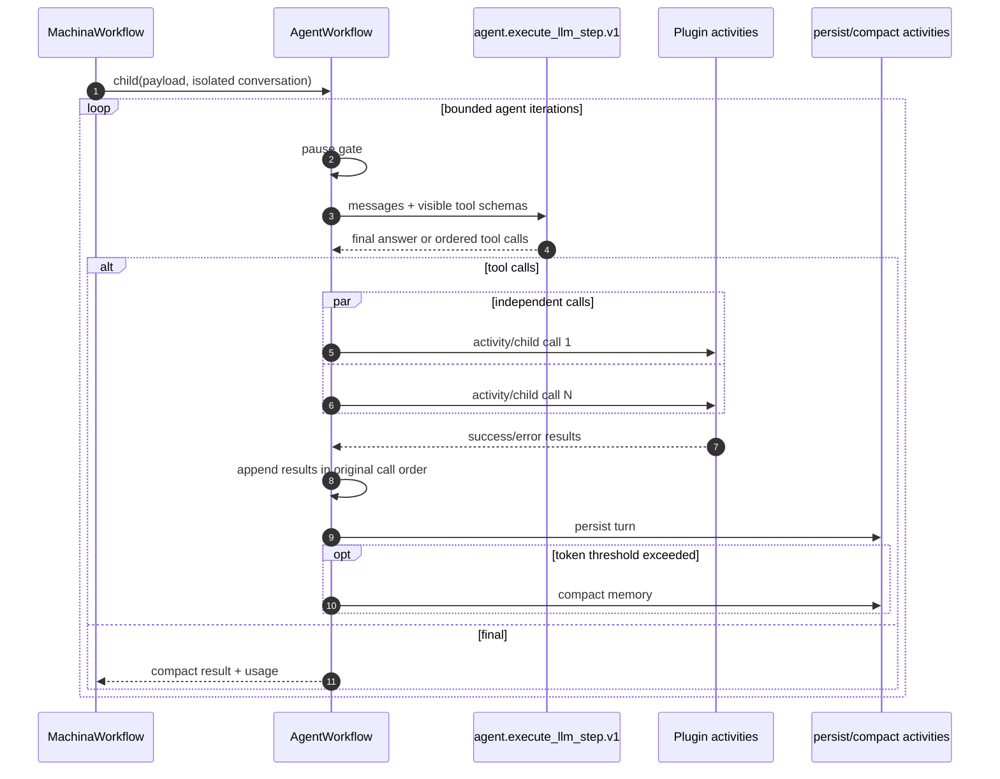

Every agent receives only the tools, skills, memory, model configuration, and
teammates connected to that node in the server-side graph. The canvas is used
for capability resolution but unrelated canvas content is not serialized into
the model prompt.

Dynamic tool refresh uses `agent.refresh_tools.v1`. Provider-visible names must
be unique. Specialized delegate names are type-derived; repeatable `aiAgent`
delegates use label-derived, collision-safe names.

## 10. Durable team delegation

### 10.1 Runtime topology

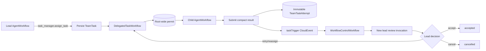

### 10.2 Delegation invariants

- Only canonical `input-teammates` connections authorize assignment.
- `aiAgent` is repeatable; other specialized teammate types are unique.
- Maximum delegation depth is two child layers.
- The default root-wide active-descendant cap is three. The root is excluded;
  children and grandchildren are included.
- Persistence succeeds before a child starts.
- `DelegatedTaskWorkflow` waits for a durable permit and heartbeats while
  queued.
- Graceful success, failure, and cancellation paths release their permit
  idempotently. Immediate Temporal termination requires the reset reconciler
  described in Known Limitations.
- A worker result moves a task to `submitted`, not `accepted`.
- The lead or authorized human must review submitted work.
- Retry and reassignment create new attempts; they never overwrite history.
- The assigning lead returns after durable queueing and does not synchronously
  wait for the teammate.

### 10.3 Task state machine

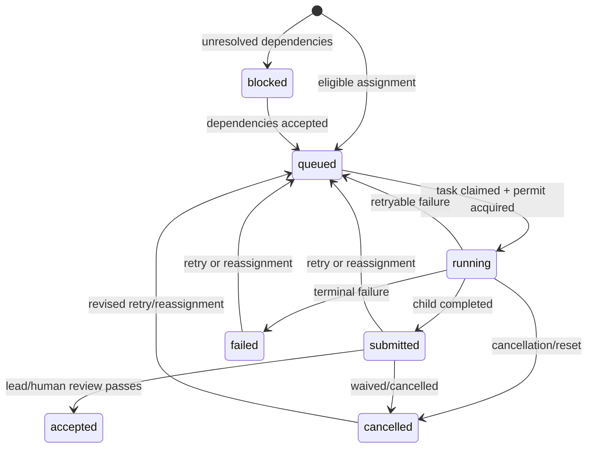

## 11. Persistence model

### 11.1 Saved definition versus run-data scope

`workflows` stores the editable, stable canvas definition. Runtime state is
partitioned by `workflow_run_data_scopes`, with exactly one scope per workflow
control generation. The scope snapshots all admitted node data, maps the
application execution identity to the actual Temporal controller Workflow/Run
identity, and supplies the session namespace used by node-output persistence.

Reset archives the scope rather than deleting it. A later Start creates a new
scope and therefore a fresh node-data namespace, while archived task, output,
trace, and graph-snapshot records remain available for historical inspection.

`simpleMemory` settings remain durable, but its conversation state is
generation-bound. Reset first writes the final memory parameters to the
archived scope's `runtime_data.simple_memory`, then clears the live transcript,
continuation metadata, connected sessions, vector/direct-memory caches,
conversation rows, and token counters. The next Start reads the reset live row.

| State class | Reset behavior | Current source after Reset |
|---|---|---|
| Graph/node execution outputs and statuses | archived; live projection cleared | new generation scope |
| Console and chat-trigger run rows | archived by root execution | new generation scope |
| Team tasks, attempts, and traces | archived and queryable | selected execution history |
| Node parameters and canvas configuration | preserved | `node_parameters` / `workflows` |
| `simpleMemory` transcript and session state | archived, then cleared | reset `node_parameters` + memory services |

### 11.2 Generic node runtime lifecycle

Reset orchestration must not contain node-type branches. The framework archives
every admitted node under `WorkflowRunDataScope.runtime_data.nodes`, keyed by
node ID and therefore transitively by `{workflow_id, execution_id, node_id}`.
Each entry contains the node type, admitted canvas data, and final parameter
snapshot.

After the generic archive succeeds, the coordinator resolves each node through
the node registry and calls `BaseNode.reset_execution_state(...)`. The default
implementation is a no-op for stateless nodes. A stateful plugin overrides the
hook to clear stores it owns and returns refreshed parameters for the standard
`node_parameters_updated` broadcast. Adding another stateful node therefore
requires a plugin lifecycle declaration, not a deployment-manager condition.

Normal execution output remains isolated by the generation's `data_scope_id`
session namespace. Console/chat rows, teams, tasks, attempts, and traces carry
the root execution ID explicitly. Together these identities prevent a current
run from reading another generation's mutable data while keeping archived runs
inspectable.

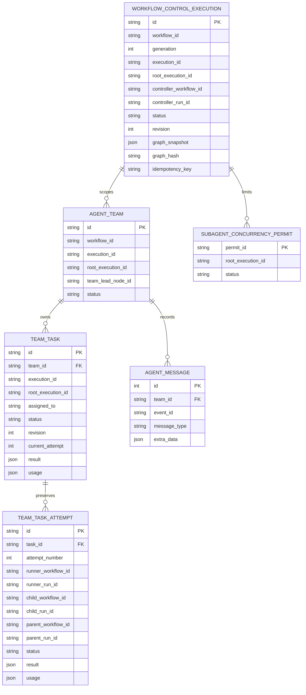

SQLite startup migrations add new nullable columns and indexes without making
historical rows unreadable. Historical attempts without execution links report
`execution_not_registered`.

## 12. Trace and observability architecture

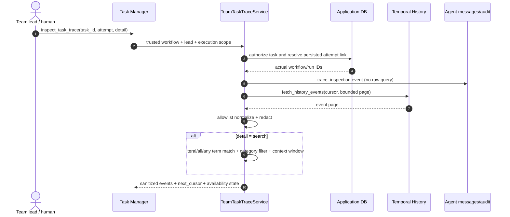

Trace detail modes:

| Mode | Purpose |
|---|---|
| `summary` | Failures, activities, and child transitions |
| `failures` | Failure and timeout events only |
| `timeline` | Sanitized normalized event page |
| `search` | Bounded grep-style scan with context and continuation cursor |

Search scans at most 500 normalized events per request, supports literal,
all-term, and any-term matching, filters by event category, and returns at most
five surrounding events. Raw payload mode does not exist. Prompts, tool
arguments, credentials, tokens, raw results, and arbitrary failure payloads are
excluded by allowlist normalization and secret redaction.

### 12.1 OpenTelemetry interceptor ownership

`core.tracing.init_tracing()` owns the process-wide `TracerProvider` and span
exporter. The shared Temporal client owns exactly one SDK
`TracingInterceptor`. A Python SDK `Worker` automatically prepends compatible
interceptors from its client, so worker interceptor lists **must not** repeat
`TracingInterceptor`; they contain only OpenCompany's
`ObservabilityWorkerInterceptor` and any distinct plugin-owned worker
interceptors.

```text
Temporal client
└── TracingInterceptor (registered once)
    └── inherited by every Worker built from that client
        └── ObservabilityWorkerInterceptor (explicit, worker-only)
```

Registering `TracingInterceptor` on both `Client.connect(...)` and
`Worker(...)` wraps every workflow and activity twice. The resulting spans are
different OpenTelemetry spans, but the compact console formatter omits their
span IDs, so adjacent copies have the same operation name and Temporal
workflow/run/activity attributes and appear identical. This is duplicate
instrumentation, not evidence that Temporal executed the workflow twice.

| Span or log | Meaning |
|---|---|
| `StartActivity:<activity>` | Workflow-side scheduling and trace-context propagation; not the activity body |
| `RunActivity:<activity>` | Worker-side activity invocation; a real retry is a separate attempt |
| `node.<type>.execute` | OpenCompany plugin-body span emitted by `BaseNode.execute()` |
| `CompleteWorkflow:AgentWorkflow` | Terminal marker for an agent child workflow |
| `CompleteWorkflow:MachinaWorkflow` | Terminal marker for the graph workflow |

`CompleteWorkflow` commonly reports `0ms`: the SDK emits a replay-safe
instantaneous completion marker rather than a wall-clock workflow-duration
span. Separate agent-child and graph-workflow completions are expected, as are
one `StartActivity` and one `RunActivity` for the same activity. Exact adjacent
repeats of the *same* phase and Temporal identity tuple indicate interceptor
duplication. Temporal Event History remains the execution authority; a single
`node.<type>.execute` span and one activity attempt in history corroborate that
the node body ran once.

Only opaque correlation identities are added to tracing attributes. Prompts,
credentials, tool arguments, and raw results are excluded. Application task
records remain available when Temporal retention has removed detailed history.

## 13. Worker and task-queue topology

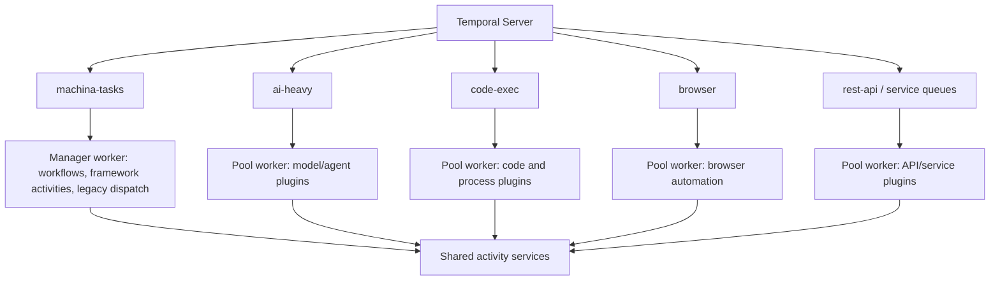

Worker construction registers framework workflows, agent workflows, legacy
listener compatibility workflows, plugin activities, polling activities, agent
activities, and plugin-contributed Temporal workflows. Autoscaling pollers and
sticky workflow caching reduce idle polling and replay overhead. Worker
identity includes the task queue for operational diagnosis.

## 14. Failure model and recovery

| Failure | Expected behavior |
|---|---|
| API process restart | Temporal histories continue; DB control/task state survives |
| Worker restart | Outstanding workflow/activity tasks are redelivered |
| Activity transient failure | Retry according to shared or plugin policy |
| User/configuration error | Non-retryable structured failure |
| One parallel tool/child fails | Successful siblings continue; error returns in call order |
| Persistence failure before delegation | Child is not started |
| Permit wait | Task stays queued; waiting activity heartbeats |
| Root cancellation | Graceful cancellation runs workflow cleanup and permit release |
| Immediate Reset termination | Visible descendants terminate; interrupted task/permit reconciliation is a current follow-up |
| Temporal unavailable during trace read | `temporal_unavailable`; persisted task result remains readable |
| History retention expired | `retention_expired`; attempt metadata/result remains readable |
| API/UI reconnect | Query DB/control status, then resume event subscriptions |

The startup termination sweep defaults off and skips active product-managed
control generations. Controlled trigger registration is durable inside the
controller history. A remaining compatibility limitation is that the
process-local `DeploymentManager` projection is not fully reconstructed from
all saved generations on boot; Temporal and database authority survive, but
some legacy UI/deployment counters may require reconciliation.

## 15. Security and isolation

1. Server-derived workflow, lead, execution, team, and attempt scope is used for
   every mutation and trace read.
2. Cross-team, cross-execution, removed-teammate, ordinary tool-edge, ambiguous,
   and forged assignments are rejected.
3. Each child agent binds only its own graph-connected capabilities.
4. Conversation history is not inherited by delegated children.
5. Trace retrieval resolves persisted execution links; caller workflow IDs are
   never treated as authority.
6. Trace output uses allowlist serialization and secret redaction.
7. OTel attributes exclude prompts, credentials, arguments, and results.
8. Optimistic revisions prevent UI/model callers from overwriting newer task or
   control state.

## 16. Determinism and compatibility rules

- Workflow code may mutate only replayable workflow state and issue Temporal
  commands.
- Non-deterministic work belongs in activities.
- Command IDs derive from stable node, iteration, call-index, task, and
  generation identities.
- Temporal patch markers preserve old command histories when command identity
  or scheduling structure changes.
- Workflow type and activity names are durable protocol identifiers; product
  rebranding does not rename existing Temporal contracts casually.
- Legacy listener workflows and the single node dispatcher remain registered
  until all replayable histories and imported deployments no longer require
  them.

## 17. Operational views

### Toolbar

- `never_started` or `ready`: Start
- `running`: Pause
- `paused`: Resume
- transition states: disabled spinner
- any active/failed generation: Reset when allowed

### Task Manager

Operational, mutable, execution-scoped view of all durable tasks, attempts,
usage, timestamps, results, errors, and sanitized Temporal traces.

### Team Monitor

Compact read-only view of connected teammates, current generation, queued and
active work, and child execution state. It does not replace Task Manager for
review or mutation.

### Temporal Web

Use for workflow history, activity attempts, timers, Signals, child relations,
and worker diagnosis. Historical executions remain visible by design. A
controlled push/poll trigger does not create a listener workflow row; an actual
triggered graph invocation does.

## 18. Capacity and scaling

- Root graph branches scale through independent activity task queues.
- Agent tool calls and child work run concurrently when independent.
- Global descendant admission defaults to three per root and is user-configurable
  within server limits.
- Delegation depth is capped at two.
- Poller autoscaling and worker pools separate heavy AI, code, browser, and
  service workloads.
- Histories must use continue-as-new or bounded execution for genuinely
  unbounded workloads. The consolidated controller currently accumulates
  trigger registration and event history for its generation; production
  retention/load testing should define a safe continue-as-new threshold that
  carries trigger specs, dedup state, polling baselines, pause state, and
  queued events.

## 19. Known limitations and follow-ups

1. Rebuild all process-local deployment projections from control records and
   Temporal Visibility after API restart.
2. Add controller continue-as-new with lossless trigger/poll state transfer.
3. Consolidate cron firing into the controller only if Temporal Schedule
   calendar semantics can be preserved without reimplementing them.
4. Replace global controller event fan-out with an indexed multi-event routing
   attribute or dedicated durable routing index as deployment count grows.
5. Add end-to-end tests against a real Temporal test server for pause races,
   reset termination, schedule pause, replay, and worker restart.
6. Define namespace retention and archival policies for high-volume traces.
7. Add an idempotent Reset reconciliation activity that marks interrupted
   attempts `cancelled` with `workflow_reset` and releases permits even though
   Temporal termination intentionally does not execute workflow `finally`
   blocks.

## 20. Source map

| Concern | Primary implementation |
|---|---|
| Control persistence/service | `server/models/database.py`, `server/core/database.py`, `server/services/deployment/control.py` |
| Control commands | `server/services/deployment/handlers.py` |
| Controller and trigger hub | `server/services/temporal/workflow_control_workflow.py` |
| Event routing | `server/services/events/dispatch.py` |
| Cron schedules | `server/services/temporal/schedules.py` |
| Root graph orchestration | `server/services/temporal/workflow.py` |
| Temporal start identity | `server/services/temporal/executor.py` |
| Agent and delegation workflows | `server/services/temporal/agent_workflow.py` |
| Agent lifecycle activities | `server/services/temporal/agent_activities.py` |
| Progressive skill runtime | `server/services/skill_runtime.py`, `server/services/skill_prompt.py` |
| Team/task authorization | `server/services/agent_team.py` |
| Trace service | `server/services/team_task_trace.py` |
| Worker topology | `server/services/temporal/worker.py`, `server/services/temporal/plugin_activities.py` |
| Toolbar/UI control | `client/src/Dashboard.tsx`, `client/src/components/ui/TopToolbar.tsx`, `client/src/contexts/WebSocketContext.tsx` |
| Task/monitor UI | `client/src/components/parameterPanel/TaskManagerPanel.tsx`, `TeamMonitorPanel.tsx` |

## 21. References

- [Temporal Python message passing](https://docs.temporal.io/develop/python/message-passing)
- [Temporal Workflow identity](https://docs.temporal.io/workflow-execution/workflowid-runid)
- [Temporal Schedules](https://docs.temporal.io/develop/python/schedules)
- [Temporal observability](https://docs.temporal.io/develop/python/observability)
- [Temporal child workflows](https://docs.temporal.io/child-workflows)
- [OpenTelemetry context propagation](https://opentelemetry.io/docs/concepts/context-propagation/)
- [Internal workflow-control notes](temporal-workflow-control.md)
- [Detailed activity/worker inventory](TEMPORAL_ARCHITECTURE.md)
- [Event framework](event_framework.md)
- [Task Manager contract](node-logic-flows/ai_tools/taskManager.md)

## 22. Acceptance criteria for architectural changes

Any change to this engine must demonstrate:

1. Replay determinism for affected workflows.
2. Idempotency under activity, command, Signal, and client retries.
3. Preservation of workflow/control/task authorization boundaries.
4. No loss of queued trigger events or delegated tasks across pause/restart.
5. Permit release under success, failure, cancellation, and reset.
6. Stable or migration-protected workflow/activity identifiers.
7. Sanitized trace output with bounded pagination/search.
8. UI reconciliation from backend authority after reconnect.
9. Focused unit tests plus an integration or replay test proportional to risk.

## 23. Progressive skill activities

Temporal agents expose metadata on the connected `Skill` tool (not through a
hardcoded agent prompt) and schedule `agent.skill.invoke.v1` only
after the model calls `Skill`. Its deterministic tool activity ID includes the
agent, iteration, and model call index, so the returned instructions are written
to workflow history and activity retries do not refetch into replay. Customized
Master Skill content is authoritative. Supporting resources are bounded and
separate. `agent.skill.clear.v1` clears canvas-only state at turn completion;
loaded tool results remain in the conversation until that execution ends.

Every Temporal skill/tool lifecycle is also emitted as a sanitized
`com.opencompany.agent.(skill|tool).<state>` CloudEvent. Its ID is derived from
workflow execution, agent, model tool-call identity, capability, and stage, so
an activity retry redelivers the same occurrence instead of inventing a second
one. `subject` remains the invoking child agent; parent progress mirroring never
copies child capability metadata. Workflow/execution scope stays inside event
`data` rather than non-conformant snake_case extension attributes. These events
are direct observability fan-out, not trigger Signals; Temporal Event History
continues to be the durable execution authority.
